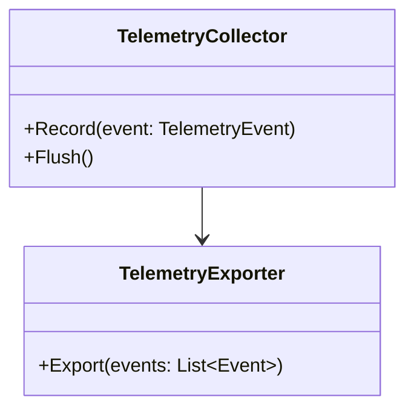
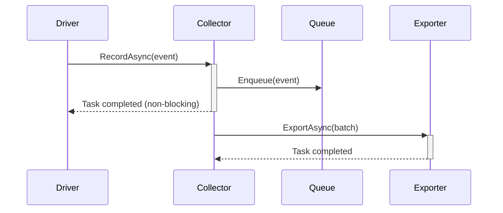

### User Input
```text
$ARGUMENTS
```

You **MUST** consider the user input before proceeding. If empty, ask the user for what to work on.

# Collect requirement from user

always collect enough information from user, this might be one or more of the following

## an existing design doc
in this case, we are working an existing doc either addressing review comments or change some of the designs. 

## an PM requirement document
you will need review the doc and reconcile with existing design doc if there is one to make sure everything is in sync, if not, working on the change of design 

## conversation with user
always good to ask a lot of clarification questions and probe users on overall requirement and corner cases


# Start the design by following below best practises

## Overview
This guide outlines best practices for writing technical design documents, based on lessons learned from code reviews.

---
## 1. Use Visual Diagrams Over Text

### ✅ DO:
- Use **mermaid diagrams** for all architectural illustrations
- Include **class diagrams** to show relationships between components
- Use **sequence diagrams** to illustrate data flow and interactions
- Render diagrams inline in markdown using mermaid code blocks

### ❌ DON'T:
- Use ASCII art for diagrams
- Describe flows in long text paragraphs
- Include large blocks of code to explain architecture

### Example:
```markdown
## Architecture

```

---

## 2. Focus on Interfaces and Contracts

### ✅ DO:
- Document **public APIs** and **interfaces**
- Show **contracts between components**
- Specify **input/output** parameters
- Define **error handling contracts**
- Document **async/await patterns** where applicable

### ❌ DON'T:
- Include detailed implementation code
- Show private method implementations
- Include complete class implementations

### Example:
```markdown
## ITelemetryCollector Interface

```csharp
public interface ITelemetryCollector
{
    // Records a telemetry event asynchronously
    Task RecordAsync(TelemetryEvent event, CancellationToken ct);

    // Flushes pending events
    Task FlushAsync(CancellationToken ct);
}
```

**Contract:**
- RecordAsync: Must be non-blocking, returns immediately
- FlushAsync: Waits for all pending events to export
- Both methods must never throw exceptions to caller
```

---

## 3. Remove Implementation Details

### ✅ DO:
- Focus on **what** the system does
- Explain **why** design decisions were made
- Document **integration points**
- Describe **configuration options**

### ❌ DON'T:
- Include internal implementation details
- Show vendor-specific backend implementations
- Document internal database schemas (unless part of public contract)
- Include proprietary or confidential information
- **Include customer names, customer data, or any personally identifiable information (PII)**

---

## 4. Simplify Code Examples

### ✅ DO:
- Use **minimal code snippets** to illustrate concepts
- Show only **signature changes** to existing APIs
- Replace code with **diagrams** where possible
- Use **pseudocode** for complex flows

### ❌ DON'T:
- Include complete class implementations
- Show detailed algorithm implementations
- Copy-paste large code blocks

### Example:
```markdown
## DatabricksConnection Changes

**Modified Methods:**
```csharp
// Add telemetry initialization
public override async Task OpenAsync(CancellationToken ct)
{
    // ... existing code ...
    await InitializeTelemetryAsync(ct);  // NEW
}
```

**New Fields:**
- `_telemetryCollector`: Optional collector instance
- `_telemetryConfig`: Configuration from connection string
```

---

## 5. Simplify Test Sections

### ✅ DO:
- List **test case names** with brief descriptions
- Group tests by **category** (unit, integration, performance)
- Document **test strategy** and coverage goals
- Include **edge cases** to be tested

### ❌ DON'T:
- Include complete test code implementations
- Show detailed assertion logic
- Copy test method bodies

### Example:
```markdown
## Test Strategy

### Unit Tests
- `TelemetryCollector_RecordEvent_AddsToQueue`
- `TelemetryCollector_Flush_ExportsAllEvents`
- `CircuitBreaker_OpensAfter_ConsecutiveFailures`

### Integration Tests
- `Telemetry_EndToEnd_ConnectionToExport`
- `Telemetry_WithFeatureFlag_RespectsServerSide`
```

---

## 6. Consider Existing Infrastructure

### ✅ DO:
- **Research existing solutions** before designing new ones
- Document how your design **integrates with existing systems**
- Explain why existing solutions are **insufficient** (if creating new)
- **Reuse components** where possible

### ❌ DON'T:
- Reinvent the wheel without justification
- Ignore existing patterns in the codebase
- Create parallel systems without explaining why

### Example:
```markdown
## Alternatives Considered

### Option 1: Extend Existing ActivityTrace Framework (PR #3315)
**Pros:** Reuses existing infrastructure, familiar patterns
**Cons:** ActivityTrace is designed for tracing, not metrics aggregation

### Option 2: New Telemetry System (Chosen)
**Rationale:** Requires aggregation across statements, batching, and different export format than traces
```

---

## 7. Address Concurrency and Async Patterns

### ✅ DO:
- Clearly mark **async operations** in interfaces
- Document **thread-safety** guarantees
- Explain **blocking vs non-blocking** operations
- Show **cancellation token** usage

### ❌ DON'T:
- Mix sync and async without explanation
- Leave thread-safety unspecified
- Ignore backpressure and resource exhaustion scenarios

### Example:
```markdown
## Concurrency Model

### Thread Safety
- `TelemetryCollector.RecordAsync()`: Thread-safe, non-blocking
- `TelemetryExporter.ExportAsync()`: Called from background thread only

### Async Operations
All telemetry operations are async to avoid blocking driver operations:

```

---

## 8. Document Edge Cases and Failure Modes

### ✅ DO:
- Explain what happens during **failures**
- Document **circuit breaker** or retry logic
- Address **data loss** scenarios
- Show how **duplicate events** are handled

### ❌ DON'T:
- Only show happy path
- Ignore error scenarios
- Leave failure behavior undefined

### Example:
```markdown
## Error Handling

### Circuit Breaker Behavior
When export fails 5 consecutive times:
1. Circuit opens, drops new events (avoids memory exhaustion)
2. Sends circuit breaker event to server
3. Attempts recovery after 60s

### Duplicate Handling
If same statement reported multiple times:
- Backend merges by `statement_id`
- Uses latest timestamp for each metric type
```

---

## 9. Include Configuration Options

### ✅ DO:
- Document **all configuration parameters**
- Show **default values** and acceptable ranges
- Explain **opt-out mechanisms**
- Document **feature flags** and server-side controls

### Example:
```markdown
## Configuration

| Parameter | Type | Default | Description |
|-----------|------|---------|-------------|
| `telemetry.enabled` | bool | `true` | Enable/disable telemetry |
| `telemetry.batch_size` | int | `100` | Events per batch (1-1000) |
| `telemetry.flush_interval_ms` | int | `5000` | Flush interval (1000-30000) |

**Feature Flag:** `spark.databricks.adbc.telemetry.enabled` (server-side)
```

---

## 10. Keep Sections Focused

### ✅ DO:
- Include only **necessary sections**
- Each section should answer **specific questions**
- Remove sections that don't add value

### ❌ DON'T:
- Include boilerplate sections "just because"
- Add sections that duplicate information
- Keep sections that reviewers flag as unnecessary

---

## Summary Checklist

Before submitting your design doc:

- [ ] All diagrams are in **mermaid format**
- [ ] Focus is on **interfaces, not implementations**
- [ ] **Internal details** removed
- [ ] Code examples are **minimal and relevant**
- [ ] Test sections show **case names, not code**
- [ ] **Existing infrastructure** considered and discussed
- [ ] **Async/thread-safety** clearly documented
- [ ] **Edge cases and failures** addressed
- [ ] **Configuration options** fully documented
- [ ] All sections are **necessary and focused**
- [ ] Design explains **why**, not just **what**

