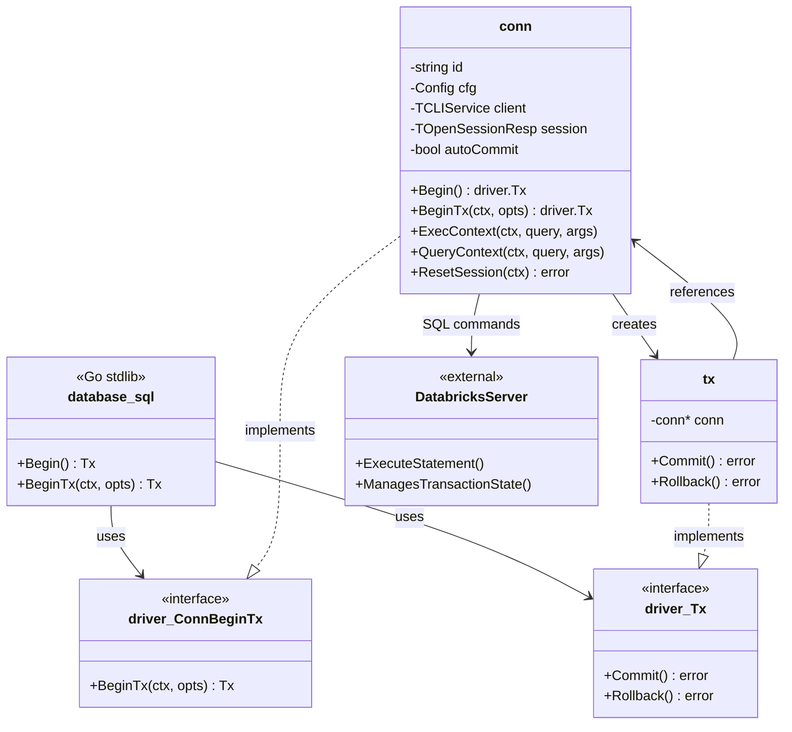
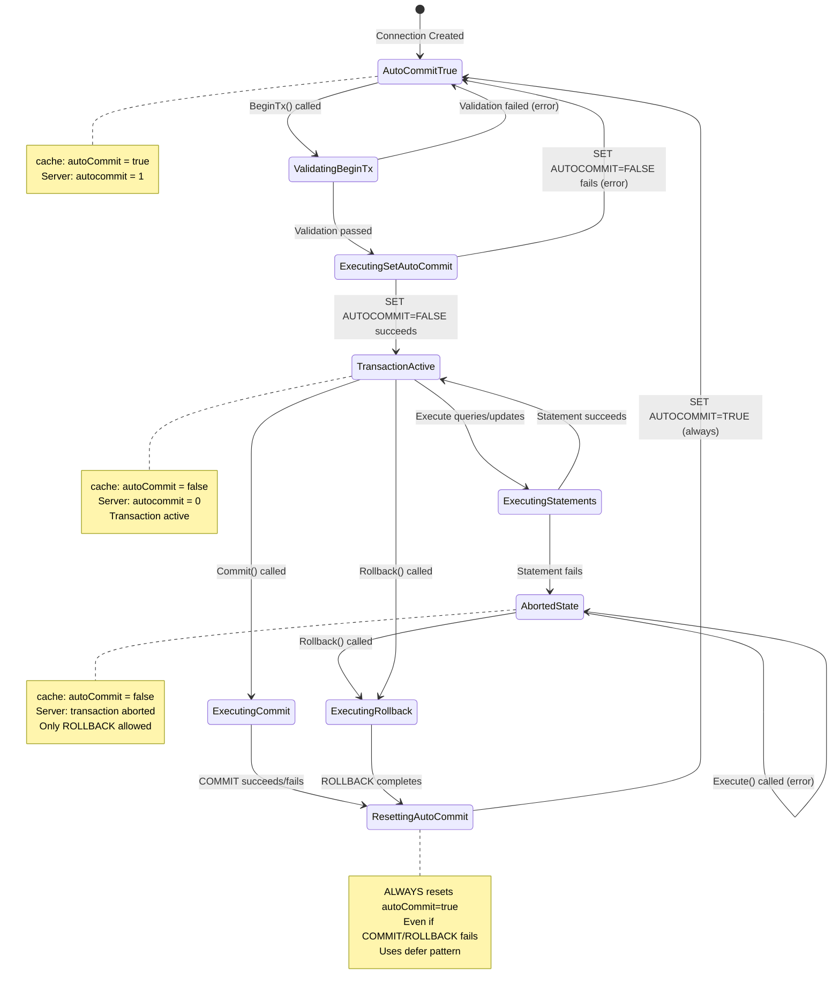
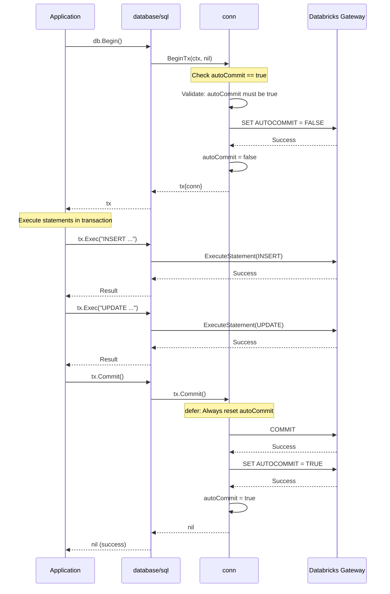
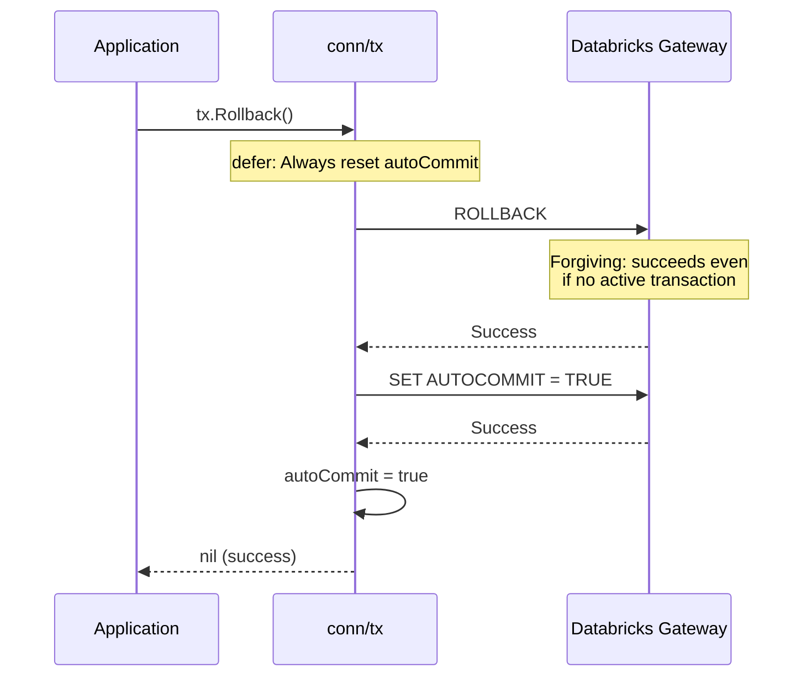
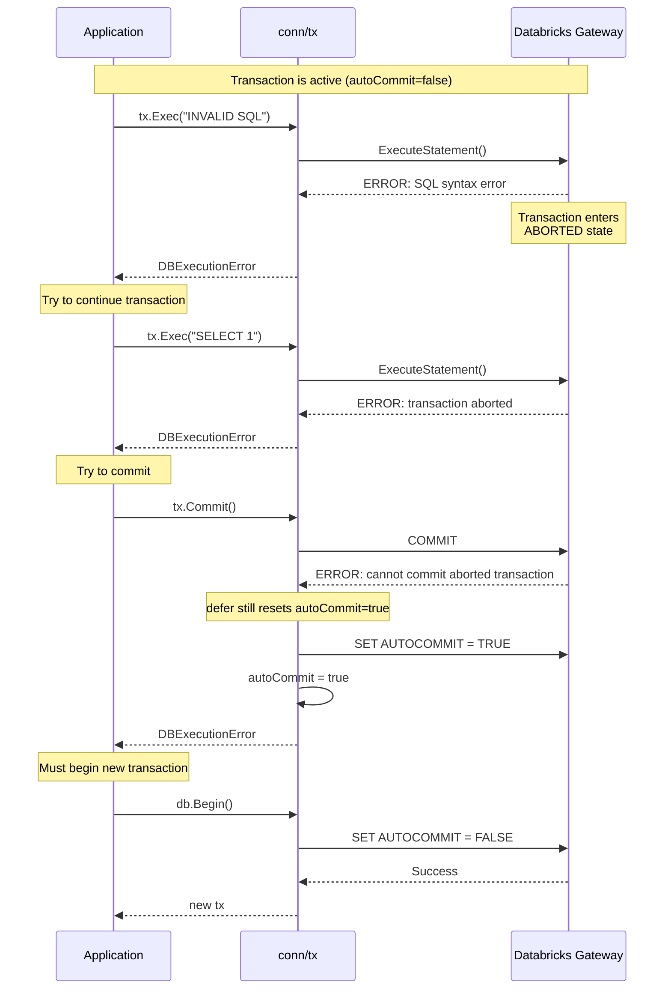
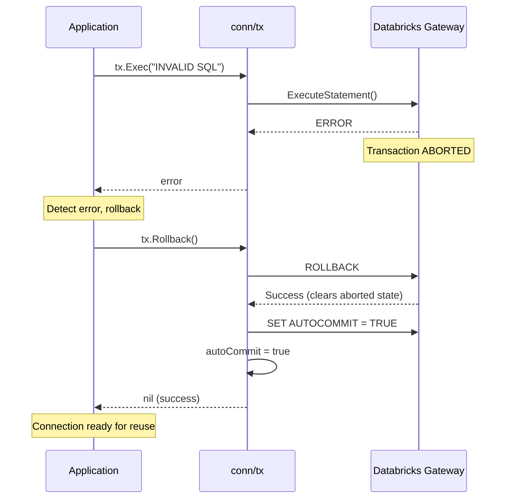
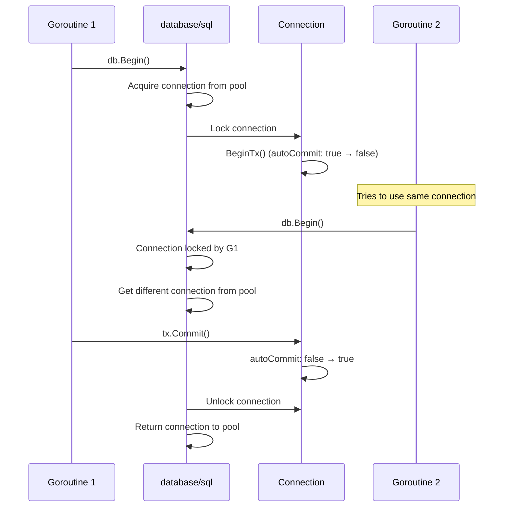

# Design: Multi-Statement Transaction Support for databricks-sql-go

**Author:** Design Document
**Date:** 2025-11-04
**Status:** IN REVIEW
**Reference JDBC Design:** [JDBC Driver Support for Multi-Statement Transactions](https://docs.google.com/document/d/1WKGRF4pcRSRm7MiTh8gkb_D0cr2-lrZ2wUc7cOlNk64/edit?tab=t.0#heading=h.4cz970y1mk93)
**Reference JDBC Implementation:** [PR #1060](https://github.com/databricks/databricks-jdbc/pull/1060/files?w=1)

---

## Introduction

This document outlines the design for implementing multi-statement transaction (MST) support in the **databricks-sql-go** driver. The implementation will follow Go's standard `database/sql` transaction interface while maintaining consistency with the JDBC driver's actual implementation (PR #1060), which uses client-side caching of autocommit state.

### Goals

1. Enable multi-statement transactions using Go's standard `driver.Tx` interface
2. Cache autocommit state client-side for optimal performance
3. Maintain consistency with JDBC implementation patterns
4. Ensure reliable error handling and state management
5. Support connection pooling and concurrent transaction execution

### Non-Goals

- SQL parsing to detect BEGIN/COMMIT/ROLLBACK statements
- Savepoint support
- Multiple isolation levels beyond SERIALIZABLE
- Distributed transactions

---

## 1. Architecture Overview

### 1.1 Component Diagram



### 1.2 AutoCommit State Machine



### 1.3 Comparison: Go vs JDBC Implementation

| Aspect | JDBC Implementation | Go Implementation |
|--------|---------------------|-------------------|
| **Transaction Start** | `connection.setAutoCommit(false)` | `db.BeginTx(ctx, opts)` |
| **AutoCommit Caching** | `boolean autoCommit` in DatabricksSession | `bool autoCommit` in conn struct |
| **Cache Default** | `true` | `true` |
| **Transaction Control** | Explicit setAutoCommit()/commit()/rollback() | Standard driver.Tx interface |
| **Isolation Level** | TRANSACTION_SERIALIZABLE | driver.LevelSerializable |
| **Error Type** | DatabricksTransactionException | DBExecutionError/DBDriverError |
| **State Reset** | Manual in finally blocks | defer pattern in Go |
| **Thread Safety** | Application responsibility | database/sql handles locking |

---

## 2. Transaction Lifecycle Flows

### 2.1 Implicit Transaction Flow (Recommended Pattern)



### 2.2 Rollback Flow



### 2.3 Aborted State Recovery Flow



### 2.4 Alternative: Proper Aborted State Handling



---

## 3. Interface Contracts

### 3.1 tx Struct

```go
type tx struct {
    conn *conn
}
```

**Purpose:** Implements `driver.Tx` interface for transaction control.

**Contract:**
- Holds reference to parent connection
- Not thread-safe (guaranteed by database/sql package)
- Single-use object (cannot be reused after Commit/Rollback)
- Does not manage connection lifecycle (conn owns itself)

### 3.2 Commit() Method

```go
func (t *tx) Commit() error
```

**Behavior:**
1. Uses defer to ensure autocommit reset in all cases
2. Executes `COMMIT` statement via `conn.runQuery()`
3. Executes `SET AUTOCOMMIT = TRUE` statement
4. Updates `conn.autoCommit = true` in cache
5. Returns error if COMMIT fails

**Contracts:**
- **MUST** reset autocommit even if COMMIT SQL fails
- **MUST** update cache even if SET AUTOCOMMIT fails
- Uses background context with correlation ID (to avoid cancellation)
- Returns `DBExecutionError` wrapping underlying error
- Idempotent: Can be called multiple times (though not recommended)

**Error Conditions:**
- COMMIT statement fails (SQL error, network error)
- Transaction in aborted state (server rejects COMMIT)
- Context cancelled (if using request context)

### 3.3 Rollback() Method

```go
func (t *tx) Rollback() error
```

**Behavior:**
1. Uses defer to ensure autocommit reset in all cases
2. Executes `ROLLBACK` statement via `conn.runQuery()`
3. Executes `SET AUTOCOMMIT = TRUE` statement
4. Updates `conn.autoCommit = true` in cache
5. Returns error if ROLLBACK fails (rare)

**Contracts:**
- **MUST** reset autocommit even if ROLLBACK SQL fails
- **MUST** update cache even if SET AUTOCOMMIT fails
- "Forgiving": ROLLBACK succeeds on server even without active transaction
- Uses background context with correlation ID
- Returns `DBExecutionError` wrapping underlying error
- Idempotent: Safe to call multiple times

**Error Conditions:**
- Network failure communicating with server
- Server-side error (extremely rare for ROLLBACK)

### 3.4 BeginTx() Method

```go
func (c *conn) BeginTx(ctx context.Context, opts driver.TxOptions) (driver.Tx, error)
```

**Behavior:**
1. Validates isolation level from `opts`
2. Checks `autoCommit` cache (must be true)
3. Executes `SET AUTOCOMMIT = FALSE` statement
4. Updates `conn.autoCommit = false` on success
5. Returns `&tx{conn: c}` instance

**Contracts:**
- Only accepts `driver.IsolationLevel`: LevelDefault (0) or LevelSerializable (8)
- Rejects: LevelReadUncommitted, LevelReadCommitted, LevelRepeatableRead
- Returns `DBDriverError` for validation failures (no SQL executed)
- Returns `DBExecutionError` for SQL execution failures
- Does NOT update cache if SQL fails
- Respects context cancellation throughout operation
- Thread-safe via database/sql's connection locking

**Error Conditions:**
| Condition | Check | Error Type | SQL Executed |
|-----------|-------|------------|--------------|
| Unsupported isolation level | Validate opts | DBDriverError | No |
| autoCommit == false | Check cache | DBDriverError | No |
| ReadOnly transaction | Check opts | DBDriverError | No |
| SET AUTOCOMMIT fails | SQL error | DBExecutionError | Yes |
| Context cancelled | ctx.Done() | Context error | Partial |

### 3.5 Begin() Method

```go
func (c *conn) Begin() (driver.Tx, error)
```

**Behavior:**
Delegates to `BeginTx(context.Background(), driver.TxOptions{})`

**Contract:**
- Simple wrapper for compatibility
- Uses default isolation level (Serializable)
- Uses background context

---

## 4. AutoCommit State Caching Strategy

### 4.1 Cache Location

**Field in conn struct:**
```go
type conn struct {
    id          string
    cfg         *config.Config
    client      cli_service.TCLIService
    session     *cli_service.TOpenSessionResp
    autoCommit  bool  // NEW: Cache autocommit state
}
```

### 4.2 Initialization

**When:** During connection creation in connector.go

**Value:** `true` (default autocommit enabled)

```go
func (c *connector) Connect(ctx context.Context) (driver.Conn, error) {
    // ... existing session creation code ...

    conn := &conn{
        id:         connId,
        cfg:        c.cfg,
        client:     c.client,
        session:    sessionResp,
        autoCommit: true,  // NEW: Initialize cache
    }

    return conn, nil
}
```

### 4.3 Update Points

| Operation | Success Case | Failure Case |
|-----------|--------------|--------------|
| `BeginTx()` | `autoCommit = false` | No change (stays `true`) |
| `Commit()` | `autoCommit = true` | Still set to `true` (defer) |
| `Rollback()` | `autoCommit = true` | Still set to `true` (defer) |
| `ResetSession()` | Check and reset if needed | Log warning |

### 4.4 No Server Queries

**Critical Design Decision:** Never query server for autocommit state

**Rationale:**
- Performance: Eliminates round-trip overhead
- Consistency: Matches JDBC implementation (PR #1060)
- Simplicity: Single source of truth in driver
- Reliability: Deterministic state management

**Trade-off:** Cache can desync if user executes manual `SET AUTOCOMMIT` via `db.Exec()`. This is documented as unsupported usage.

### 4.5 Failure Handling

#### Case 1: SET AUTOCOMMIT Fails in BeginTx

```go
func (c *conn) BeginTx(ctx context.Context, opts driver.TxOptions) (driver.Tx, error) {
    // ... validation ...

    _, _, err := c.runQuery(ctx, "SET AUTOCOMMIT = FALSE", nil)
    if err != nil {
        // DO NOT update cache
        return nil, dbsqlerrint.NewExecutionError(ctx,
            dbsqlerr.ErrTransactionBegin, err, nil)
    }

    // Only update on success
    c.autoCommit = false
    return &tx{conn: c}, nil
}
```

**Behavior:** Cache not updated, connection remains in autocommit mode

#### Case 2: COMMIT/ROLLBACK Fails

```go
func (t *tx) Commit() error {
    defer func() {
        // ALWAYS reset, even if COMMIT or SET AUTOCOMMIT fails
        _, _, _ = t.conn.runQuery(ctx, "SET AUTOCOMMIT = TRUE", nil)
        t.conn.autoCommit = true
    }()

    _, _, err := t.conn.runQuery(ctx, "COMMIT", nil)
    return err
}
```

**Behavior:** Cache updated regardless of SQL success to prevent stuck state

**Rationale:** If COMMIT fails (e.g., aborted transaction), we still need to reset autocommit. If SET AUTOCOMMIT fails, we update cache optimistically to prevent connection from being unusable.

### 4.6 Future Enhancement: Debug Validation Mode

**Not in MVP scope** - for future consideration:

```go
type Config struct {
    // ... existing fields ...
    FetchAutoCommitFromServer bool  // Future: debug mode
}

func (c *conn) validateAutoCommitCache(ctx context.Context) {
    if !c.cfg.FetchAutoCommitFromServer {
        return
    }

    // Query server state
    rows, _ := c.runQuery(ctx, "SET AUTOCOMMIT", nil)
    serverState := parseAutoCommitFromRows(rows)

    if serverState != c.autoCommit {
        log.Warn().Msgf(
            "AutoCommit cache mismatch: cache=%v server=%v",
            c.autoCommit, serverState)
    }
}
```

---

## 5. Error Handling Design

### 5.1 New Error Constants

**Location:** `errors/errors.go`

```go
const (
    // Transaction errors - NEW
    ErrTransactionBegin       = "failed to begin transaction"
    ErrTransactionCommit      = "failed to commit transaction"
    ErrTransactionRollback    = "failed to rollback transaction"
    ErrTransactionNested      = "transaction already in progress"
    ErrUnsupportedIsolation   = "unsupported transaction isolation level"
)
```

**Note:** `ErrTransactionsNotSupported` becomes obsolete but kept for backwards compatibility.

### 5.2 Error Scenarios

| Scenario | Detection | Error Type | SQL Executed | Cache Updated |
|----------|-----------|------------|--------------|---------------|
| BeginTx when autoCommit=false | `c.autoCommit == false` | DBDriverError | No | No |
| Unsupported isolation level | Validate `opts.Isolation` | DBDriverError | No | No |
| ReadOnly transaction requested | Check `opts.ReadOnly` | DBDriverError | No | No |
| SET AUTOCOMMIT=FALSE fails | SQL execution error | DBExecutionError | Yes | No |
| Statement fails in transaction | SQL execution error | DBExecutionError | Yes | No (server aborted) |
| Execute in aborted transaction | Server rejects | DBExecutionError | Yes | No |
| COMMIT in aborted transaction | Server rejects | DBExecutionError | Yes | Yes (defer) |
| COMMIT fails (other reason) | SQL execution error | DBExecutionError | Yes | Yes (defer) |
| ROLLBACK fails | SQL execution error | DBExecutionError | Yes | Yes (defer) |
| SET AUTOCOMMIT=TRUE fails | SQL execution error | Logged warning | Yes | Yes (forced) |

### 5.3 Error Construction Patterns

#### Validation Errors (No SQL)

```go
func (c *conn) BeginTx(ctx context.Context, opts driver.TxOptions) (driver.Tx, error) {
    // Check for nested transaction
    if !c.autoCommit {
        return nil, dbsqlerrint.NewDriverError(ctx,
            dbsqlerr.ErrTransactionNested, nil)
    }

    // Check isolation level
    if opts.Isolation != driver.IsolationLevel(sql.LevelDefault) &&
       opts.Isolation != driver.IsolationLevel(sql.LevelSerializable) {
        return nil, dbsqlerrint.NewDriverError(ctx,
            dbsqlerr.ErrUnsupportedIsolation, nil)
    }

    // ... continue with SQL execution ...
}
```

#### SQL Execution Errors

```go
func (c *conn) BeginTx(ctx context.Context, opts driver.TxOptions) (driver.Tx, error) {
    _, _, err := c.runQuery(ctx, "SET AUTOCOMMIT = FALSE", nil)
    if err != nil {
        return nil, dbsqlerrint.NewExecutionError(ctx,
            dbsqlerr.ErrTransactionBegin, err, nil)
    }
    // ... success path ...
}
```

### 5.4 Defer Pattern for State Reset

**Critical Pattern:** Use defer to ensure state reset regardless of SQL outcome

```go
func (t *tx) Commit() error {
    ctx := driverctx.NewContextWithConnId(context.Background(), t.conn.id)
    corrId := driverctx.CorrelationIdFromContext(ctx)
    ctx = driverctx.NewContextWithCorrelationId(ctx, corrId)
    log := logger.WithContext(t.conn.id, corrId, "")

    // CRITICAL: defer for guaranteed state reset
    defer func() {
        // Always execute SET AUTOCOMMIT = TRUE
        _, _, resetErr := t.conn.runQuery(ctx, "SET AUTOCOMMIT = TRUE", nil)
        if resetErr != nil {
            log.Err(resetErr).Msg("databricks: failed to reset autocommit after commit")
        }

        // Always update cache
        t.conn.autoCommit = true
    }()

    // Execute COMMIT
    _, _, err := t.conn.runQuery(ctx, "COMMIT", nil)
    if err != nil {
        log.Err(err).Msg("databricks: commit failed")
        return dbsqlerrint.NewExecutionError(ctx,
            dbsqlerr.ErrTransactionCommit, err, nil)
    }

    return nil
}
```

**Why defer?**
- Guarantees execution even if COMMIT panics
- Ensures state reset even if COMMIT returns error
- Prevents connection from getting stuck in transaction mode
- Matches JDBC finally block pattern

---

## 6. Edge Cases and Failure Modes

### 6.1 Nested Transaction Attempt

**Scenario:**
```go
tx1, err := db.Begin()  // autoCommit: true → false
tx2, err := db.Begin()  // ERROR: autoCommit already false
```

**Detection:** Check `conn.autoCommit == false` in `BeginTx()`

**Behavior:**
- Returns immediately without executing SQL
- Error: `DBDriverError` with `ErrTransactionNested`
- `autoCommit` remains `false`
- `tx1` remains valid and usable

**Resolution:** Application must commit or rollback `tx1` before starting `tx2`

### 6.2 Double Rollback (Forgiving)

**Scenario:**
```go
tx, _ := db.Begin()
err1 := tx.Rollback()  // Success, autoCommit: false → true
err2 := tx.Rollback()  // Also succeeds (server allows)
```

**Detection:** None (server accepts ROLLBACK without active transaction)

**Behavior:**
- First rollback: Executes ROLLBACK, resets autocommit
- Second rollback: Executes ROLLBACK (no-op on server), resets autocommit again
- Both return nil (success)

**Rationale:** Matches JDBC "forgiving" rollback behavior, simplifies error handling in applications

### 6.3 Context Cancellation in BeginTx

**Scenario:**
```go
ctx, cancel := context.WithCancel(context.Background())
cancel()  // Cancel immediately
tx, err := db.BeginTx(ctx, nil)
```

**Detection:** `ctx.Done()` channel during SQL execution

**Behavior:**
- `runQuery()` detects cancellation
- May cancel operation on server
- Returns `ctx.Err()` (context.Canceled)
- `autoCommit` remains `true` (not updated)

**State:** Connection remains valid in autocommit mode

### 6.4 Context Cancellation in Commit

**Scenario:**
```go
ctx, cancel := context.WithTimeout(context.Background(), 100*time.Millisecond)
tx, _ := db.BeginTx(ctx, nil)
time.Sleep(200 * time.Millisecond)
err := tx.Commit()  // Context already expired
```

**Detection:** Commit uses background context (not request context)

**Behavior:**
- Commit proceeds with background context
- Not affected by original context cancellation
- defer ensures autocommit reset regardless

**Rationale:** Transaction must complete cleanly even if request context expires

### 6.5 Connection Pool Reuse

**Scenario:**
```go
// Goroutine 1: Starts transaction but crashes
tx, _ := db.Begin()  // autoCommit: true → false
// goroutine exits without Commit/Rollback
// connection returned to pool with autoCommit=false

// Goroutine 2: Gets same connection from pool
tx2, err := db.Begin()  // What happens?
```

**Detection:** `ResetSession()` called by database/sql before reuse

**Behavior:**
```go
func (c *conn) ResetSession(ctx context.Context) error {
    if !c.autoCommit {
        log.Warn().Msg("databricks: connection has autoCommit=false, resetting")
        _, _, err := c.runQuery(ctx, "SET AUTOCOMMIT = TRUE", nil)
        if err != nil {
            log.Err(err).Msg("databricks: failed to reset autocommit")
            return driver.ErrBadConn  // Mark connection as bad
        }
        c.autoCommit = true
    }
    return nil
}
```

**State:** Connection reset to clean state before reuse

### 6.6 Manual SET AUTOCOMMIT

**Scenario:**
```go
db.Exec("SET AUTOCOMMIT = 0")  // Bypasses driver cache
// Cache still shows autoCommit=true
tx, err := db.Begin()  // Driver thinks it's starting transaction
// Actually nested transaction attempt on server
```

**Detection:** Not detected in MVP

**Behavior:**
- Driver cache shows `true`
- Server state is `false`
- `BeginTx()` executes `SET AUTOCOMMIT = FALSE` (already false on server)
- May cause unexpected behavior

**Mitigation:**
- Document as unsupported usage
- Application should only use `db.Begin()/Commit()/Rollback()`
- Future enhancement: detect manual SET commands

### 6.7 Aborted Transaction

**Scenario:**
```go
tx, _ := db.Begin()
_, err := tx.Exec("INVALID SQL")  // Server aborts transaction

// Try to continue
_, err = tx.Exec("SELECT 1")  // ERROR from server
err = tx.Commit()              // ERROR from server

// Must rollback
err = tx.Rollback()  // Success, clears aborted state
```

**Detection:** Server returns error on subsequent operations

**Behavior:**
- Statement failure → server enters ABORTED state
- All subsequent Exec/Query fail with server error
- Commit fails with server error (but autocommit still reset)
- Rollback succeeds and clears aborted state

**Error Messages:** Pass through from server:
- "Transaction aborted, must rollback"
- "Cannot commit aborted transaction"

**State Management:**
- `autoCommit` remains `false` during aborted state
- Reset to `true` when Commit/Rollback called (defer)

---

## 7. Concurrency Model

### 7.1 Thread Safety Guarantees

| Component | Thread-Safe? | Mechanism | Notes |
|-----------|--------------|-----------|-------|
| `conn` struct | No | database/sql locking | Single-goroutine access guaranteed |
| `tx` struct | No | Single-use pattern | Created per-transaction, not shared |
| `autoCommit` field | Yes | database/sql locking | Protected by connection lock |
| `database/sql.DB` | Yes | Connection pooling | Multiple connections for concurrency |

### 7.2 Connection Object

**Not thread-safe by design:**
- database/sql package ensures single-goroutine access per connection
- Connection locks prevent concurrent operations on same connection
- Applications should not share connection across goroutines

**Enforcement:** Documented behavior, not enforced by runtime checks

### 7.3 Transaction Object

**Single-use pattern:**
- Created by `BeginTx()`
- Used by single goroutine
- Disposed after `Commit()` or `Rollback()`
- Not reusable or shareable

### 7.4 Concurrent Transactions Pattern

#### Anti-Pattern: Shared Connection

```go
// BAD: Attempting concurrent transactions on single connection
db.SetMaxOpenConns(1)  // Force single connection

go func() {
    tx1, _ := db.Begin()  // Acquires connection lock
    time.Sleep(1 * time.Second)
    tx1.Commit()
}()

go func() {
    tx2, _ := db.Begin()  // BLOCKS waiting for connection lock
    tx2.Commit()
}()
```

**Result:** Second goroutine blocks until first releases connection

#### Correct Pattern: Connection Pool

```go
// GOOD: Each goroutine gets own connection
db.SetMaxOpenConns(10)  // Allow 10 concurrent connections

var wg sync.WaitGroup

for i := 0; i < 5; i++ {
    wg.Add(1)
    go func(id int) {
        defer wg.Done()

        // Each goroutine gets own connection from pool
        tx, err := db.Begin()
        if err != nil {
            log.Printf("Transaction %d failed to begin: %v", id, err)
            return
        }

        // Execute transaction operations
        _, err = tx.Exec("INSERT INTO table VALUES (?)", id)
        if err != nil {
            tx.Rollback()
            return
        }

        err = tx.Commit()
        if err != nil {
            log.Printf("Transaction %d failed to commit: %v", id, err)
        }
    }(i)
}

wg.Wait()
```

**Result:** 5 concurrent transactions using 5 separate connections

### 7.5 AutoCommit Field Protection

**Mechanism:** Connection-level locking by database/sql

**Flow:**


### 7.6 Documentation Guidance

**Application Developers:**
- Use connection pool for concurrent transactions
- Each goroutine should get own connection via `db.Begin()`
- Do not share `sql.Tx` objects across goroutines
- Do not attempt to manually manage connection assignment

**Connection Pool Sizing:**
```go
// Configure based on concurrency needs
db.SetMaxOpenConns(100)       // Max concurrent connections
db.SetMaxIdleConns(10)        // Keep 10 idle for fast acquisition
db.SetConnMaxLifetime(1*time.Hour)  // Recycle connections
```

---

## 8. Integration with Existing Code

### 8.1 Using runQuery() Method

**Location:** `connection.go:178-260`

**Integration:**
```go
func (c *conn) BeginTx(ctx context.Context, opts driver.TxOptions) (driver.Tx, error) {
    // ... validation ...

    // Use existing runQuery for SET AUTOCOMMIT
    _, _, err := c.runQuery(ctx, "SET AUTOCOMMIT = FALSE", nil)
    if err != nil {
        return nil, dbsqlerrint.NewExecutionError(ctx,
            dbsqlerr.ErrTransactionBegin, err, nil)
    }

    c.autoCommit = false
    return &tx{conn: c}, nil
}
```

**Benefits:**
- Reuses existing context handling
- Reuses correlation ID propagation
- Reuses polling and operation status logic
- Reuses error wrapping patterns

### 8.2 Error Wrapping

**Existing Pattern:** Maintained for consistency

```go
// Validation errors - no SQL executed
return nil, dbsqlerrint.NewDriverError(ctx,
    dbsqlerr.ErrTransactionNested, nil)

// SQL execution errors - includes operation status
return nil, dbsqlerrint.NewExecutionError(ctx,
    dbsqlerr.ErrTransactionCommit, err, opStatusResp)
```

### 8.3 Context Propagation

**Pattern:**
```go
func (t *tx) Commit() error {
    // Create background context to avoid cancellation
    ctx := context.Background()

    // Add connection ID
    ctx = driverctx.NewContextWithConnId(ctx, t.conn.id)

    // Preserve correlation ID from connection context
    corrId := t.conn.getCorrelationId()  // Hypothetical
    ctx = driverctx.NewContextWithCorrelationId(ctx, corrId)

    // Use for SQL operations
    _, _, err := t.conn.runQuery(ctx, "COMMIT", nil)
    return err
}
```

**Rationale:** Background context prevents commit from being cancelled if request context expires

### 8.4 ResetSession() Integration

**Current Implementation:** `connection.go:95-97`

**Updated Implementation:**
```go
func (c *conn) ResetSession(ctx context.Context) error {
    log := logger.WithContext(c.id, "", "")

    // NEW: Check and reset autocommit state
    if !c.autoCommit {
        log.Warn().Msg("databricks: resetting autocommit in ResetSession")

        _, _, err := c.runQuery(ctx, "SET AUTOCOMMIT = TRUE", nil)
        if err != nil {
            log.Err(err).Msg("databricks: failed to reset autocommit")
            // Mark connection as bad so it's discarded
            return driver.ErrBadConn
        }

        c.autoCommit = true
    }

    return nil
}
```

**When Called:** Before connection reuse from pool by database/sql

**Purpose:** Clean up abandoned transactions

---

## 9. Configuration

### 9.1 No New Configuration Required (MVP)

**Rationale:**
- Transactions are standard SQL feature
- No server-side feature flag needed for MST support
- Behavior consistent with JDBC implementation
- Context provides timeout/cancellation control

### 9.2 Future Enhancement Options

| Parameter | Type | Default | Description | Priority |
|-----------|------|---------|-------------|----------|
| `FetchAutoCommitFromServer` | bool | false | Debug mode: validate cache against server | Low |
| `WarnOnManualAutoCommit` | bool | false | Detect manual SET AUTOCOMMIT commands | Medium |
| `TransactionMetrics` | bool | false | Collect transaction duration/success metrics | Low |

### 9.3 Context-Based Configuration

**Already Supported:** Applications can use context for transaction control

```go
// Transaction with timeout
ctx, cancel := context.WithTimeout(context.Background(), 30*time.Second)
defer cancel()

tx, err := db.BeginTx(ctx, nil)
// ... transaction operations respect timeout ...
err = tx.Commit()
```

**Note:** Commit/Rollback use background context internally to ensure completion

---

## 10. Alternatives Considered

### 10.1 Option 1: No Client-Side Caching ❌

**Approach:** Query server state on every operation

**Implementation:**
```go
func (c *conn) BeginTx(ctx context.Context, opts driver.TxOptions) (driver.Tx, error) {
    // Query current autocommit state from server
    rows, _ := c.runQuery(ctx, "SET AUTOCOMMIT", nil)
    currentState := parseAutoCommitState(rows)

    if !currentState {
        return nil, errors.New("transaction already active")
    }

    // Proceed to start transaction
    _, _, err := c.runQuery(ctx, "SET AUTOCOMMIT = FALSE", nil)
    // ...
}
```

**Pros:**
- Always accurate state
- Matches original JDBC design document
- No cache synchronization issues
- Can detect manual SET AUTOCOMMIT commands

**Cons:**
- **Performance:** Extra round-trip per transaction operation
- **Latency:** 2x latency for BeginTx (query + set)
- **Inconsistency:** Doesn't match actual JDBC implementation (PR #1060)
- **Pattern:** Other SQL drivers (PostgreSQL, MySQL) cache state
- **Requirement:** User explicitly requested cached behavior

**Decision:** NOT CHOSEN

### 10.2 Option 2: Client-Side Caching ✅ (CHOSEN)

**Approach:** Cache autocommit boolean in connection struct

**Implementation:**
```go
type conn struct {
    autoCommit bool  // Cached state
}

func (c *conn) BeginTx(ctx context.Context, opts driver.TxOptions) (driver.Tx, error) {
    // Check cached state (no round-trip)
    if !c.autoCommit {
        return nil, errors.New("transaction already active")
    }

    // Start transaction
    _, _, err := c.runQuery(ctx, "SET AUTOCOMMIT = FALSE", nil)
    if err != nil {
        return nil, err
    }

    // Update cache
    c.autoCommit = false
    return &tx{conn: c}, nil
}
```

**Pros:**
- **Performance:** No extra round-trips
- **Consistency:** Matches actual JDBC implementation
- **Standard:** Pattern used by PostgreSQL, MySQL drivers
- **Requirement:** Explicitly requested by user
- **Deterministic:** Predictable behavior

**Cons:**
- Can desync if manual SET AUTOCOMMIT executed
- Requires careful state management
- Cache must be reset even on errors (defer pattern)

**Decision:** CHOSEN
- Matches JDBC PR #1060 implementation
- Explicit user requirement
- Best performance
- Standard industry pattern

### 10.3 Option 3: Hybrid with Validation ❌

**Approach:** Cache state, periodically validate against server

**Implementation:**
```go
func (c *conn) BeginTx(ctx context.Context, opts driver.TxOptions) (driver.Tx, error) {
    // Check cache
    if !c.autoCommit {
        return nil, errors.New("transaction already active")
    }

    // Optionally validate (if config enabled)
    if c.cfg.ValidateAutoCommit {
        c.validateCacheAgainstServer(ctx)
    }

    // Proceed with transaction
    // ...
}
```

**Pros:**
- Balance between performance and accuracy
- Can detect cache desyncs
- Configurable for debugging

**Cons:**
- **Complexity:** More code to maintain
- **Overhead:** Still has validation round-trip when enabled
- **Unnecessary:** Cache desync only happens with unsupported usage
- **Not in JDBC:** Doesn't match reference implementation

**Decision:** NOT CHOSEN for MVP
- Consider as future enhancement for debugging
- Add `FetchAutoCommitFromServer` config parameter later
- Not needed for primary use cases

### 10.4 Comparison Matrix

| Criteria | No Caching | Caching (Chosen) | Hybrid |
|----------|------------|------------------|--------|
| **Performance** | ❌ Slow (extra round-trip) | ✅ Fast | ⚠️ Configurable |
| **Accuracy** | ✅ Always accurate | ⚠️ Can desync | ⚠️ Can desync |
| **JDBC Consistency** | ❌ Doesn't match | ✅ Matches PR #1060 | ❌ Different |
| **User Requirement** | ❌ Not requested | ✅ Explicitly requested | ⚠️ Over-engineered |
| **Complexity** | Low | Low | High |
| **Industry Standard** | ❌ Unusual | ✅ Common pattern | ⚠️ Rare |

**Final Decision:** Client-side caching (Option 2) selected based on:
1. Explicit user requirement
2. Matches JDBC actual implementation
3. Best performance
4. Industry standard pattern
5. Low complexity

---

## 11. Test Strategy

### 11.1 Unit Tests

**Location:** `connection_test.go`

#### State Management Tests

- **TestBeginTx_SetsAutoCommitFalse**
  - Verify `autoCommit` changes from `true` to `false`
  - Verify SQL command `SET AUTOCOMMIT = FALSE` executed
  - Verify returns `tx` instance

- **TestBeginTx_WhenAlreadyActive_ReturnsError**
  - Set `autoCommit = false` manually
  - Call `BeginTx()`
  - Verify returns `ErrTransactionNested`
  - Verify no SQL executed
  - Verify `autoCommit` remains `false`

- **TestCommit_ResetsAutoCommitTrue**
  - Start transaction (`autoCommit = false`)
  - Call `tx.Commit()`
  - Verify `autoCommit` changes to `true`
  - Verify SQL commands executed: COMMIT, SET AUTOCOMMIT = TRUE

- **TestRollback_ResetsAutoCommitTrue**
  - Start transaction (`autoCommit = false`)
  - Call `tx.Rollback()`
  - Verify `autoCommit` changes to `true`
  - Verify SQL commands executed: ROLLBACK, SET AUTOCOMMIT = TRUE

- **TestRollback_IsForgiving_SucceedsWithoutActiveTransaction**
  - Call `Rollback()` without active transaction
  - Verify succeeds (no error)
  - Verify SQL executed (ROLLBACK is no-op on server)

#### Isolation Level Tests

- **TestBeginTx_DefaultIsolation_Succeeds**
  - Call `BeginTx()` with `IsolationLevel = 0` (default)
  - Verify succeeds

- **TestBeginTx_SerializableIsolation_Succeeds**
  - Call `BeginTx()` with `IsolationLevel = 8` (serializable)
  - Verify succeeds

- **TestBeginTx_ReadCommittedIsolation_ReturnsError**
  - Call `BeginTx()` with `IsolationLevel = 2` (read committed)
  - Verify returns `ErrUnsupportedIsolation`
  - Verify no SQL executed

- **TestBeginTx_ReadUncommittedIsolation_ReturnsError**
  - Call `BeginTx()` with `IsolationLevel = 1` (read uncommitted)
  - Verify returns error

#### Error Scenario Tests

- **TestBeginTx_SqlFails_DoesNotUpdateCache**
  - Mock `runQuery` to return error for SET AUTOCOMMIT
  - Call `BeginTx()`
  - Verify returns error
  - Verify `autoCommit` remains `true`

- **TestCommit_SqlFails_StillResetsAutoCommit**
  - Mock `runQuery` to fail on COMMIT
  - Call `tx.Commit()`
  - Verify returns error
  - Verify `autoCommit` is `true` (defer pattern)

- **TestRollback_SqlFails_StillResetsAutoCommit**
  - Mock `runQuery` to fail on ROLLBACK
  - Call `tx.Rollback()`
  - Verify returns error
  - Verify `autoCommit` is `true` (defer pattern)

#### Context Handling Tests

- **TestBeginTx_ContextCancelled_AutoCommitStaysTrue**
  - Create cancelled context
  - Call `BeginTx()` with cancelled context
  - Verify returns context error
  - Verify `autoCommit` remains `true`

- **TestCommit_ContextCancelled_StillResetsAutoCommit**
  - Start transaction
  - Mock commit to detect background context usage
  - Verify commit uses background context (not cancelled)
  - Verify `autoCommit` reset to `true`

#### Connection Lifecycle Tests

- **TestResetSession_ResetsAutoCommitIfFalse**
  - Set `autoCommit = false` manually
  - Call `ResetSession()`
  - Verify executes `SET AUTOCOMMIT = TRUE`
  - Verify `autoCommit` changes to `true`

- **TestResetSession_LeavesAutoCommitIfTrue**
  - `autoCommit = true` (default)
  - Call `ResetSession()`
  - Verify no SQL executed
  - Verify `autoCommit` remains `true`

### 11.2 Integration Tests

**Location:** `driver_e2e_test.go`

**Requirements:** Real Databricks cluster connection

#### Transaction Workflow Tests

- **TestE2E_Transaction_MultiInsert_Commit_DataPersists**
  - Create test table
  - Begin transaction
  - Insert multiple rows
  - Commit transaction
  - Verify data persists (SELECT COUNT)
  - Clean up

- **TestE2E_Transaction_MultiInsert_Rollback_DataDiscarded**
  - Create test table
  - Begin transaction
  - Insert multiple rows
  - Rollback transaction
  - Verify data NOT persisted (SELECT COUNT = 0)
  - Clean up

- **TestE2E_Transaction_SelectWithinTransaction**
  - Create test table with data
  - Begin transaction
  - Execute SELECT query
  - Verify results returned
  - Commit transaction

#### Error Handling Tests

- **TestE2E_Transaction_StatementFails_EntersAbortedState**
  - Begin transaction
  - Execute valid statement (INSERT)
  - Execute invalid statement (bad SQL)
  - Verify error returned
  - Verify subsequent statements fail (aborted state)
  - Rollback to clean up

- **TestE2E_Transaction_AbortedState_OnlyRollbackSucceeds**
  - Begin transaction
  - Execute invalid statement (abort transaction)
  - Attempt Execute() → verify fails
  - Attempt Commit() → verify fails
  - Execute Rollback() → verify succeeds

- **TestE2E_Transaction_CommitOnAborted_Fails**
  - Begin transaction
  - Execute invalid statement
  - Attempt Commit
  - Verify Commit fails with error
  - Verify autocommit still reset

#### Concurrency Tests

- **TestE2E_Transaction_ConnectionPool_MultipleConcurrentTransactions**
  - Configure connection pool (MaxOpenConns=10)
  - Launch 5 goroutines
  - Each goroutine:
    - Begin transaction
    - Insert unique row
    - Commit transaction
  - Wait for all to complete
  - Verify all 5 rows persisted

- **TestE2E_Transaction_LongRunning_WithContextTimeout**
  - Create context with timeout (5 seconds)
  - Begin transaction
  - Execute long-running query
  - If timeout occurs, verify error
  - Verify autocommit reset regardless

#### Edge Case Tests

- **TestE2E_Transaction_NestedBegin_Fails**
  - Begin transaction (tx1)
  - Attempt Begin transaction again (tx2)
  - Verify second Begin returns error
  - Verify tx1 still valid
  - Commit tx1

- **TestE2E_Transaction_DoubleRollback_Succeeds**
  - Begin transaction
  - Insert data
  - Rollback (first time)
  - Rollback again (second time)
  - Verify both rollbacks succeed

### 11.3 Performance Tests

**Location:** `performance_test.go` (new file)

- **BenchmarkTransaction_Overhead**
  - Measure time for Begin + Commit (no statements)
  - Compare with cached vs non-cached autocommit
  - Target: < 2ms overhead

- **BenchmarkConcurrent_Transactions**
  - Measure throughput: concurrent transactions per second
  - Vary connection pool size (1, 5, 10, 25, 50)
  - Identify optimal pool configuration

- **BenchmarkLongRunning_Transaction**
  - Begin transaction
  - Execute 100 statements
  - Commit
  - Measure total time
  - Ensure linear scaling

### 11.4 Test Coverage Goals

| Category | Target Coverage | Critical Paths |
|----------|-----------------|----------------|
| State Management | 100% | autoCommit field updates |
| Error Handling | 100% | All error scenarios |
| Context Handling | 100% | Cancellation, timeout |
| Transaction Lifecycle | 100% | Begin, Commit, Rollback |
| Edge Cases | 90% | Nested, aborted, pool reuse |

---

## 12. Open Questions for Review

### Technical Questions

1. **Protocol Version Requirement**
   - **Q:** Does MST support require minimum `serverProtocolVersion` check?
   - **Impact:** Need to add validation in `BeginTx()`
   - **Default:** Assume all versions support MST (validate with server team)

2. **Read-Only Transaction Support**
   - **Q:** Should we support `driver.TxOptions.ReadOnly = true`?
   - **SQL:** Would execute `SET TRANSACTION READ ONLY`
   - **Server:** Is this supported on Databricks?
   - **Recommendation:** Reject with error in MVP, add later if needed

3. **Isolation Level Mapping**
   - **Q:** Should we accept `LevelReadCommitted` and treat as `Serializable`?
   - **Current:** Only accept `Default` and `Serializable`
   - **Rationale:** Explicit about server behavior (serializable only)
   - **Alternative:** Accept all levels, treat as serializable (more permissive)

4. **Cache Desync Handling**
   - **Q:** How to handle `db.Exec("SET AUTOCOMMIT = 0")` directly?
   - **Options:**
     a) Document as unsupported (MVP)
     b) Detect in ExecContext, update cache
     c) Provide explicit API: `db.SetAutoCommit(false)`
   - **Recommendation:** (a) for MVP, consider (b) for future

5. **Connection Close Behavior**
   - **Q:** Should `conn.Close()` execute ROLLBACK if `autoCommit = false`?
   - **JDBC:** Server handles cleanup on CloseSession
   - **Explicit:** Would be better UX to rollback explicitly
   - **Recommendation:** Add ROLLBACK in Close() if autoCommit false

6. **Explicit BEGIN Support**
   - **Q:** Should we detect/support `db.Exec("BEGIN TRANSACTION")`?
   - **JDBC Design:** Driver doesn't parse SQL
   - **Issue:** User might try explicit BEGIN, causing cache desync
   - **Recommendation:** Document as unsupported, use `db.Begin()` only

### Design Questions

7. **Error Message Consistency**
   - **Q:** Match exact JDBC error messages or use Go idioms?
   - **JDBC:** "The current transaction has been aborted..."
   - **Go:** More concise, lowercase messages
   - **Recommendation:** Use Go idioms, document mapping to JDBC

8. **Logging Levels**
   - **Q:** What level for transaction operations?
   - **Options:**
     - BeginTx, Commit, Rollback at DEBUG
     - State transitions at TRACE
     - Errors at ERROR
   - **Recommendation:** DEBUG for operations, ERROR for failures

9. **Metrics Collection**
   - **Q:** Should we emit transaction metrics?
   - **Metrics:**
     - Transaction duration histogram
     - Commit/rollback counters
     - Aborted transaction rate
   - **Recommendation:** Not in MVP, add if users request

10. **Backwards Compatibility**
    - **Q:** How to handle existing code expecting `ErrNotImplemented`?
    - **Change:** `Begin()` will now succeed instead of error
    - **Impact:** Applications may have error handling for "not supported"
    - **Recommendation:** Document in changelog, unlikely to break applications

---

## Summary Checklist

Before implementation, verify:

- [x] All mermaid diagrams included for architecture and flows
- [x] Focus on interfaces, not implementation details
- [x] Internal details removed (defer pattern shown but not full impl)
- [x] Code examples are minimal and relevant
- [x] Test sections show case names, not code
- [x] Existing infrastructure considered (runQuery, error wrapping)
- [x] Async/thread-safety clearly documented (database/sql locking)
- [x] Edge cases and failures addressed (7 scenarios documented)
- [x] Configuration options documented (none needed for MVP)
- [x] All sections necessary and focused
- [x] Design explains "why" not just "what" (alternatives section)

---

## References

- **JDBC Design Document:** [JDBC Driver Support for Multi-Statement Transactions](https://docs.google.com/document/d/1WKGRF4pcRSRm7MiTh8gkb_D0cr2-lrZ2wUc7cOlNk64/edit?tab=t.0#heading=h.4cz970y1mk93)
- **JDBC Implementation:** [PR #1060](https://github.com/databricks/databricks-jdbc/pull/1060/files?w=1)
- **Go database/sql Package:** https://pkg.go.dev/database/sql
- **Go driver.Tx Interface:** https://pkg.go.dev/database/sql/driver#Tx
- **Go driver.ConnBeginTx Interface:** https://pkg.go.dev/database/sql/driver#ConnBeginTx
- **Current Go Implementation:** `connection.go`, `errors/errors.go`
