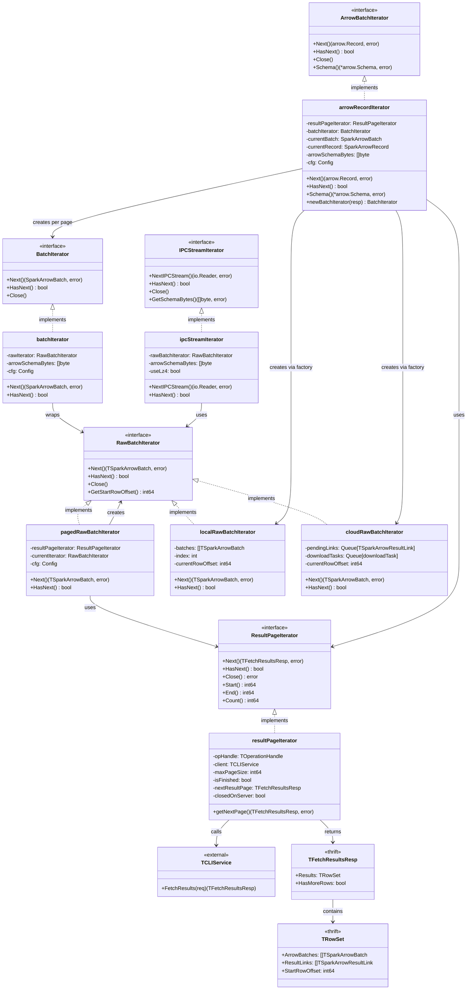
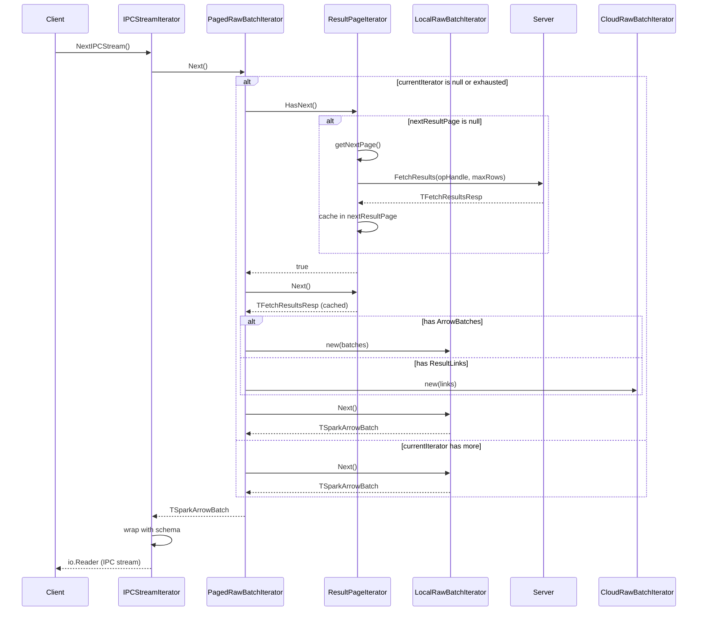
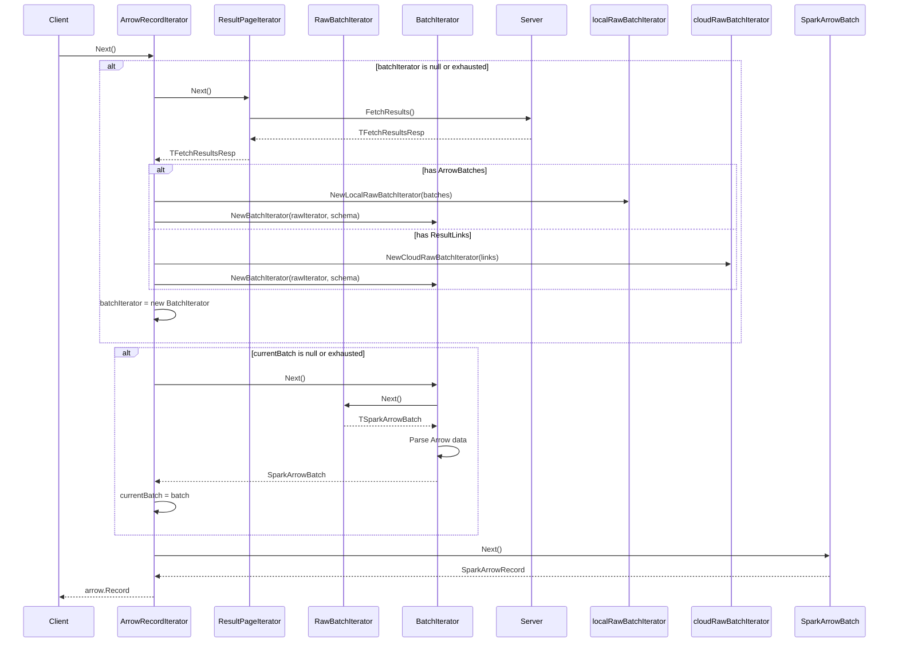

# Databricks SQL Go Driver - Pagination Architecture

## UML Class Diagram



## Sequence Diagram - How Pagination Works



## Component Interaction Flow

```mermaid
flowchart TB
    subgraph Server Side
        DB[(Database)]
        API[Thrift API<br/>FetchResults]
    end
    
    subgraph Client Side - Pagination Layer
        RPI[ResultPageIterator]
        RPI -->|fetches pages| API
        RPI -->|pre-fetches on HasNext| Cache[Page Cache]
    end
    
    subgraph Client Side - Raw Batch Layer
        PRBI[PagedRawBatchIterator]
        LRBI[LocalRawBatchIterator]
        CRBI[CloudRawBatchIterator]
        
        PRBI -->|uses| RPI
        PRBI -->|creates per page| LRBI
        PRBI -->|creates per page| CRBI
    end
    
    subgraph Client Side - Processing Layer
        BI[BatchIterator]
        IPCI[IPCStreamIterator]
        ARI[ArrowRecordIterator]
        
        BI -->|wraps| LRBI
        BI -->|wraps| CRBI
        IPCI -->|uses| PRBI
        ARI -->|uses| RPI
        ARI -->|creates| BI
    end
    
    subgraph Client Side - User API
        Rows[rows.GetIPCStreams()]
        ArrowAPI[rows.GetArrowBatches()]
        
        Rows -->|creates| IPCI
        ArrowAPI -->|creates| ARI
    end
```

## ArrowRecordIterator Flow (New Architecture)



## Key Design Patterns

1. **Iterator Pattern**: Multiple levels of iterators, each handling a specific concern
2. **Decorator Pattern**: BatchIterator decorates RawBatchIterator with parsing
3. **Strategy Pattern**: Different strategies for local vs cloud batch fetching
4. **Lazy Loading**: Pages fetched only when needed
5. **Pre-fetching**: HasNext() pre-fetches to check availability without consuming

## Benefits of This Architecture

- **Separation of Concerns**: Each layer handles one responsibility
- **Flexibility**: Easy to add new iterator types or change implementations
- **Performance**: Pre-fetching and lazy loading optimize network calls
- **Reusability**: Raw batch iterators can be used by multiple consumers