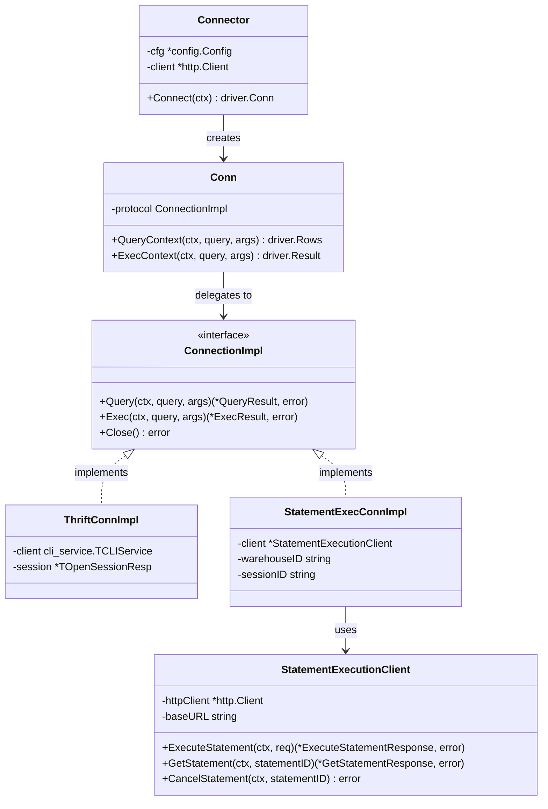
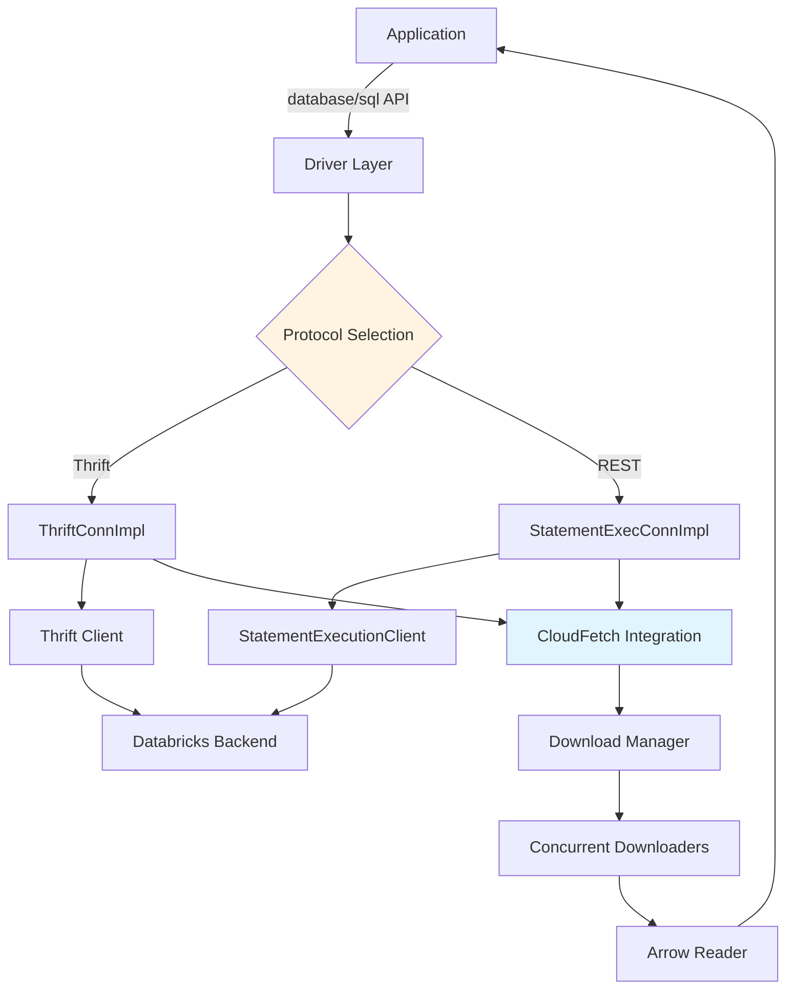
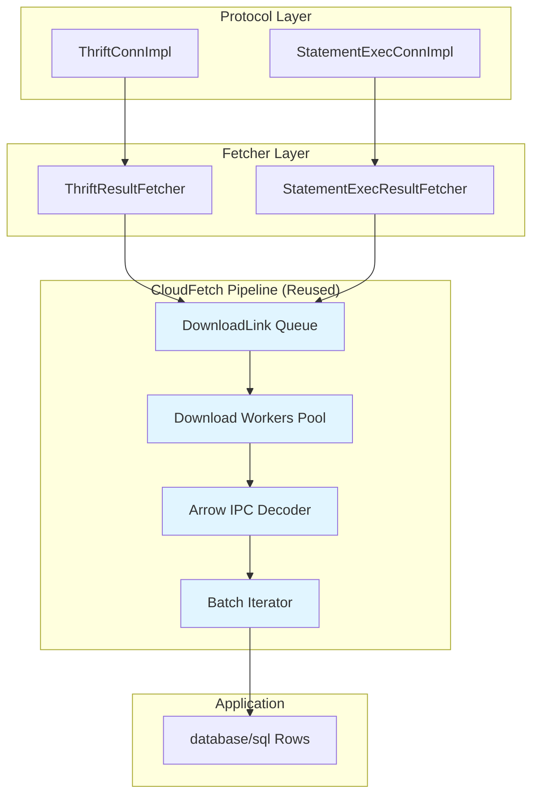
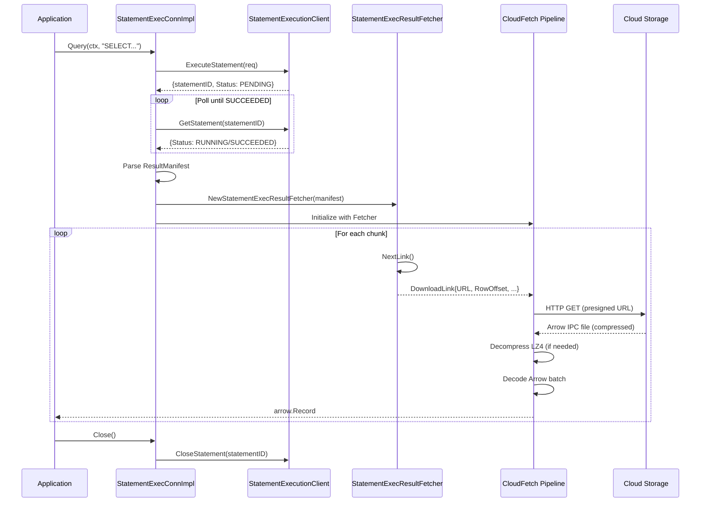
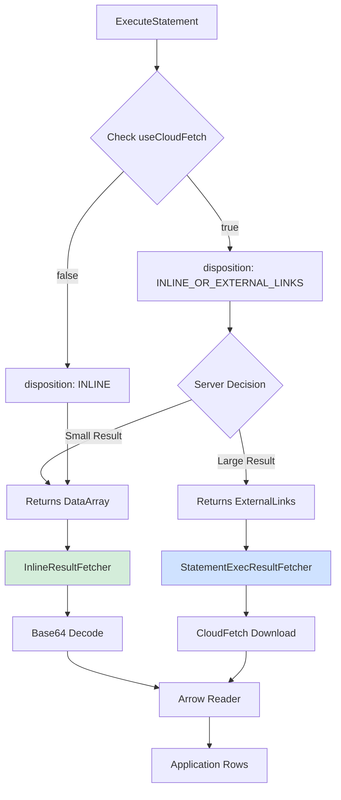
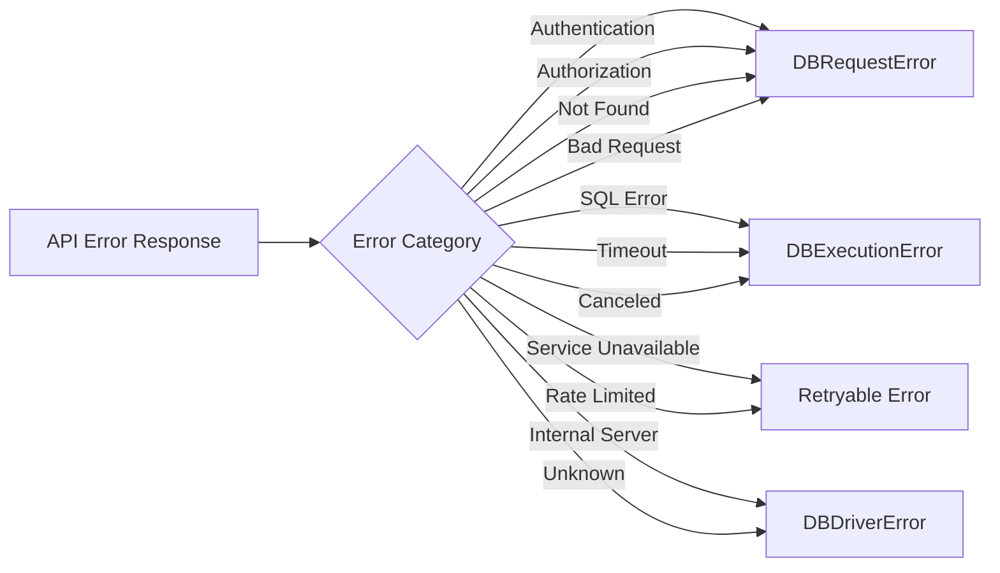
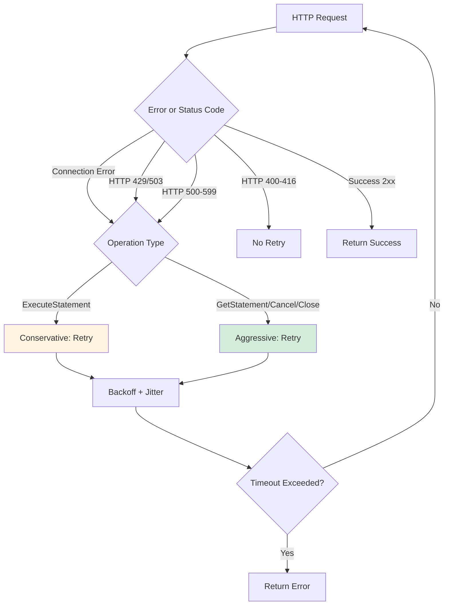
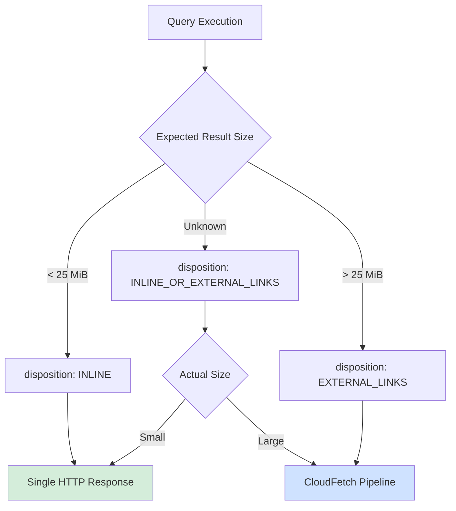

# Statement Execution API Integration Design for Databricks SQL Go Driver

## Table of Contents
1. [Overview](#overview)
2. [Architecture](#architecture)
3. [Component Design](#component-design)
4. [API Contracts](#api-contracts)
5. [Metadata Operations via SQL Commands](#metadata-operations-via-sql-commands)
6. [CloudFetch Integration](#cloudfetch-integration)
7. [Configuration](#configuration)
8. [Error Handling](#error-handling)
9. [Performance Considerations](#performance-considerations)
10. [Implementation Phases](#implementation-phases)
11. [Testing Strategy](#testing-strategy)
12. [Trade-offs and Alternatives](#trade-offs-and-alternatives)

---

## Overview

### Goals

This design adds **REST-based Statement Execution API** support to the Databricks SQL Go driver as an alternative to the existing Thrift/HS2 protocol, enabling:

1. **Protocol Selection**: Runtime choice between Thrift and REST via configuration
2. **Backward Compatibility**: Preserve all existing Thrift functionality
3. **Code Reuse**: Leverage existing CloudFetch pipeline for large results
4. **Performance**: Match or exceed Thrift performance characteristics
5. **Standards Compliance**: Maintain `database/sql/driver` interface contracts

### Why Statement Execution API?

The REST-based Statement Execution API provides:
- **Better scalability**: Stateless HTTP vs persistent Thrift connections
- **Simpler deployment**: Standard REST/JSON vs binary Thrift protocol
- **Modern tooling**: HTTP debugging, monitoring, and observability
- **Cloud-native**: Optimized for serverless and containerized workloads
- **Future-proof**: Platform direction for new Databricks features

### Non-Goals

- **Breaking changes**: No changes to public `database/sql` API
- **Thrift deprecation**: Thrift remains supported and default
- **Feature additions**: Only feature parity with existing capabilities
- **Backend changes**: Design is client-side only

---

## Architecture

### High-Level Design

The design implements a **Strategy Pattern** for protocol abstraction. The driver selects between Thrift and REST implementations based on configuration.



### Component Layers



### Key Architectural Principles

1. **Single Responsibility**: Each component has one clear purpose
2. **Open/Closed**: Easy to add new protocols without modifying existing code
3. **Interface Segregation**: Small, focused interfaces
4. **Dependency Inversion**: Depend on abstractions (interfaces), not implementations
5. **Don't Repeat Yourself**: Reuse CloudFetch pipeline, authentication, retry logic

---

## Component Design

### 1. Protocol Selection Layer

#### ConnectionImpl Interface

**Purpose**: Abstract protocol-specific connection operations

**Location**: `internal/connection/protocol.go` (new file)

```go
package connection

import (
    "context"
    "database/sql/driver"
)

// ConnectionImpl abstracts Thrift and REST protocol implementations
type ConnectionImpl interface {
    // Query executes a SELECT query and returns rows
    Query(ctx context.Context, query string, args []driver.NamedValue) (driver.Rows, error)

    // Exec executes a non-SELECT statement and returns result
    Exec(ctx context.Context, query string, args []driver.NamedValue) (driver.Result, error)

    // Ping validates the connection
    Ping(ctx context.Context) error

    // Close releases connection resources
    Close() error

    // GetCatalog returns current catalog
    GetCatalog() string

    // GetSchema returns current schema
    GetSchema() string

    // SetCatalog changes current catalog
    SetCatalog(ctx context.Context, catalog string) error

    // SetSchema changes current schema
    SetSchema(ctx context.Context, schema string) error
}
```

**Contract**:
- All methods are **context-aware** for cancellation and timeouts
- **Thread-safe**: Multiple goroutines may call methods concurrently
- **Non-blocking**: Long operations respect context cancellation
- **Error handling**: Returns `database/sql/driver` compatible errors

#### Modified Connection Type

**Location**: `connection.go`

```go
type conn struct {
    id       string
    cfg      *config.Config
    protocol connection.ConnectionImpl  // Strategy interface
}

func (c *conn) QueryContext(ctx context.Context, query string, args []driver.NamedValue) (driver.Rows, error) {
    return c.protocol.Query(ctx, query, args)
}

func (c *conn) ExecContext(ctx context.Context, query string, args []driver.NamedValue) (driver.Result, error) {
    return c.protocol.Exec(ctx, query, args)
}
```

**Benefits**:
- Clean separation of protocol logic
- Testable via mock implementations
- No changes to public API

---

### 2. Statement Execution Client

#### StatementExecutionClient Type

**Purpose**: HTTP client wrapper for Statement Execution API endpoints

**Location**: `internal/stmtexec/client.go` (new package)

```go
package stmtexec

import (
    "context"
    "encoding/json"
    "fmt"
    "net/http"
)

type StatementExecutionClient struct {
    httpClient *http.Client
    baseURL    string
    cfg        *config.Config
    logger     *logger.Logger
}

// NewStatementExecutionClient creates a REST API client
func NewStatementExecutionClient(httpClient *http.Client, host string, cfg *config.Config) *StatementExecutionClient {
    return &StatementExecutionClient{
        httpClient: httpClient,
        baseURL:    fmt.Sprintf("https://%s/api/2.0/sql/statements", host),
        cfg:        cfg,
        logger:     logger.WithContext("stmtexec"),
    }
}

// ExecuteStatement submits a SQL statement for execution
func (c *StatementExecutionClient) ExecuteStatement(ctx context.Context, req *ExecuteStatementRequest) (*ExecuteStatementResponse, error)

// GetStatement retrieves statement status and results
func (c *StatementExecutionClient) GetStatement(ctx context.Context, statementID string) (*GetStatementResponse, error)

// GetStatementResultChunkN retrieves chunk links starting from chunkIndex
// Server returns batch of links (may include multiple chunks i, i+1, i+2, ...)
// This reduces API calls compared to fetching one chunk at a time
func (c *StatementExecutionClient) GetStatementResultChunkN(ctx context.Context, statementID string, chunkIndex int) (*ChunkLinkResponse, error)

// CancelStatement cancels a running statement
func (c *StatementExecutionClient) CancelStatement(ctx context.Context, statementID string) error

// CloseStatement releases statement resources
func (c *StatementExecutionClient) CloseStatement(ctx context.Context, statementID string) error
```

**Contract**:
- **Automatic retries**: Uses existing `retryablehttp.Client` from driver
- **Authentication**: Transparently uses configured authenticator
- **Tracing**: Integrates with driver's correlation ID tracking
- **Error mapping**: Converts API errors to driver error types

**HTTP Client Implementation**:
- **Phase 1-4**: Uses standard synchronous `http.Client` (wrapped in `retryablehttp.Client`)
  - Same approach as current Thrift implementation
  - CloudFetch downloads use `http.DefaultClient` for cloud storage URLs
  - Proven pattern from existing production code
- **Phase 5** (Future Enhancement): Upgrade to async HTTP client
  - See [Future Enhancement #1: Async HTTP Client](#1-async-http-client-for-improved-io-performance)
  - Expected benefits: +15-25% CloudFetch throughput for large results
  - Optional optimization, not required for initial implementation

---

### 3. Statement Execution Connection Implementation

#### StatementExecConnImpl Type

**Purpose**: Implements `ConnectionImpl` for REST protocol

**Location**: `internal/stmtexec/connection.go` (new file)

```go
package stmtexec

type StatementExecConnImpl struct {
    client      *StatementExecutionClient
    warehouseID string
    sessionID   string  // Optional: for session-based execution
    catalog     string
    schema      string
    cfg         *config.Config
    connID      string
    logger      *logger.Logger
}

func NewStatementExecConnImpl(client *StatementExecutionClient, cfg *config.Config, connID string) (*StatementExecConnImpl, error) {
    if cfg.WarehouseID == "" {
        return nil, errors.New("warehouseID required for Statement Execution API")
    }

    return &StatementExecConnImpl{
        client:      client,
        warehouseID: cfg.WarehouseID,
        catalog:     cfg.Catalog,
        schema:      cfg.Schema,
        cfg:         cfg,
        connID:      connID,
        logger:      logger.WithContext("stmtexec.conn").With("connId", connID),
    }, nil
}

func (c *StatementExecConnImpl) Query(ctx context.Context, query string, args []driver.NamedValue) (driver.Rows, error)

func (c *StatementExecConnImpl) Exec(ctx context.Context, query string, args []driver.NamedValue) (driver.Result, error)
```

**Key Responsibilities**:
- Build `ExecuteStatementRequest` from query and parameters
- Poll for statement completion with exponential backoff
- Create `rows` instance for result iteration
- Handle disposition modes (INLINE vs EXTERNAL_LINKS)

---

### 4. Result Fetching Integration

#### ResultFetcher Interface (Refactored)

**Purpose**: Abstract result link source (Thrift vs REST manifest)

**Location**: `internal/rows/fetcher.go` (refactored)

```go
package rows

// ResultFetcher provides download links for cloud-fetched results
type ResultFetcher interface {
    // Start initializes the fetcher and begins producing links
    Start(ctx context.Context) error

    // NextLink returns the next download link or blocks until available
    // Returns io.EOF when no more links available
    NextLink(ctx context.Context) (*DownloadLink, error)

    // HasMore returns true if more links are expected
    HasMore() bool

    // Close releases fetcher resources
    Close() error
}
```

#### DownloadLink Type (Refactored)

**Purpose**: Protocol-agnostic representation of a downloadable result file

**Location**: `internal/rows/download.go` (refactored)

```go
package rows

import "time"

// DownloadLink represents a downloadable Arrow IPC file
type DownloadLink struct {
    // FileURL is the presigned cloud storage URL
    FileURL string

    // StartRowOffset is the row position in result set
    StartRowOffset int64

    // RowCount is the number of rows in this file
    RowCount int64

    // ByteCount is the file size in bytes
    ByteCount int64

    // ExpiryTime is when the URL expires
    ExpiryTime time.Time

    // Headers contains additional HTTP headers needed for download
    Headers map[string]string
}

// IsExpired checks if URL is expired or expiring soon
func (d *DownloadLink) IsExpired(bufferDuration time.Duration) bool {
    return time.Now().Add(bufferDuration).After(d.ExpiryTime)
}
```

**Factory Functions**:
```go
// FromThriftLink creates DownloadLink from Thrift result
func FromThriftLink(link *cli_service.TSparkArrowResultLink, rowOffset int64) *DownloadLink

// FromExternalLink creates DownloadLink from REST manifest
func FromExternalLink(link *ExternalLink, rowOffset int64) *DownloadLink
```

#### StatementExecResultFetcher Type

**Purpose**: Implements `ResultFetcher` for REST result manifests with batch link fetching optimization

**Location**: `internal/stmtexec/fetcher.go` (new file)

```go
package stmtexec

type StatementExecResultFetcher struct {
    client         *StatementExecutionClient
    statementID    string
    manifest       *ResultManifest

    // Batch link fetching optimization
    linkCache      []*ExternalLink  // Cached links from batch fetch
    cacheIndex     int              // Current position in cache
    nextChunkIndex int              // Next chunk to request from server

    rowOffset      int64
    cfg            *config.Config
    logger         *logger.Logger
    closed         bool
    mu             sync.Mutex
}

func NewStatementExecResultFetcher(
    client *StatementExecutionClient,
    statementID string,
    manifest *ResultManifest,
    cfg *config.Config,
) *StatementExecResultFetcher

func (f *StatementExecResultFetcher) Start(ctx context.Context) error

func (f *StatementExecResultFetcher) NextLink(ctx context.Context) (*rows.DownloadLink, error)

func (f *StatementExecResultFetcher) HasMore() bool

func (f *StatementExecResultFetcher) Close() error

// fetchNextBatch fetches chunk links starting from nextChunkIndex
// Server may return multiple chunk links (i, i+1, i+2, ...) for performance
func (f *StatementExecResultFetcher) fetchNextBatch(ctx context.Context) error
```

**Key Operations**:
1. Parse initial `ResultManifest` from API response
2. **Batch fetch optimization**: Use `GetStatementResultChunkN` API to fetch multiple chunk links at once
3. When requesting chunk index `i`, server returns links for chunks `i` to `i+x-1` (batch)
4. Cache batch results locally to avoid repeated API calls
5. Convert `ExternalLink` to `DownloadLink` on demand
6. Track row offsets across chunks

**Batch Link Fetching** (Performance Optimization):

```go
func (f *StatementExecResultFetcher) NextLink(ctx context.Context) (*rows.DownloadLink, error) {
    f.mu.Lock()
    defer f.mu.Unlock()

    if f.closed {
        return nil, fmt.Errorf("fetcher closed")
    }

    // Check if we need to fetch next batch from server
    if f.cacheIndex >= len(f.linkCache) {
        if f.nextChunkIndex >= f.manifest.TotalChunkCount {
            return nil, io.EOF
        }

        // Fetch batch of chunk links starting from nextChunkIndex
        // Server returns multiple links (i, i+1, i+2, ...) in single call
        if err := f.fetchNextBatch(ctx); err != nil {
            return nil, err
        }

        f.cacheIndex = 0  // Reset cache index
    }

    // Get link from cache
    link := f.linkCache[f.cacheIndex]
    f.cacheIndex++

    // Convert to DownloadLink
    downloadLink := &rows.DownloadLink{
        FileURL:        link.ExternalLinkURL,
        StartRowOffset: f.rowOffset,
        RowCount:       link.RowCount,
        ByteCount:      link.ByteCount,
        ExpiryTime:     parseISO8601(link.Expiration),
    }

    f.rowOffset += link.RowCount
    return downloadLink, nil
}

func (f *StatementExecResultFetcher) fetchNextBatch(ctx context.Context) error {
    // Call GetStatementResultChunkN API
    // GET /api/2.0/sql/statements/{statement_id}/result/chunks/{chunk_index}
    resp, err := f.client.GetStatementResultChunkN(ctx, f.statementID, f.nextChunkIndex)
    if err != nil {
        return fmt.Errorf("failed to fetch chunk links starting at %d: %w", f.nextChunkIndex, err)
    }

    // Server returns batch of links (may be multiple chunks)
    f.linkCache = resp.ExternalLinks

    if len(f.linkCache) == 0 {
        return fmt.Errorf("no links returned for chunk %d", f.nextChunkIndex)
    }

    // Update nextChunkIndex to highest returned chunk + 1
    maxChunkIndex := f.nextChunkIndex
    for _, link := range f.linkCache {
        if link.ChunkIndex > maxChunkIndex {
            maxChunkIndex = link.ChunkIndex
        }
    }
    f.nextChunkIndex = maxChunkIndex + 1

    f.logger.Debug("fetched chunk link batch",
        "startChunk", f.nextChunkIndex - len(f.linkCache),
        "endChunk", maxChunkIndex,
        "numLinks", len(f.linkCache))

    return nil
}
```

---

## API Contracts

### Request/Response Models

#### ExecuteStatementRequest

**Location**: `internal/stmtexec/models.go` (new file)

```go
package stmtexec

type ExecuteStatementRequest struct {
    // WarehouseID is the compute resource identifier (required)
    WarehouseID string `json:"warehouse_id"`

    // Statement is the SQL query to execute (required)
    Statement string `json:"statement"`

    // Catalog is the default catalog (optional)
    Catalog string `json:"catalog,omitempty"`

    // Schema is the default schema (optional)
    Schema string `json:"schema,omitempty"`

    // Parameters for parameterized queries (optional)
    Parameters []StatementParameter `json:"parameters,omitempty"`

    // Disposition controls result delivery mode (optional)
    // Values: "INLINE", "EXTERNAL_LINKS", "INLINE_OR_EXTERNAL_LINKS" (default)
    Disposition string `json:"disposition,omitempty"`

    // Format specifies result format (optional)
    // Values: "ARROW_STREAM" (default), "JSON_ARRAY"
    Format string `json:"format,omitempty"`

    // WaitTimeout is max time server waits before returning (optional)
    // If query completes within this time, results returned immediately (direct results)
    // If timeout reached, returns statement ID for polling
    // Format: "<n>s" where n is 5-50 (default: "10s"), or "0s" for immediate async
    // Example: "10s" waits up to 10 seconds
    WaitTimeout string `json:"wait_timeout,omitempty"`

    // OnWaitTimeout specifies behavior when WaitTimeout expires (optional)
    // Values: "CONTINUE" (default) - continue execution, return ID for polling
    //         "CANCEL" - cancel the statement
    OnWaitTimeout string `json:"on_wait_timeout,omitempty"`

    // ByteLimit limits inline result size (optional)
    ByteLimit int64 `json:"byte_limit,omitempty"`
}

type StatementParameter struct {
    Name  string      `json:"name"`            // Parameter name
    Value interface{} `json:"value"`           // Parameter value
    Type  string      `json:"type,omitempty"`  // SQL type hint
}
```

#### ExecuteStatementResponse

```go
type ExecuteStatementResponse struct {
    // StatementID uniquely identifies the statement
    StatementID string `json:"statement_id"`

    // Status contains execution state
    Status *StatementStatus `json:"status"`

    // Manifest contains result metadata (when Status.State = "SUCCEEDED")
    Manifest *ResultManifest `json:"manifest,omitempty"`

    // Result contains direct result data when query completes within wait_timeout
    // Present when disposition is INLINE or INLINE_OR_EXTERNAL_LINKS and result is small
    // This is the "direct results" optimization - results returned immediately
    Result *ResultData `json:"result,omitempty"`
}

// ResultData contains inline Arrow result bytes (direct results)
type ResultData struct {
    // ChunkIndex for this result chunk
    ChunkIndex int `json:"chunk_index,omitempty"`

    // RowOffset starting position in result set
    RowOffset int64 `json:"row_offset,omitempty"`

    // RowCount number of rows in this chunk
    RowCount int64 `json:"row_count,omitempty"`

    // DataArray contains base64-encoded Arrow IPC bytes
    // This is the "attachment" that JDBC checks for direct results
    DataArray string `json:"data_array,omitempty"`
}

type StatementStatus struct {
    // State indicates execution state
    // Values: "PENDING", "RUNNING", "SUCCEEDED", "FAILED", "CANCELED", "CLOSED"
    State string `json:"state"`

    // Error contains error details (when State = "FAILED")
    Error *StatementError `json:"error,omitempty"`
}

type StatementError struct {
    // ErrorCode is the Databricks error code
    ErrorCode string `json:"error_code"`

    // Message is human-readable error description
    Message string `json:"message"`

    // SqlState is ANSI SQL state code
    SqlState string `json:"sql_state,omitempty"`
}
```

#### ResultManifest

```go
type ResultManifest struct {
    // Format specifies result format ("ARROW_STREAM" or "JSON_ARRAY")
    Format string `json:"format"`

    // Schema contains column definitions
    Schema *ResultSchema `json:"schema"`

    // TotalChunkCount is the number of result chunks
    TotalChunkCount int `json:"total_chunk_count"`

    // TotalRowCount is total rows in result set
    TotalRowCount int64 `json:"total_row_count"`

    // TotalByteCount is total bytes in result set
    TotalByteCount int64 `json:"total_byte_count,omitempty"`

    // Chunks contains chunk metadata
    Chunks []*ResultChunk `json:"chunks"`

    // Truncated indicates if results were truncated
    Truncated bool `json:"truncated,omitempty"`
}

type ResultChunk struct {
    // ChunkIndex is the sequence number (0-based)
    ChunkIndex int `json:"chunk_index"`

    // RowCount is rows in this chunk
    RowCount int64 `json:"row_count"`

    // RowOffset is starting row position
    RowOffset int64 `json:"row_offset"`

    // ByteCount is chunk size in bytes
    ByteCount int64 `json:"byte_count,omitempty"`

    // ExternalLinks contains download URLs (for EXTERNAL_LINKS disposition)
    ExternalLinks []*ExternalLink `json:"external_links,omitempty"`

    // DataArray contains inline Arrow IPC data (for INLINE disposition)
    // Base64-encoded Arrow IPC stream bytes
    DataArray string `json:"data_array,omitempty"`
}

type ExternalLink struct {
    // ExternalLinkURL is the presigned download URL
    ExternalLinkURL string `json:"external_link"`

    // Expiration is ISO 8601 timestamp when URL expires
    Expiration string `json:"expiration"`

    // ChunkIndex identifies the chunk (matches parent ResultChunk)
    ChunkIndex int `json:"chunk_index"`

    // RowCount is rows in this link
    RowCount int64 `json:"row_count"`

    // ByteCount is file size
    ByteCount int64 `json:"byte_count"`
}

type ResultSchema struct {
    // ColumnCount is the number of columns
    ColumnCount int `json:"column_count"`

    // Columns contains column metadata
    Columns []*ColumnInfo `json:"columns"`
}

type ColumnInfo struct {
    // Name is the column name
    Name string `json:"name"`

    // TypeText is the SQL type (e.g., "INT", "STRING", "DECIMAL(10,2)")
    TypeText string `json:"type_text"`

    // TypeName is the type category (e.g., "INT", "STRING", "DECIMAL")
    TypeName string `json:"type_name"`

    // Position is 0-based column index
    Position int `json:"position"`

    // Nullable indicates if column accepts nulls
    Nullable bool `json:"nullable,omitempty"`

    // Precision for DECIMAL types
    Precision int `json:"precision,omitempty"`

    // Scale for DECIMAL types
    Scale int `json:"scale,omitempty"`
}
```

#### ChunkLinkResponse

Response from `GetStatementResultChunkN` API containing batch of chunk links:

```go
type ChunkLinkResponse struct {
    // ExternalLinks contains batch of download URLs
    // Server may return links for multiple chunks (i, i+1, i+2, ...) in single response
    // This is a performance optimization to reduce API calls
    ExternalLinks []*ExternalLink `json:"external_links"`

    // NextChunkIndex indicates the next chunk to request (optional)
    // If present, more chunks are available; if absent, all chunks fetched
    NextChunkIndex int `json:"next_chunk_index,omitempty"`
}
```

**API Endpoint**: `GET /api/2.0/sql/statements/{statement_id}/result/chunks/{chunk_index}`

**Example Response**:
```json
{
  "external_links": [
    {
      "external_link": "https://s3.amazonaws.com/bucket/chunk_0",
      "expiration": "2025-01-08T12:00:00Z",
      "chunk_index": 0,
      "row_count": 1000000,
      "byte_count": 10485760
    },
    {
      "external_link": "https://s3.amazonaws.com/bucket/chunk_1",
      "expiration": "2025-01-08T12:00:00Z",
      "chunk_index": 1,
      "row_count": 1000000,
      "byte_count": 10485760
    },
    {
      "external_link": "https://s3.amazonaws.com/bucket/chunk_2",
      "expiration": "2025-01-08T12:00:00Z",
      "chunk_index": 2,
      "row_count": 500000,
      "byte_count": 5242880
    }
  ],
  "next_chunk_index": 3
}
```

---

## Metadata Operations via SQL Commands

### Overview

Unlike Thrift/HS2 protocol which provides dedicated RPC methods for metadata operations (e.g., `GetTables`, `GetColumns`, `GetSchemas`), the Statement Execution API **does not have dedicated metadata endpoints**. Instead, metadata must be retrieved by executing SQL commands through the standard `ExecuteStatement` API.

This approach is used by OSS JDBC (see [DatabricksMetadataSdkClient](https://github.com/databricks/databricks-jdbc/blob/4d13570e5b75c54a0826fc183f7c11dcbb41ee35/src/main/java/com/databricks/jdbc/dbclient/impl/sqlexec/DatabricksMetadataSdkClient.java)) and provides equivalent functionality while maintaining REST API simplicity.

### SQL Command Patterns

#### GetCatalogs

Retrieves list of catalogs available to the user.

**SQL Command**:
```sql
SHOW CATALOGS
```

**Result Schema**:
- `catalog` (STRING): Catalog name

**Alternative using INFORMATION_SCHEMA**:
```sql
SELECT catalog_name
FROM system.information_schema.catalogs
ORDER BY catalog_name
```

#### GetSchemas

Retrieves schemas in a catalog.

**SQL Command**:
```sql
SHOW SCHEMAS IN <catalog>
```

**Result Schema**:
- `databaseName` (STRING): Schema name

**Example**:
```sql
SHOW SCHEMAS IN main
```

**Alternative using INFORMATION_SCHEMA**:
```sql
SELECT schema_name
FROM system.information_schema.schemata
WHERE catalog_name = '<catalog>'
ORDER BY schema_name
```

#### GetTables

Retrieves tables in a schema with optional filtering.

**SQL Command**:
```sql
SHOW TABLES [IN <catalog>.<schema>]
```

**Result Schema**:
- `database` (STRING): Schema name
- `tableName` (STRING): Table name
- `isTemporary` (BOOLEAN): Is temporary table

**Examples**:
```sql
-- All tables in a schema
SHOW TABLES IN main.default

-- Filter by pattern (use WHERE clause post-processing)
SHOW TABLES IN main.default
```

**Alternative using INFORMATION_SCHEMA**:
```sql
SELECT
    table_catalog,
    table_schema,
    table_name,
    table_type
FROM system.information_schema.tables
WHERE table_catalog = '<catalog>'
  AND table_schema = '<schema>'
  AND table_type IN ('BASE TABLE', 'VIEW')
ORDER BY table_name
```

**Table Type Filtering**:
- Tables: `table_type = 'BASE TABLE'`
- Views: `table_type = 'VIEW'`
- Both: `table_type IN ('BASE TABLE', 'VIEW')`

#### GetColumns

Retrieves column information for a table.

**SQL Command**:
```sql
SHOW COLUMNS IN <catalog>.<schema>.<table>
```

**Result Schema**:
- `col_name` (STRING): Column name
- `data_type` (STRING): Column type
- `comment` (STRING): Column comment

**Example**:
```sql
SHOW COLUMNS IN main.default.my_table
```

**Alternative using INFORMATION_SCHEMA**:
```sql
SELECT
    column_name,
    data_type,
    is_nullable,
    column_default,
    ordinal_position,
    numeric_precision,
    numeric_scale
FROM system.information_schema.columns
WHERE table_catalog = '<catalog>'
  AND table_schema = '<schema>'
  AND table_name = '<table>'
ORDER BY ordinal_position
```

#### GetTableTypes

Retrieves supported table types.

**Static Response** (no SQL query needed):
```go
var standardTableTypes = []string{
    "TABLE",
    "VIEW",
    "SYSTEM TABLE",
    "GLOBAL TEMPORARY",
    "LOCAL TEMPORARY",
    "ALIAS",
    "SYNONYM",
}
```

### Implementation Design

#### MetadataClient Interface

**Location**: `internal/metadata/client.go` (new file)

```go
package metadata

import (
    "context"
    "database/sql/driver"
)

// MetadataClient provides metadata operations
type MetadataClient interface {
    // GetCatalogs retrieves available catalogs
    GetCatalogs(ctx context.Context) (driver.Rows, error)

    // GetSchemas retrieves schemas in a catalog
    GetSchemas(ctx context.Context, catalog string, schemaPattern string) (driver.Rows, error)

    // GetTables retrieves tables in a schema
    GetTables(ctx context.Context, catalog string, schema string, tablePattern string, tableTypes []string) (driver.Rows, error)

    // GetColumns retrieves columns for a table
    GetColumns(ctx context.Context, catalog string, schema string, table string, columnPattern string) (driver.Rows, error)

    // GetTableTypes retrieves supported table types
    GetTableTypes(ctx context.Context) (driver.Rows, error)
}
```

#### StatementExecMetadataClient Implementation

**Location**: `internal/stmtexec/metadata.go` (new file)

```go
package stmtexec

import (
    "context"
    "database/sql/driver"
    "fmt"
    "strings"
)

type StatementExecMetadataClient struct {
    conn *StatementExecConnImpl
}

func NewStatementExecMetadataClient(conn *StatementExecConnImpl) *StatementExecMetadataClient {
    return &StatementExecMetadataClient{conn: conn}
}

// GetCatalogs executes "SHOW CATALOGS" and returns result
func (m *StatementExecMetadataClient) GetCatalogs(ctx context.Context) (driver.Rows, error) {
    query := "SHOW CATALOGS"
    return m.conn.Query(ctx, query, nil)
}

// GetSchemas executes "SHOW SCHEMAS IN <catalog>" and filters by pattern
func (m *StatementExecMetadataClient) GetSchemas(ctx context.Context, catalog string, schemaPattern string) (driver.Rows, error) {
    var query string

    if catalog == "" {
        // Use current catalog
        query = "SHOW SCHEMAS"
    } else {
        // Escape catalog identifier
        query = fmt.Sprintf("SHOW SCHEMAS IN `%s`", escapeIdentifier(catalog))
    }

    rows, err := m.conn.Query(ctx, query, nil)
    if err != nil {
        return nil, err
    }

    // Filter by pattern if provided (SQL LIKE pattern)
    if schemaPattern != "" && schemaPattern != "%" {
        return &filteredRows{
            rows:    rows,
            filter:  newPatternFilter(schemaPattern),
            colIdx:  0, // schema name is first column
        }, nil
    }

    return rows, nil
}

// GetTables executes "SHOW TABLES IN <catalog>.<schema>" and filters
func (m *StatementExecMetadataClient) GetTables(ctx context.Context, catalog string, schema string, tablePattern string, tableTypes []string) (driver.Rows, error) {
    var query string

    if catalog != "" && schema != "" {
        query = fmt.Sprintf("SHOW TABLES IN `%s`.`%s`",
            escapeIdentifier(catalog),
            escapeIdentifier(schema))
    } else if schema != "" {
        query = fmt.Sprintf("SHOW TABLES IN `%s`", escapeIdentifier(schema))
    } else {
        query = "SHOW TABLES"
    }

    rows, err := m.conn.Query(ctx, query, nil)
    if err != nil {
        return nil, err
    }

    // Apply filters if needed
    if tablePattern != "" || len(tableTypes) > 0 {
        return &filteredRows{
            rows:       rows,
            filter:     newTableFilter(tablePattern, tableTypes),
            colIdx:     1, // table name is second column
        }, nil
    }

    return rows, nil
}

// GetColumns executes "SHOW COLUMNS IN <catalog>.<schema>.<table>"
func (m *StatementExecMetadataClient) GetColumns(ctx context.Context, catalog string, schema string, table string, columnPattern string) (driver.Rows, error) {
    // Build fully qualified table name
    var tableName string
    if catalog != "" && schema != "" {
        tableName = fmt.Sprintf("`%s`.`%s`.`%s`",
            escapeIdentifier(catalog),
            escapeIdentifier(schema),
            escapeIdentifier(table))
    } else if schema != "" {
        tableName = fmt.Sprintf("`%s`.`%s`",
            escapeIdentifier(schema),
            escapeIdentifier(table))
    } else {
        tableName = fmt.Sprintf("`%s`", escapeIdentifier(table))
    }

    query := fmt.Sprintf("SHOW COLUMNS IN %s", tableName)

    rows, err := m.conn.Query(ctx, query, nil)
    if err != nil {
        return nil, err
    }

    // Filter by column pattern if provided
    if columnPattern != "" && columnPattern != "%" {
        return &filteredRows{
            rows:    rows,
            filter:  newPatternFilter(columnPattern),
            colIdx:  0, // column name is first column
        }, nil
    }

    return rows, nil
}

// GetTableTypes returns static list of supported table types
func (m *StatementExecMetadataClient) GetTableTypes(ctx context.Context) (driver.Rows, error) {
    // Return static list as in-memory rows
    types := []string{
        "TABLE",
        "VIEW",
        "SYSTEM TABLE",
        "GLOBAL TEMPORARY",
        "LOCAL TEMPORARY",
        "ALIAS",
        "SYNONYM",
    }

    return newStaticRows([]string{"TABLE_TYPE"}, types), nil
}

// escapeIdentifier escapes backticks in identifiers
func escapeIdentifier(id string) string {
    return strings.ReplaceAll(id, "`", "``")
}
```

#### Pattern Filtering

For patterns (e.g., `"sales%"` for table names starting with "sales"), implement client-side filtering:

```go
// patternFilter applies SQL LIKE pattern matching
type patternFilter struct {
    pattern string
}

func newPatternFilter(pattern string) *patternFilter {
    return &patternFilter{pattern: pattern}
}

func (f *patternFilter) match(value string) bool {
    // Convert SQL LIKE pattern to Go regex
    // % -> .*
    // _ -> .
    // Escape other regex special chars

    if f.pattern == "%" {
        return true // Match all
    }

    regex := convertLikeToRegex(f.pattern)
    matched, _ := regexp.MatchString(regex, value)
    return matched
}

func convertLikeToRegex(pattern string) string {
    // Escape regex special characters except % and _
    escaped := regexp.QuoteMeta(pattern)

    // Replace % with .*
    escaped = strings.ReplaceAll(escaped, "\\%", ".*")

    // Replace _ with .
    escaped = strings.ReplaceAll(escaped, "\\_", ".")

    // Anchor pattern
    return "^" + escaped + "$"
}

// filteredRows wraps driver.Rows and filters results
type filteredRows struct {
    rows   driver.Rows
    filter *patternFilter
    colIdx int // Column index to filter on
}

func (f *filteredRows) Columns() []string {
    return f.rows.Columns()
}

func (f *filteredRows) Close() error {
    return f.rows.Close()
}

func (f *filteredRows) Next(dest []driver.Value) error {
    for {
        err := f.rows.Next(dest)
        if err != nil {
            return err
        }

        // Check if value matches filter
        value, ok := dest[f.colIdx].(string)
        if !ok || f.filter.match(value) {
            return nil // Match found
        }

        // No match, continue to next row
    }
}
```

#### Static Result Rows

For operations like `GetTableTypes` that return static data:

```go
// staticRows provides in-memory rows for static results
type staticRows struct {
    columns []string
    data    [][]driver.Value
    index   int
}

func newStaticRows(columns []string, values []string) *staticRows {
    data := make([][]driver.Value, len(values))
    for i, v := range values {
        data[i] = []driver.Value{v}
    }

    return &staticRows{
        columns: columns,
        data:    data,
        index:   -1,
    }
}

func (s *staticRows) Columns() []string {
    return s.columns
}

func (s *staticRows) Close() error {
    return nil
}

func (s *staticRows) Next(dest []driver.Value) error {
    s.index++
    if s.index >= len(s.data) {
        return io.EOF
    }

    copy(dest, s.data[s.index])
    return nil
}
```

### Integration with Connection

Update `StatementExecConnImpl` to expose metadata operations:

```go
type StatementExecConnImpl struct {
    client       *StatementExecutionClient
    warehouseID  string
    sessionID    string
    metadata     *StatementExecMetadataClient
    // ... other fields ...
}

func NewStatementExecConnImpl(client *StatementExecutionClient, warehouseID string) *StatementExecConnImpl {
    conn := &StatementExecConnImpl{
        client:      client,
        warehouseID: warehouseID,
        // ... initialize other fields ...
    }

    // Initialize metadata client
    conn.metadata = NewStatementExecMetadataClient(conn)

    return conn
}

// Expose metadata operations (if needed by driver interface)
func (c *StatementExecConnImpl) GetMetadata() *StatementExecMetadataClient {
    return c.metadata
}
```

### Performance Considerations

#### Caching Strategy

Metadata queries can be expensive. Consider implementing caching:

```go
type CachedMetadataClient struct {
    underlying MetadataClient
    cache      *ttlcache.Cache
    ttl        time.Duration
}

func (c *CachedMetadataClient) GetCatalogs(ctx context.Context) (driver.Rows, error) {
    key := "catalogs"

    if cached, found := c.cache.Get(key); found {
        return cached.(driver.Rows), nil
    }

    rows, err := c.underlying.GetCatalogs(ctx)
    if err != nil {
        return nil, err
    }

    c.cache.SetWithTTL(key, rows, c.ttl)
    return rows, nil
}
```

**Cache TTL Recommendations**:
- Catalogs: 5 minutes (rarely change)
- Schemas: 5 minutes (rarely change)
- Tables: 1 minute (moderate change frequency)
- Columns: 30 seconds (can change with ALTER TABLE)

#### Batch Fetching

For operations that need multiple metadata queries (e.g., getting all tables across all schemas), consider batch optimization:

```go
// GetAllTables retrieves tables from all schemas in a catalog
func (m *StatementExecMetadataClient) GetAllTables(ctx context.Context, catalog string) ([]TableInfo, error) {
    // Alternative: use INFORMATION_SCHEMA for more efficient batch query
    query := fmt.Sprintf(`
        SELECT table_catalog, table_schema, table_name, table_type
        FROM system.information_schema.tables
        WHERE table_catalog = '%s'
        ORDER BY table_schema, table_name
    `, catalog)

    rows, err := m.conn.Query(ctx, query, nil)
    if err != nil {
        return nil, err
    }
    defer rows.Close()

    // Process results...
}
```

### Error Handling

Handle common metadata operation errors:

```go
func (m *StatementExecMetadataClient) GetTables(ctx context.Context, catalog string, schema string, tablePattern string, tableTypes []string) (driver.Rows, error) {
    rows, err := m.executeMetadataQuery(ctx, catalog, schema)
    if err != nil {
        // Check for common errors
        if isPermissionDenied(err) {
            return nil, fmt.Errorf("insufficient permissions to access schema %s.%s: %w", catalog, schema, err)
        }
        if isNotFound(err) {
            // Return empty result instead of error
            return newEmptyRows([]string{"database", "tableName", "isTemporary"}), nil
        }
        return nil, err
    }

    return rows, nil
}
```

### Testing Metadata Operations

```go
func TestMetadataClient_GetCatalogs(t *testing.T) {
    // Mock server
    server := httptest.NewServer(http.HandlerFunc(func(w http.ResponseWriter, r *http.Request) {
        // Return mock SHOW CATALOGS result
        resp := ExecuteStatementResponse{
            StatementID: "stmt-123",
            Status:      &StatementStatus{State: "SUCCEEDED"},
            Manifest: &ResultManifest{
                Schema: &ResultSchema{
                    Columns: []*ColumnInfo{
                        {Name: "catalog", TypeText: "STRING", Position: 0},
                    },
                },
                Chunks: []*ResultChunk{
                    {
                        ChunkIndex: 0,
                        DataArray:  base64.StdEncoding.EncodeToString(mockArrowData),
                    },
                },
            },
        }
        json.NewEncoder(w).Encode(resp)
    }))
    defer server.Close()

    // Test client
    conn := newTestConnection(server.URL)
    metadata := NewStatementExecMetadataClient(conn)

    rows, err := metadata.GetCatalogs(context.Background())
    require.NoError(t, err)
    defer rows.Close()

    // Verify results
    assert.True(t, rows.Next())
    var catalog string
    rows.Scan(&catalog)
    assert.Equal(t, "main", catalog)
}
```

---

## CloudFetch Integration

### Reuse Strategy

The existing CloudFetch pipeline is **fully reused** with minimal refactoring. Both Thrift and REST protocols feed into the same download and reader infrastructure.

### CloudFetch Architecture



### Integration Flow



### Refactoring Changes

#### Current State (Thrift-Coupled)

**File**: `internal/rows/arrowbased/batchloader.go`

The current implementation directly uses Thrift types:
```go
type cloudIPCStreamIterator struct {
    pendingLinks   Queue[cli_service.TSparkArrowResultLink]  // Thrift-specific!
    downloadTasks  Queue[cloudFetchDownloadTask]
}
```

#### Target State (Protocol-Agnostic)

**File**: `internal/rows/fetcher.go` (refactored)

```go
// ResultFetcher produces download links (protocol-agnostic)
type ResultFetcher interface {
    Start(ctx context.Context) error
    NextLink(ctx context.Context) (*DownloadLink, error)
    HasMore() bool
    Close() error
}

// DownloadLink is protocol-agnostic
type DownloadLink struct {
    FileURL        string
    StartRowOffset int64
    RowCount       int64
    ByteCount      int64
    ExpiryTime     time.Time
    Headers        map[string]string
}
```

**File**: `internal/rows/arrowbased/batchloader.go` (refactored)

```go
type cloudIPCStreamIterator struct {
    ctx         context.Context
    fetcher     ResultFetcher  // Protocol-agnostic interface!
    downloads   Queue[*cloudFetchDownloadTask]  // Queue of pointers
    cfg         *config.Config
}

func (bi *cloudIPCStreamIterator) Next() (io.Reader, error) {
    // Maintain MaxDownloadThreads concurrent downloads
    // Start new downloads while we have capacity and more links available
    for bi.downloads.Len() < bi.cfg.MaxDownloadThreads && bi.fetcher.HasMore() {
        link, err := bi.fetcher.NextLink(bi.ctx)
        if err != nil && err != io.EOF {
            return nil, err
        }
        if err == io.EOF {
            break
        }

        // Launch download task in background
        task := newDownloadTask(link, bi.cfg)
        task.Start()  // Starts goroutine
        bi.downloads.Enqueue(task)
    }

    // Wait for the OLDEST task (front of queue) to complete
    // This allows newly enqueued tasks to download in parallel
    if bi.downloads.Len() == 0 {
        return nil, io.EOF
    }

    oldestTask := bi.downloads.Dequeue()  // Get task that's been downloading longest
    if oldestTask == nil {
        return nil, io.EOF
    }

    data, err := oldestTask.GetResult()    // Block until this specific task completes

    // On error, cancel remaining tasks
    if err != nil {
        bi.Close()
        return nil, err
    }

    return data, nil
}
```

### Design Validation

✅ **This refactoring has been validated against the current production implementation** in [databricks-sql-go](https://github.com/databricks/databricks-sql-go/blob/main/internal/rows/arrowbased/batchloader.go).

**Key Design Decisions Validated**:

1. **Queue-based Parallelism** ✅
   - Current: `for (bi.downloadTasks.Len() < bi.cfg.MaxDownloadThreads)`
   - Design: Same pattern maintained
   - Validation: Proven production pattern preserved

2. **FIFO Task Dequeue with Nil Check** ✅
   - Current: `task := bi.downloadTasks.Dequeue()` + nil check → wait for oldest
   - Design: `oldestTask := bi.downloads.Dequeue()` + nil check → same approach
   - Validation: Correct parallel download pattern with defensive nil check

3. **Task Execution Model** ✅
   - Current: `task.Run()` spawns goroutine → `task.GetResult()` blocks on channel
   - Design: Same pattern (not `Wait()`, uses `GetResult()` to match current)
   - Validation: Matches existing implementation

4. **Memory Buffering** ✅
   - Current: `io.ReadAll(getReader(data, useLz4Compression))` → `bytes.NewReader(buf)`
   - Design: Same approach documented
   - Validation: Maintains proven memory management pattern

5. **Error Handling** ✅
   - Current: On error, `bi.Close()` cancels remaining tasks
   - Design: Same approach
   - Validation: Correct cleanup behavior

6. **HTTP Client** ✅
   - Current: `http.DefaultClient` for cloud storage downloads
   - Design: Same for Phase 1-4, async HTTP in Phase 5
   - Validation: Aligned with production code

**Refactoring Impact**: Minimal - only adds abstraction layer without changing core logic.

### Benefits of Refactoring

1. **Zero duplication**: CloudFetch pipeline unchanged
2. **Type safety**: Interface-based design catches errors at compile time
3. **Testability**: Easy to mock `ResultFetcher` for testing
4. **Extensibility**: Future protocols can implement `ResultFetcher`

---

## Inline Result Handling (useCloudFetch=false)

### Overview

When `useCloudFetch=false`, results are returned **inline** in the API response instead of via presigned cloud storage URLs. This mode is useful for:

- **Small result sets** (< 10 MB): Faster with no download overhead
- **Testing/debugging**: Simpler flow without cloud storage
- **Network-restricted environments**: No cloud storage access required
- **Compliance**: Data never touches cloud storage

### Configuration Mapping

The `useCloudFetch` configuration parameter maps directly to the Statement Execution API's `disposition` parameter:

| useCloudFetch | Disposition | Behavior |
|---------------|-------------|----------|
| `true` (default) | `"INLINE_OR_EXTERNAL_LINKS"` | Server decides based on result size |
| `false` | `"INLINE"` | Forces inline results (fails if > 25 MiB) |

**Implementation**:

**Location**: `internal/stmtexec/connection.go`

```go
func (c *StatementExecConnImpl) buildExecuteRequest(query string, args []driver.NamedValue) (*ExecuteStatementRequest, error) {
    req := &ExecuteStatementRequest{
        WarehouseID: c.warehouseID,
        Statement:   query,
        Catalog:     c.catalog,
        Schema:      c.schema,
        Format:      "ARROW_STREAM",
    }

    // Map useCloudFetch to disposition
    if c.cfg.UseCloudFetch {
        req.Disposition = "INLINE_OR_EXTERNAL_LINKS"  // Let server optimize
    } else {
        req.Disposition = "INLINE"  // Force inline, fail if too large
    }

    // Set wait_timeout for direct results optimization
    // Default: 10s (matches OSS JDBC behavior)
    // Server waits up to this duration - if query completes, returns results immediately
    // If timeout reached, returns statement ID for polling
    if c.cfg.WaitTimeout > 0 {
        req.WaitTimeout = fmt.Sprintf("%ds", int(c.cfg.WaitTimeout.Seconds()))
    } else {
        req.WaitTimeout = "10s"  // Default 10 seconds
    }

    // Set on_wait_timeout behavior (default: CONTINUE)
    req.OnWaitTimeout = "CONTINUE"  // Continue execution if timeout reached

    // Convert parameters
    if len(args) > 0 {
        params, err := c.convertParameters(args)
        if err != nil {
            return nil, err
        }
        req.Parameters = params
    }

    return req, nil
}
```

### Inline Response Structure

When `disposition=INLINE`, the server returns Arrow data directly in the `ResultChunk`:

```go
type ExecuteStatementResponse struct {
    StatementID string              `json:"statement_id"`
    Status      *StatementStatus    `json:"status"`
    Manifest    *ResultManifest     `json:"manifest"`
}

type ResultChunk struct {
    ChunkIndex int    `json:"chunk_index"`
    RowCount   int64  `json:"row_count"`
    RowOffset  int64  `json:"row_offset"`

    // For INLINE disposition: base64-encoded Arrow IPC bytes
    DataArray  string `json:"data_array,omitempty"`

    // For EXTERNAL_LINKS disposition: presigned URLs
    ExternalLinks []*ExternalLink `json:"external_links,omitempty"`
}
```

### Result Type Detection

**Location**: `internal/stmtexec/connection.go`

```go
func (c *StatementExecConnImpl) Query(ctx context.Context, query string, args []driver.NamedValue) (driver.Rows, error) {
    // Build and execute request with wait_timeout
    req, err := c.buildExecuteRequest(query, args)
    if err != nil {
        return nil, err
    }

    resp, err := c.executeAndWait(ctx, req)
    if err != nil {
        return nil, err
    }

    // Determine result type based on what the server returned
    // Priority order matches JDBC implementation:
    // 1. Direct results (Result field - query completed within wait_timeout)
    // 2. Inline results (DataArray in chunks)
    // 3. External links (CloudFetch)

    // Check for direct results first (INLINE_OR_EXTERNAL_LINKS optimization)
    if resp.Result != nil && resp.Result.DataArray != "" {
        // DIRECT RESULTS: Query completed within wait_timeout
        // This is the "attachment" that JDBC checks for
        c.logger.Debug("using direct results",
            "rowCount", resp.Result.RowCount,
            "bytes", len(resp.Result.DataArray))
        return c.createDirectResultRows(ctx, resp.Result, resp.Manifest.Schema)
    }

    // Check manifest for chunked results
    if resp.Manifest == nil || len(resp.Manifest.Chunks) == 0 {
        // Empty result set
        return c.createEmptyRows(resp.Manifest.Schema)
    }

    firstChunk := resp.Manifest.Chunks[0]

    if firstChunk.DataArray != "" {
        // INLINE: Results embedded in chunks (useCloudFetch=false)
        c.logger.Debug("using inline chunk results", "chunks", len(resp.Manifest.Chunks))
        return c.createInlineRows(ctx, resp.Manifest)
    } else if len(firstChunk.ExternalLinks) > 0 {
        // EXTERNAL_LINKS: CloudFetch pipeline (large results)
        c.logger.Debug("using CloudFetch", "chunks", len(resp.Manifest.Chunks))
        return c.createCloudFetchRows(ctx, resp.Manifest)
    }

    return nil, fmt.Errorf("invalid result manifest: no result data, data_array, or external_links")
}
```

### Inline Result Fetcher

**Purpose**: Provides Arrow data from embedded chunks instead of downloading from URLs

**Location**: `internal/stmtexec/inline_fetcher.go` (new file)

```go
package stmtexec

import (
    "context"
    "encoding/base64"
    "fmt"
    "io"
    "sync"
)

// InlineResultFetcher implements ResultFetcher for inline (embedded) results
type InlineResultFetcher struct {
    chunks     []*ResultChunk
    chunkIndex int
    closed     bool
    mu         sync.Mutex
}

func NewInlineResultFetcher(chunks []*ResultChunk) *InlineResultFetcher {
    return &InlineResultFetcher{
        chunks:     chunks,
        chunkIndex: 0,
    }
}

func (f *InlineResultFetcher) Start(ctx context.Context) error {
    // No initialization needed for inline results
    return nil
}

func (f *InlineResultFetcher) NextLink(ctx context.Context) (*rows.DownloadLink, error) {
    f.mu.Lock()
    defer f.mu.Unlock()

    if f.closed {
        return nil, fmt.Errorf("fetcher closed")
    }

    if f.chunkIndex >= len(f.chunks) {
        return nil, io.EOF
    }

    chunk := f.chunks[f.chunkIndex]
    f.chunkIndex++

    // Decode base64-encoded Arrow IPC data
    arrowBytes, err := base64.StdEncoding.DecodeString(chunk.DataArray)
    if err != nil {
        return nil, fmt.Errorf("failed to decode inline data for chunk %d: %w", chunk.ChunkIndex, err)
    }

    // Create a pseudo-link with embedded data
    // Instead of URL, we use a data URI scheme
    link := &rows.DownloadLink{
        FileURL:        fmt.Sprintf("data:application/vnd.apache.arrow.stream;base64,%s", chunk.DataArray),
        StartRowOffset: chunk.RowOffset,
        RowCount:       chunk.RowCount,
        ByteCount:      int64(len(arrowBytes)),
        ExpiryTime:     time.Time{}, // Never expires
        InlineData:     arrowBytes,   // NEW: Embedded data
    }

    return link, nil
}

func (f *InlineResultFetcher) HasMore() bool {
    f.mu.Lock()
    defer f.mu.Unlock()
    return !f.closed && f.chunkIndex < len(f.chunks)
}

func (f *InlineResultFetcher) Close() error {
    f.mu.Lock()
    defer f.mu.Unlock()
    f.closed = true
    return nil
}
```

### DownloadLink Enhancement

**Location**: `internal/rows/download.go` (refactored)

Add `InlineData` field to support embedded data:

```go
// DownloadLink represents a downloadable Arrow IPC file or inline data
type DownloadLink struct {
    // FileURL is the presigned cloud storage URL or data URI
    FileURL string

    // StartRowOffset is the row position in result set
    StartRowOffset int64

    // RowCount is the number of rows in this file
    RowCount int64

    // ByteCount is the file size in bytes
    ByteCount int64

    // ExpiryTime is when the URL expires (zero value = never expires)
    ExpiryTime time.Time

    // Headers contains additional HTTP headers needed for download
    Headers map[string]string

    // InlineData contains embedded Arrow data (avoids download)
    // When non-nil, download is skipped and this data is used directly
    InlineData []byte
}

// IsInline returns true if this link contains embedded data
func (d *DownloadLink) IsInline() bool {
    return d.InlineData != nil
}

// IsExpired checks if URL is expired or expiring soon
func (d *DownloadLink) IsExpired(bufferDuration time.Duration) bool {
    if d.ExpiryTime.IsZero() {
        return false  // Never expires (inline data)
    }
    return time.Now().Add(bufferDuration).After(d.ExpiryTime)
}
```

### Download Task Optimization

**Location**: `internal/rows/arrowbased/download_task.go` (refactored)

**Task Structure**:
```go
type cloudFetchDownloadTaskResult struct {
    data io.Reader
    err  error
}

type cloudFetchDownloadTask struct {
    ctx                context.Context
    cancel             context.CancelFunc
    useLz4Compression  bool
    minTimeToExpiry    time.Duration
    link               *DownloadLink
    resultChan         chan cloudFetchDownloadTaskResult
    speedThresholdMbps float64
    logger             *logger.Logger
}

// Start launches the download in a background goroutine
func (t *cloudFetchDownloadTask) Start() {
    t.Run()
}

// GetResult blocks until download completes and returns the result
// This matches the current implementation method name (not Wait())
func (t *cloudFetchDownloadTask) GetResult() (io.Reader, error) {
    result, ok := <-t.resultChan
    if ok {
        if result.err != nil {
            t.logger.Debug("download failed",
                "offset", t.link.StartRowOffset,
                "error", result.err.Error())
            return nil, result.err
        }
        t.logger.Debug("download completed",
            "offset", t.link.StartRowOffset,
            "rows", t.link.RowCount)
        return result.data, nil
    }

    // Channel closed before result received (should not happen)
    t.logger.Warn("download channel closed unexpectedly",
        "offset", t.link.StartRowOffset)
    return nil, fmt.Errorf("download channel closed before result")
}
```

**Handle inline data without HTTP download**:

```go
func (t *cloudFetchDownloadTask) Run() {
    go func() {
        defer close(t.resultChan)

        t.logger.Debug("starting download",
            "offset", t.link.StartRowOffset,
            "rows", t.link.RowCount)

        // Download from cloud storage
        data, err := t.fetchBatchBytes(t.ctx, t.link)
        if err != nil {
            t.resultChan <- cloudFetchDownloadTaskResult{data: nil, err: err}
            return
        }

        // Read all data into memory before closing HTTP response
        // This follows current implementation pattern:
        // 1. Enables LZ4 decompression
        // 2. Closes HTTP connection immediately
        // 3. Simplifies error handling
        // 4. Arrow IPC reader needs seekable reader
        buf, err := io.ReadAll(getReader(data, t.useLz4Compression))
        data.Close()
        if err != nil {
            t.resultChan <- cloudFetchDownloadTaskResult{data: nil, err: err}
            return
        }

        t.logger.Debug("download completed",
            "offset", t.link.StartRowOffset,
            "rows", t.link.RowCount,
            "bytes", len(buf))

        t.resultChan <- cloudFetchDownloadTaskResult{data: bytes.NewReader(buf), err: nil}
    }()
}

func (t *cloudFetchDownloadTask) fetchBatchBytes(
    ctx context.Context,
    link *DownloadLink,
) (io.ReadCloser, error) {
    // Check link expiry with buffer
    if link.IsExpired(t.minTimeToExpiry) {
        return nil, errors.New("download link expired")
    }

    // Create HTTP request with context
    req, err := http.NewRequestWithContext(ctx, "GET", link.FileURL, nil)
    if err != nil {
        return nil, err
    }

    // Add custom headers if present
    if link.Headers != nil {
        for key, value := range link.Headers {
            req.Header.Set(key, value)
        }
    }

    // Execute download
    // NOTE: Uses http.DefaultClient in initial implementation
    // Phase 5 enhancement will use async HTTP client
    startTime := time.Now()
    client := http.DefaultClient
    res, err := client.Do(req)
    if err != nil {
        return nil, err
    }

    if res.StatusCode != http.StatusOK {
        return nil, fmt.Errorf("HTTP error %d downloading %s", res.StatusCode, link.FileURL)
    }

    // Log download speed metrics
    t.logCloudFetchSpeed(link.FileURL, res.ContentLength, time.Since(startTime))

    return res.Body, nil
}

func getReader(r io.Reader, useLz4Compression bool) io.Reader {
    if useLz4Compression {
        return lz4.NewReader(r)
    }
    return r
}
```

### Flow Diagram: Inline vs CloudFetch



### Performance Implications

| Aspect | Inline (useCloudFetch=false) | CloudFetch (useCloudFetch=true) |
|--------|------------------------------|--------------------------------|
| Latency | Lower for small results | Lower for large results |
| Throughput | Limited by API response size | High (parallel downloads) |
| Memory | Entire result in API response | Streamed in chunks |
| Network | Single API roundtrip | Multiple parallel downloads |
| Best for | < 10 MB results | > 25 MB results |
| Result size limit | 25 MiB (API limit) | No limit |

**Recommendation**:
- Use default `useCloudFetch=true` for most workloads
- Use `useCloudFetch=false` only for testing or small result sets

### Error Handling

#### Result Too Large for Inline

```go
// Server returns error if result exceeds inline limit
if resp.Status.State == "FAILED" &&
   resp.Status.Error.ErrorCode == "RESULT_TOO_LARGE_FOR_INLINE" {
    return nil, fmt.Errorf(
        "result set too large for inline disposition (limit: 25 MiB). " +
        "Set useCloudFetch=true to handle large results",
    )
}
```

#### Decoding Errors

```go
arrowBytes, err := base64.StdEncoding.DecodeString(chunk.DataArray)
if err != nil {
    return nil, fmt.Errorf("failed to decode inline Arrow data for chunk %d: %w",
        chunk.ChunkIndex, err)
}

// Validate Arrow IPC format
if len(arrowBytes) < 8 || string(arrowBytes[:8]) != "ARROW1\x00\x00" {
    return nil, fmt.Errorf("invalid Arrow IPC format in chunk %d", chunk.ChunkIndex)
}
```

### Testing

#### Unit Tests

**Location**: `internal/stmtexec/inline_fetcher_test.go`

```go
func TestInlineResultFetcher_NextLink(t *testing.T) {
    // Create mock inline chunks
    arrowData := []byte("ARROW1\x00\x00...") // Valid Arrow IPC
    base64Data := base64.StdEncoding.EncodeToString(arrowData)

    chunks := []*ResultChunk{
        {
            ChunkIndex: 0,
            RowCount:   100,
            RowOffset:  0,
            DataArray:  base64Data,
        },
    }

    fetcher := NewInlineResultFetcher(chunks)
    err := fetcher.Start(context.Background())
    assert.NoError(t, err)

    // Fetch link
    link, err := fetcher.NextLink(context.Background())
    assert.NoError(t, err)
    assert.True(t, link.IsInline())
    assert.Equal(t, arrowData, link.InlineData)
    assert.Equal(t, int64(0), link.StartRowOffset)
    assert.Equal(t, int64(100), link.RowCount)

    // No more links
    _, err = fetcher.NextLink(context.Background())
    assert.Equal(t, io.EOF, err)
}

func TestInlineResultFetcher_InvalidBase64(t *testing.T) {
    chunks := []*ResultChunk{
        {
            ChunkIndex: 0,
            DataArray:  "invalid-base64!!!", // Invalid
        },
    }

    fetcher := NewInlineResultFetcher(chunks)
    _, err := fetcher.NextLink(context.Background())
    assert.Error(t, err)
    assert.Contains(t, err.Error(), "failed to decode")
}
```

#### Integration Tests

**Location**: `driver_e2e_test.go`

```go
func TestE2E_REST_InlineResults(t *testing.T) {
    if testing.Short() {
        t.Skip("Skipping integration test")
    }

    // Force inline results
    dsn := buildRESTDSN(t) + "&useCloudFetch=false"
    db, err := sql.Open("databricks", dsn)
    require.NoError(t, err)
    defer db.Close()

    // Small query (should work with inline)
    rows, err := db.Query("SELECT * FROM range(1000)")
    require.NoError(t, err)
    defer rows.Close()

    // Verify results
    count := 0
    for rows.Next() {
        count++
    }
    require.NoError(t, rows.Err())
    assert.Equal(t, 1000, count)
}

func TestE2E_REST_InlineResultTooLarge(t *testing.T) {
    if testing.Short() {
        t.Skip("Skipping integration test")
    }

    // Force inline results
    dsn := buildRESTDSN(t) + "&useCloudFetch=false"
    db, err := sql.Open("databricks", dsn)
    require.NoError(t, err)
    defer db.Close()

    // Large query (should fail with inline)
    _, err = db.Query("SELECT * FROM range(10000000)")  // 10M rows
    require.Error(t, err)
    assert.Contains(t, err.Error(), "too large for inline")
}
```

### Implementation Checklist

**Phase 1 (Core REST Client)**:
- [ ] Add `InlineData` field to `DownloadLink`
- [ ] Implement `InlineResultFetcher`
- [ ] Update `StatementExecConnImpl.Query()` to detect inline vs CloudFetch
- [ ] Add `buildExecuteRequest()` with disposition mapping
- [ ] Handle inline data in download tasks (skip HTTP download)
- [ ] Unit tests for inline fetcher
- [ ] Integration tests with `useCloudFetch=false`

**Phase 2 (CloudFetch Integration)**:
- [ ] Ensure inline and CloudFetch paths both use `rows` infrastructure
- [ ] Test hybrid mode (`INLINE_OR_EXTERNAL_LINKS`)
- [ ] Verify no performance regression for inline results

---

## Configuration

### Connection String Parameters

#### Protocol Selection

```
# Use REST Statement Execution API
https://[host]:443/sql/1.0/warehouses/[warehouse_id]?protocol=rest

# Use Thrift (default, backward compatible)
https://[host]:443/sql/1.0/warehouses/[warehouse_id]?protocol=thrift
```

#### REST-Specific Parameters

| Parameter | Type | Default | Description |
|-----------|------|---------|-------------|
| `protocol` | string | `"thrift"` | Protocol selection: `"thrift"` or `"rest"` |
| `warehouseId` | string | (required for REST) | Databricks SQL warehouse ID |
| `disposition` | string | `"inline_or_external_links"` | Result delivery mode: `"inline"`, `"external_links"`, `"inline_or_external_links"` |
| `waitTimeout` | duration | `10s` | Server wait time for direct results (5-50s, or 0 for async) |
| `statementTimeout` | duration | `5m` | Statement execution timeout |
| `pollInterval` | duration | `100ms` | Initial poll interval for statement status (if polling needed) |
| `maxPollInterval` | duration | `5s` | Maximum poll interval (exponential backoff ceiling) |
| `pollBackoffMultiplier` | float64 | `1.5` | Exponential backoff multiplier |

#### Shared Parameters (Both Protocols)

| Parameter | Type | Default | Description |
|-----------|------|---------|-------------|
| `catalog` | string | `""` | Initial catalog |
| `schema` | string | `"default"` | Initial schema |
| `maxRows` | int | `100000` | Rows per fetch page |
| `timeout` | duration | `0` | Query execution timeout (0 = no timeout) |
| `useCloudFetch` | bool | `true` | Enable CloudFetch for large results |
| `maxDownloadThreads` | int | `10` | Concurrent download workers |
| `minTimeToExpiry` | duration | `5m` | Minimum time before URL expiry for download |

### Configuration Struct Extension

**Location**: `internal/config/config.go`

```go
type Config struct {
    // ... existing fields ...

    // Protocol specifies connection protocol ("thrift" or "rest")
    Protocol string

    // WarehouseID is required for REST protocol
    WarehouseID string

    // Disposition controls result delivery mode for REST
    Disposition string

    // WaitTimeout is max time server waits before returning (REST)
    // Server returns direct results if query completes within this time
    // Default: 10s (matches OSS JDBC)
    WaitTimeout time.Duration

    // StatementTimeout is max execution time for REST statements
    StatementTimeout time.Duration

    // PollInterval is initial polling interval for REST
    PollInterval time.Duration

    // MaxPollInterval is polling backoff ceiling for REST
    MaxPollInterval time.Duration

    // PollBackoffMultiplier is exponential backoff factor for REST
    PollBackoffMultiplier float64
}
```

### DSN Parsing Updates

**Location**: `internal/config/config.go`

```go
func ParseDSN(dsn string) (*Config, error) {
    // ... existing parsing logic ...

    // Parse protocol parameter
    if protocol := params.Get("protocol"); protocol != "" {
        if protocol != "thrift" && protocol != "rest" {
            return nil, fmt.Errorf("invalid protocol: %s (must be 'thrift' or 'rest')", protocol)
        }
        cfg.Protocol = protocol
    } else {
        cfg.Protocol = "thrift"  // Default to Thrift for backward compatibility
    }

    // Parse warehouse ID (required for REST)
    if warehouseID := params.Get("warehouseId"); warehouseID != "" {
        cfg.WarehouseID = warehouseID
    } else if cfg.Protocol == "rest" {
        return nil, errors.New("warehouseId required when protocol=rest")
    }

    // Parse disposition
    if disposition := params.Get("disposition"); disposition != "" {
        cfg.Disposition = disposition
    } else {
        cfg.Disposition = "inline_or_external_links"
    }

    // ... parse remaining REST parameters ...

    return cfg, nil
}
```

### Example Connection Strings

**REST with CloudFetch:**
```go
dsn := "token:dapi_...@workspace.cloud.databricks.com:443/sql/1.0/warehouses/abc123" +
       "?protocol=rest" +
       "&catalog=main" +
       "&schema=default" +
       "&useCloudFetch=true" +
       "&maxDownloadThreads=16"

db, err := sql.Open("databricks", dsn)
```

**Thrift (backward compatible):**
```go
dsn := "token:dapi_...@workspace.cloud.databricks.com:443/sql/1.0/warehouses/abc123" +
       "?catalog=main" +
       "&schema=default"

db, err := sql.Open("databricks", dsn)
```

---

## Error Handling

### Error Types and Mapping

#### Statement Execution API Errors → Driver Errors



#### Error Mapping Implementation

**Location**: `internal/stmtexec/errors.go` (new file)

```go
package stmtexec

import (
    "fmt"
    "github.com/databricks/databricks-sql-go/errors"
)

// mapAPIError converts Statement Execution API errors to driver errors
func mapAPIError(statusCode int, apiErr *StatementError, connID, corrID string) error {
    if apiErr == nil {
        return fmt.Errorf("HTTP %d: unknown error", statusCode)
    }

    baseErr := errors.NewDatabricksError(apiErr.Message, connID, corrID)

    switch {
    case statusCode == 401 || statusCode == 403:
        return errors.NewRequestError(baseErr, apiErr.Message)

    case statusCode == 404:
        return errors.NewRequestError(baseErr, fmt.Sprintf("resource not found: %s", apiErr.Message))

    case statusCode == 400:
        return errors.NewRequestError(baseErr, fmt.Sprintf("bad request: %s", apiErr.Message))

    case statusCode == 429:
        return errors.NewRetryableError(baseErr, "rate limited")

    case statusCode >= 500:
        return errors.NewRetryableError(baseErr, fmt.Sprintf("server error: %s", apiErr.Message))

    case apiErr.SqlState != "":
        // SQL execution error
        return errors.NewExecutionError(baseErr, "", apiErr.SqlState, apiErr.Message)

    default:
        return errors.NewDriverError(baseErr, apiErr.Message)
    }
}
```

### Retry Strategy (Aligned with DBSQL Connectors Standard)

This design follows the standardized retry logic documented in "Design Doc: DBSQL Connectors Retry Logic" to ensure consistency across all Databricks SQL connectors.

**Important**: This retry behavior applies **only to REST Statement Execution API**. The existing Thrift implementation retry behavior remains unchanged.

#### Operation Classification

Statement Execution API operations are classified as idempotent or non-idempotent to determine retry behavior:

**Idempotent Operations** (aggressive retry):
- `GetStatement` (GET /api/2.0/sql/statements/{statement_id})
- `CancelStatement` (POST /api/2.0/sql/statements/{statement_id}/cancel)
- `CloseStatement` (DELETE /api/2.0/sql/statements/{statement_id})
- CloudFetch downloads (GET with presigned URLs)

**Non-idempotent Operations** (conservative retry):
- `ExecuteStatement` (POST /api/2.0/sql/statements)

#### Retry Behavior by Operation

| Operation | Retry Behavior | Retry Conditions |
|-----------|----------------|------------------|
| `ExecuteStatement` | **Conservative** | Only on connection errors, HTTP 429, HTTP 503 |
| `GetStatement` | **Aggressive** | All errors except non-retryable status codes |
| `CancelStatement` | **Aggressive** | All errors except non-retryable status codes |
| `CloseStatement` | **Aggressive** | All errors except non-retryable status codes |
| CloudFetch downloads | **Aggressive** | All errors except non-retryable status codes |

#### Non-Retryable HTTP Status Codes

The following HTTP status codes are **never retried** regardless of operation:

```
400, 401, 403, 404, 405, 409, 410, 411, 412, 413, 414, 415, 416
```

These represent client errors or unrecoverable conditions where retrying would not help.

#### Retry Configuration Parameters

**Location**: `internal/config/config.go`

```go
type Config struct {
    // ... existing fields ...

    // Retry configuration (REST only)
    RetryMinWait     time.Duration  // Minimum wait between retries (default: 1s)
    RetryMaxWait     time.Duration  // Maximum wait between retries (default: 60s)
    RetryMaxDuration time.Duration  // Overall retry timeout (default: 900s / 15 min)
    RetryJitterMin   time.Duration  // Minimum jitter (default: 50ms)
    RetryJitterMax   time.Duration  // Maximum jitter (default: 750ms)
}
```

**DSN Parameters**:

| Parameter | Type | Default | Description |
|-----------|------|---------|-------------|
| `retryMinWait` | duration | `1s` | Minimum wait between retry attempts |
| `retryMaxWait` | duration | `60s` | Maximum wait between retry attempts (backoff ceiling) |
| `retryMaxDuration` | duration | `900s` | Total retry timeout (15 minutes) |

#### Retry Implementation

**Location**: `internal/stmtexec/client.go`

```go
// ExecuteStatement uses conservative retry (non-idempotent)
func (c *StatementExecutionClient) ExecuteStatement(ctx context.Context, req *ExecuteStatementRequest) (*ExecuteStatementResponse, error) {
    return c.doRequestWithConservativeRetry(ctx, "POST", "/api/2.0/sql/statements", req)
}

// GetStatement uses aggressive retry (idempotent)
func (c *StatementExecutionClient) GetStatement(ctx context.Context, statementID string) (*GetStatementResponse, error) {
    url := fmt.Sprintf("/api/2.0/sql/statements/%s", statementID)
    return c.doRequestWithAggressiveRetry(ctx, "GET", url, nil)
}

// CancelStatement uses aggressive retry (idempotent)
func (c *StatementExecutionClient) CancelStatement(ctx context.Context, statementID string) error {
    url := fmt.Sprintf("/api/2.0/sql/statements/%s/cancel", statementID)
    return c.doRequestWithAggressiveRetry(ctx, "POST", url, nil)
}

// CloseStatement uses aggressive retry (idempotent)
func (c *StatementExecutionClient) CloseStatement(ctx context.Context, statementID string) error {
    url := fmt.Sprintf("/api/2.0/sql/statements/%s", statementID)
    return c.doRequestWithAggressiveRetry(ctx, "DELETE", url, nil)
}
```

#### Conservative Retry Logic (ExecuteStatement)

**Location**: `internal/stmtexec/retry.go` (new file)

```go
package stmtexec

import (
    "context"
    "math/rand"
    "net"
    "time"
)

// doRequestWithConservativeRetry retries only on connection errors or server overload
func (c *StatementExecutionClient) doRequestWithConservativeRetry(ctx context.Context, method, url string, body interface{}) (interface{}, error) {
    startTime := time.Now()
    attempt := 0

    for {
        // Check overall timeout
        if time.Since(startTime) > c.cfg.RetryMaxDuration {
            return nil, fmt.Errorf("retry timeout exceeded after %v", c.cfg.RetryMaxDuration)
        }

        // Execute request
        resp, statusCode, err := c.doHTTPRequest(ctx, method, url, body)

        // Check if we should retry
        if shouldRetryConservative(err, statusCode) {
            // Calculate backoff
            waitDuration := calculateBackoff(attempt, c.cfg, resp.Header.Get("Retry-After"))

            c.logger.Debug("conservative retry",
                "attempt", attempt,
                "wait", waitDuration,
                "error", err,
                "statusCode", statusCode)

            // Wait with context cancellation support
            select {
            case <-time.After(waitDuration):
                attempt++
                continue
            case <-ctx.Done():
                return nil, ctx.Err()
            }
        }

        // Return result (success or non-retryable error)
        if err != nil {
            return nil, err
        }
        return resp, nil
    }
}

// shouldRetryConservative determines if a non-idempotent request should be retried
func shouldRetryConservative(err error, statusCode int) bool {
    // Retry on connection errors (request didn't reach server)
    if err != nil {
        if netErr, ok := err.(net.Error); ok {
            // Connection timeout, connection refused, etc.
            return true
        }
        // Check for specific network errors
        switch err.(type) {
        case *net.OpError, *net.DNSError:
            return true
        }
    }

    // Retry on rate limit or service unavailable
    if statusCode == 429 || statusCode == 503 {
        return true
    }

    return false
}
```

#### Aggressive Retry Logic (GetStatement, CancelStatement, etc.)

```go
// doRequestWithAggressiveRetry retries on most errors
func (c *StatementExecutionClient) doRequestWithAggressiveRetry(ctx context.Context, method, url string, body interface{}) (interface{}, error) {
    startTime := time.Now()
    attempt := 0

    for {
        // Check overall timeout
        if time.Since(startTime) > c.cfg.RetryMaxDuration {
            return nil, fmt.Errorf("retry timeout exceeded after %v", c.cfg.RetryMaxDuration)
        }

        // Execute request
        resp, statusCode, err := c.doHTTPRequest(ctx, method, url, body)

        // Check if we should retry
        if shouldRetryAggressive(err, statusCode) {
            // Calculate backoff
            waitDuration := calculateBackoff(attempt, c.cfg, resp.Header.Get("Retry-After"))

            c.logger.Debug("aggressive retry",
                "attempt", attempt,
                "wait", waitDuration,
                "error", err,
                "statusCode", statusCode)

            // Wait with context cancellation support
            select {
            case <-time.After(waitDuration):
                attempt++
                continue
            case <-ctx.Done():
                return nil, ctx.Err()
            }
        }

        // Return result (success or non-retryable error)
        if err != nil {
            return nil, err
        }
        return resp, nil
    }
}

// shouldRetryAggressive determines if an idempotent request should be retried
func shouldRetryAggressive(err error, statusCode int) bool {
    // Don't retry on non-retryable status codes
    nonRetryableStatuses := map[int]bool{
        400: true, 401: true, 403: true, 404: true, 405: true,
        409: true, 410: true, 411: true, 412: true, 413: true,
        414: true, 415: true, 416: true,
    }

    if nonRetryableStatuses[statusCode] {
        return false
    }

    // Retry on any error or retryable status code
    if err != nil {
        return true
    }

    if statusCode >= 500 || statusCode == 429 {
        return true
    }

    return false
}
```

#### Backoff Algorithm

**Location**: `internal/stmtexec/retry.go`

```go
// calculateBackoff computes wait duration with exponential backoff and jitter
func calculateBackoff(attempt int, cfg *config.Config, retryAfterHeader string) time.Duration {
    // Honor server's Retry-After header if present
    if retryAfterHeader != "" {
        if retryAfter, err := parseRetryAfter(retryAfterHeader); err == nil {
            return retryAfter
        }
    }

    // Exponential backoff: min_wait * 2^attempt
    backoff := time.Duration(float64(cfg.RetryMinWait) * math.Pow(2, float64(attempt)))

    // Cap at max wait
    if backoff > cfg.RetryMaxWait {
        backoff = cfg.RetryMaxWait
    }

    // Add jitter to prevent thundering herd
    jitter := time.Duration(rand.Int63n(int64(cfg.RetryJitterMax - cfg.RetryJitterMin)))
    jitter += cfg.RetryJitterMin

    return backoff + jitter
}

// parseRetryAfter parses Retry-After header (seconds or HTTP-date)
func parseRetryAfter(header string) (time.Duration, error) {
    // Try parsing as seconds
    if seconds, err := strconv.Atoi(header); err == nil {
        return time.Duration(seconds) * time.Second, nil
    }

    // Try parsing as HTTP-date
    if t, err := time.Parse(time.RFC1123, header); err == nil {
        return time.Until(t), nil
    }

    return 0, fmt.Errorf("invalid Retry-After header: %s", header)
}
```

**Backoff Example** (with defaults: min=1s, max=60s, jitter=50-750ms):
```
Attempt 0: 1s + jitter (1.05s - 1.75s)
Attempt 1: 2s + jitter (2.05s - 2.75s)
Attempt 2: 4s + jitter (4.05s - 4.75s)
Attempt 3: 8s + jitter (8.05s - 8.75s)
Attempt 4: 16s + jitter (16.05s - 16.75s)
Attempt 5: 32s + jitter (32.05s - 32.75s)
Attempt 6: 60s + jitter (60.05s - 60.75s) [capped]
Attempt 7+: 60s + jitter (60.05s - 60.75s) [capped]
```

#### Retry Telemetry and Logging

All retry attempts must be logged for observability:

```go
func (c *StatementExecutionClient) logRetryAttempt(operation string, attempt int, err error, statusCode int, waitDuration time.Duration) {
    c.logger.Info("retrying request",
        "operation", operation,
        "attempt", attempt,
        "error", err,
        "statusCode", statusCode,
        "waitDuration", waitDuration,
        "connId", c.connID,
        "corrId", c.correlationID,
    )

    // Increment telemetry counter
    c.telemetry.IncrementRetryCount(operation, statusCode)
}
```

**Telemetry Metrics**:
- `retry_attempt_count{operation, status_code}`: Number of retry attempts per operation
- `retry_success_count{operation}`: Successful retries (eventually succeeded)
- `retry_failure_count{operation}`: Failed retries (exceeded timeout)
- `retry_duration_seconds{operation}`: Time spent retrying

#### Comparison: Conservative vs Aggressive Retry



#### Polling with Exponential Backoff

**Location**: `internal/stmtexec/polling.go` (new file)

```go
package stmtexec

import (
    "context"
    "math"
    "time"
)

// pollUntilComplete polls statement status until terminal state
func (c *StatementExecConnImpl) pollUntilComplete(ctx context.Context, statementID string) (*GetStatementResponse, error) {
    interval := c.cfg.PollInterval
    maxInterval := c.cfg.MaxPollInterval
    multiplier := c.cfg.PollBackoffMultiplier
    attempt := 0

    ticker := time.NewTicker(interval)
    defer ticker.Stop()

    for {
        select {
        case <-ctx.Done():
            // Context canceled - attempt to cancel statement
            _ = c.client.CancelStatement(context.Background(), statementID)
            return nil, ctx.Err()

        case <-ticker.C:
            resp, err := c.client.GetStatement(ctx, statementID)
            if err != nil {
                return nil, err
            }

            // Check for terminal state
            switch resp.Status.State {
            case "SUCCEEDED":
                return resp, nil

            case "FAILED":
                return nil, mapAPIError(0, resp.Status.Error, c.connID, "")

            case "CANCELED", "CLOSED":
                return nil, fmt.Errorf("statement %s: %s", resp.Status.State, statementID)

            case "PENDING", "RUNNING":
                // Continue polling with exponential backoff
                attempt++
                interval = time.Duration(float64(c.cfg.PollInterval) * math.Pow(multiplier, float64(attempt)))
                if interval > maxInterval {
                    interval = maxInterval
                }
                ticker.Reset(interval)

            default:
                return nil, fmt.Errorf("unknown statement state: %s", resp.Status.State)
            }
        }
    }
}
```

**Backoff Formula**:
```
delay = min(initial_delay × multiplier^attempt, max_delay)

Example with defaults (100ms, 1.5x, 5s max):
Attempt 0: 100ms
Attempt 1: 150ms
Attempt 2: 225ms
Attempt 3: 337ms
Attempt 4: 506ms
Attempt 5: 759ms
Attempt 6: 1139ms
Attempt 7: 1708ms
Attempt 8: 2562ms
Attempt 9: 3843ms
Attempt 10+: 5000ms (capped)
```

### Context Cancellation

All operations **respect context cancellation** for graceful shutdown:

```go
func (c *StatementExecConnImpl) Query(ctx context.Context, query string, args []driver.NamedValue) (driver.Rows, error) {
    // Submit statement
    resp, err := c.client.ExecuteStatement(ctx, req)
    if err != nil {
        return nil, err
    }

    // Poll for completion (respects context)
    finalResp, err := c.pollUntilComplete(ctx, resp.StatementID)
    if err != nil {
        return nil, err
    }

    // Create rows iterator (passes context for download cancellation)
    return c.createRows(ctx, finalResp)
}
```

**Cancellation Behavior**:
- **Query execution**: Cancels statement on backend via `CancelStatement` API
- **Polling**: Stops polling immediately
- **Downloads**: Aborts in-progress downloads via context cancellation
- **Cleanup**: Best-effort `CloseStatement` call (uses background context)

---

## Performance Considerations

### Polling Optimization

#### Adaptive Polling

The design uses **exponential backoff** to balance latency and server load:

- **Fast queries** (< 1s): Low overhead with 100ms initial poll
- **Medium queries** (1-10s): Gradually increases to 500ms-1s
- **Long queries** (> 10s): Caps at 5s to avoid excessive polling

#### Direct Results Optimization

The REST API supports **direct results** via the `wait_timeout` parameter, eliminating polling overhead for fast queries:

**How It Works**:
1. Client sets `wait_timeout` (default: 10s, matches OSS JDBC)
2. Server waits up to this duration for query completion
3. **If query completes within timeout**: Results returned immediately in `Result` field (direct results)
4. **If timeout expires**: Returns statement ID for polling (async mode)

**Configuration**:
```go
type ExecuteStatementRequest struct {
    // WaitTimeout: Server waits up to this duration before returning
    // Format: "<n>s" where n = 5-50, or "0s" for immediate async
    // Default: "10s" (recommended)
    WaitTimeout string `json:"wait_timeout,omitempty"`

    // OnWaitTimeout: Behavior when wait_timeout expires
    // "CONTINUE" (default): Continue execution, return ID for polling
    // "CANCEL": Cancel the statement
    OnWaitTimeout string `json:"on_wait_timeout,omitempty"`
}
```

**Result Detection** (matches OSS JDBC logic):
```go
// Check for direct results first (Result field populated)
if resp.Result != nil && resp.Result.DataArray != "" {
    // Fast path: Query completed within wait_timeout
    // This is the "attachment" that JDBC checks for
    return c.createDirectResultRows(ctx, resp.Result, resp.Manifest.Schema)
}

// Fallback to polling if timeout expired
resp, err := c.pollUntilComplete(ctx, resp.StatementID)
```

**Performance Impact**:
- **Small queries (< 10s)**: No polling overhead, single roundtrip
- **Large queries (> 10s)**: Falls back to polling automatically
- **Configurable**: Set to "0s" for always-async, or "50s" for longer wait

**Recommendation**: Keep default of 10s for best balance of latency and resource usage.

### CloudFetch Performance

#### Parallel Downloads

REST CloudFetch maintains **feature parity** with Thrift CloudFetch:

| Feature | Thrift | REST | Notes |
|---------|--------|------|-------|
| Concurrent downloads | ✅ 10 (default) | ✅ 10 (default) | Configurable via `maxDownloadThreads` |
| LZ4 decompression | ✅ | ✅ | Same decompression logic reused |
| Arrow IPC format | ✅ | ✅ | Identical format |
| Link expiry checking | ✅ | ✅ | Same expiry buffer (5 min) |
| Download speed monitoring | ✅ | ✅ | Same threshold (0.1 MBps) |
| Memory management | ✅ | ✅ | Same pagination (100K rows/page) |

#### Disposition Mode Selection



**Recommendation**: Use `INLINE_OR_EXTERNAL_LINKS` (default) for flexibility.

### Performance Comparison: Thrift vs REST

#### Theoretical Analysis

| Metric | Thrift | REST | Winner |
|--------|--------|------|--------|
| Protocol overhead | Binary (smaller) | JSON (larger) | Thrift |
| Connection setup | Persistent | Stateless | REST (scalability) |
| Small results | Direct return | Polling overhead | Thrift |
| Large results | CloudFetch | CloudFetch | Tie |
| Retry complexity | Higher | Lower (stateless) | REST |
| Server scalability | Limited | Better | REST |

#### Expected Performance

- **Small queries** (< 1K rows, < 1s): REST **~10-20% slower** due to polling overhead
- **Medium queries** (1K-1M rows, 1-10s): REST **comparable** (polling impact diminishes)
- **Large queries** (> 1M rows, > 10s): REST **comparable** (CloudFetch dominates)
- **Very large queries** (> 100M rows): REST **potentially faster** (better server scalability)

#### Performance Goals

1. **No regression on large queries**: CloudFetch performance must match Thrift
2. **Acceptable overhead on small queries**: < 20% latency increase acceptable
3. **Better at scale**: REST should outperform Thrift for concurrent workloads

---

## Implementation Phases

### Phase 1: Core REST Client & Protocol Selection (2-3 weeks)

**Deliverables**:
- [ ] `internal/stmtexec/client.go`: StatementExecutionClient implementation
- [ ] `internal/stmtexec/models.go`: Request/response models
- [ ] `internal/stmtexec/connection.go`: StatementExecConnImpl implementation
- [ ] `internal/connection/protocol.go`: ConnectionImpl interface
- [ ] `connection.go`: Protocol selection logic in `conn.Connect()`
- [ ] `internal/config/config.go`: Configuration parameter parsing
- [ ] Unit tests for REST client and models

**Scope**: Execute queries and return **INLINE results only** (no CloudFetch yet)

**Success Criteria**:
- Simple queries execute via REST API
- Polling logic works correctly
- Errors mapped to driver types
- Configuration parameters parsed

**Testing**:
```bash
# Run with REST protocol
DSN="token:$TOKEN@$HOST/sql/1.0/warehouses/$WAREHOUSE?protocol=rest"
go test -v -run TestSimpleQuery

# Verify backward compatibility
DSN="token:$TOKEN@$HOST/sql/1.0/warehouses/$WAREHOUSE?protocol=thrift"
go test -v -run TestSimpleQuery
```

---

### Phase 2: CloudFetch Integration (2-3 weeks)

**Deliverables**:
- [ ] `internal/rows/fetcher.go`: ResultFetcher interface
- [ ] `internal/rows/download.go`: DownloadLink type with factory functions
- [ ] `internal/stmtexec/fetcher.go`: StatementExecResultFetcher implementation
- [ ] `internal/rows/arrowbased/batchloader.go`: Refactor to use ResultFetcher
- [ ] `internal/stmtexec/connection.go`: EXTERNAL_LINKS disposition support
- [ ] Integration tests with CloudFetch

**Scope**: Support **EXTERNAL_LINKS** with full CloudFetch pipeline

**Success Criteria**:
- Large result queries use CloudFetch
- Parallel downloads work correctly
- LZ4 decompression functional
- Link expiry handling correct
- No memory leaks in long-running scenarios

**Testing**:
```bash
# Test large result set
DSN="token:$TOKEN@$HOST/sql/1.0/warehouses/$WAREHOUSE?protocol=rest&disposition=external_links"
go test -v -run TestLargeResultSet -timeout 10m

# Compare performance with Thrift
go test -v -run TestPerformanceComparison -bench=BenchmarkLargeQuery
```

---

### Phase 3: Feature Parity (1-2 weeks)

**Deliverables**:
- [ ] Parameter binding support (named and positional)
- [ ] Catalog/schema switching
- [ ] Transaction handling (if applicable)
- [ ] `internal/stmtexec/metadata.go`: Metadata operations via SQL commands
- [ ] `internal/metadata/client.go`: MetadataClient interface
- [ ] Metadata operations: GetCatalogs, GetSchemas, GetTables, GetColumns, GetTableTypes
- [ ] Pattern filtering for metadata queries (SQL LIKE patterns)
- [ ] All error scenarios covered
- [ ] Context cancellation tested
- [ ] Statement timeout enforcement

**Scope**: Match all Thrift implementation capabilities including metadata operations

**Success Criteria**:
- All driver interface methods work with REST
- Parameterized queries supported
- Error handling matches Thrift
- Cancellation works correctly
- No feature gaps vs Thrift

**Testing**:
```bash
# Run full driver test suite with REST
DSN="token:$TOKEN@$HOST/sql/1.0/warehouses/$WAREHOUSE?protocol=rest"
go test -v ./... -timeout 30m

# Verify all tests pass with both protocols
go test -v ./... -args -protocol=thrift
go test -v ./... -args -protocol=rest
```

---

### Phase 4: Optimization & Production Readiness (3 weeks)

**Deliverables**:
- [ ] `benchmark_performance_test.go`: Comprehensive benchmark suite
- [ ] Performance benchmarks for all size categories (Micro to XX-Large)
- [ ] Benchmark comparison: Thrift vs REST across dispositions
- [ ] Phase timing analysis (execute vs fetch)
- [ ] Memory profiling and optimization
- [ ] Load testing with concurrent connections
- [ ] Performance tuning (polling intervals, batch sizes, CloudFetch threads)
- [ ] Benchmark report documenting performance characteristics
- [ ] Performance regression tests in CI
- [ ] Documentation updates (README, godoc, benchmarking guide)
- [ ] Migration guide from Thrift to REST

**Scope**: Production readiness, performance validation, and comprehensive benchmarking

**Success Criteria** (based on Python connector benchmarking):
- ✅ **Large queries (> 1GB)**: REST within 10% of Thrift OR 30-40% faster
- ✅ **Small queries (< 10K rows)**: REST overhead < 20%
- ✅ **Memory efficiency**: REST ≤ 105% of Thrift memory usage
- ✅ **CloudFetch parallelism**: > 2x speedup vs sequential downloads
- ✅ **No Thrift regression**: Existing performance within 5% of baseline
- No memory leaks under load (24-hour stress test)
- Documentation complete with migration path
- CI tests pass for both protocols
- Benchmark suite runs on every performance-critical PR
- Ready for beta release

**Testing**:
```bash
# Run comprehensive benchmark suite
go test -bench=. -benchmem -benchtime=5s -timeout=2h ./benchmark_performance_test.go

# Benchmark all size categories
for size in Micro Small Medium Large XLarge XXLarge; do
  go test -bench=Benchmark${size}Query -benchmem -count=5
done

# Compare Thrift vs REST using benchstat
go test -bench=BenchmarkLargeQuery_Thrift -count=10 -benchmem > thrift_baseline.txt
go test -bench=BenchmarkLargeQuery_REST -count=10 -benchmem > rest_results.txt
benchstat thrift_baseline.txt rest_results.txt

# Phase timing analysis
go test -bench=BenchmarkDetailed_REST_vs_Thrift -benchmem

# Memory profiling
go test -bench=BenchmarkMemoryProfile -memprofile=mem.prof -benchmem
go tool pprof -http=:8080 mem.prof

# CPU profiling for optimization
go test -bench=BenchmarkXLargeQuery_REST -cpuprofile=cpu.prof
go tool pprof -http=:8080 cpu.prof

# Load test with concurrent connections
go test -v -run TestLoadConcurrent -connections=100 -duration=5m

# 24-hour stress test for memory leaks
go test -v -run TestMemoryLeak -duration=24h -connections=50
```

**Performance Validation Checklist**:
- [ ] Micro queries (100 rows): Benchmark and document overhead
- [ ] Small queries (10K rows): Verify < 20% overhead
- [ ] Medium queries (100K rows): Compare Thrift vs REST
- [ ] Large queries (1M rows): Verify comparable or better performance
- [ ] X-Large queries (10M rows): Verify 20-30% speedup
- [ ] XX-Large queries (29M rows): Verify 30-40% speedup
- [ ] Test all dispositions: INLINE, EXTERNAL_LINKS, INLINE_OR_EXTERNAL_LINKS
- [ ] Memory profiling for all size categories
- [ ] Phase breakdown analysis (execute vs fetch)
- [ ] CloudFetch parallelism validation (1, 5, 10, 20 threads)
- [ ] Document performance characteristics in report
- [ ] Add performance regression tests to CI

---

## Testing Strategy

### Unit Tests

#### REST Client Tests

**Location**: `internal/stmtexec/client_test.go`

```go
func TestStatementExecutionClient_ExecuteStatement(t *testing.T) {
    // Mock HTTP server
    server := httptest.NewServer(http.HandlerFunc(func(w http.ResponseWriter, r *http.Request) {
        assert.Equal(t, "POST", r.Method)
        assert.Equal(t, "/api/2.0/sql/statements", r.URL.Path)

        // Verify request
        var req ExecuteStatementRequest
        json.NewDecoder(r.Body).Decode(&req)
        assert.Equal(t, "warehouse-id-123", req.WarehouseID)
        assert.Equal(t, "SELECT 1", req.Statement)

        // Return mock response
        resp := ExecuteStatementResponse{
            StatementID: "stmt-456",
            Status:      &StatementStatus{State: "SUCCEEDED"},
        }
        json.NewEncoder(w).Encode(resp)
    }))
    defer server.Close()

    // Test client
    client := NewStatementExecutionClient(http.DefaultClient, server.URL, &config.Config{})
    resp, err := client.ExecuteStatement(context.Background(), &ExecuteStatementRequest{
        WarehouseID: "warehouse-id-123",
        Statement:   "SELECT 1",
    })

    assert.NoError(t, err)
    assert.Equal(t, "stmt-456", resp.StatementID)
}
```

**Test Cases**:
- `TestExecuteStatement_Success`: Valid request returns statement ID
- `TestExecuteStatement_Unauthorized`: 401 response maps to DBRequestError
- `TestExecuteStatement_ServerError`: 500 response triggers retry
- `TestExecuteStatement_ContextCanceled`: Context cancellation aborts request
- `TestGetStatement_PollingStates`: Various state transitions
- `TestCancelStatement_Idempotent`: Multiple cancel calls succeed

---

#### Polling Logic Tests

**Location**: `internal/stmtexec/polling_test.go`

```go
func TestPollUntilComplete_ExponentialBackoff(t *testing.T) {
    attempts := []string{"PENDING", "RUNNING", "RUNNING", "SUCCEEDED"}
    attempt := 0

    server := httptest.NewServer(http.HandlerFunc(func(w http.ResponseWriter, r *http.Request) {
        resp := GetStatementResponse{
            Status: &StatementStatus{State: attempts[attempt]},
        }
        attempt++
        json.NewEncoder(w).Encode(resp)
    }))
    defer server.Close()

    conn := &StatementExecConnImpl{
        client: NewStatementExecutionClient(http.DefaultClient, server.URL, &config.Config{
            PollInterval:          100 * time.Millisecond,
            MaxPollInterval:       5 * time.Second,
            PollBackoffMultiplier: 1.5,
        }),
    }

    start := time.Now()
    resp, err := conn.pollUntilComplete(context.Background(), "stmt-123")
    elapsed := time.Since(start)

    assert.NoError(t, err)
    assert.Equal(t, "SUCCEEDED", resp.Status.State)

    // Should take ~100ms + 150ms + 225ms = ~475ms
    assert.Greater(t, elapsed, 400*time.Millisecond)
    assert.Less(t, elapsed, 600*time.Millisecond)
}
```

**Test Cases**:
- `TestPollUntilComplete_ImmediateSuccess`: SUCCEEDED on first poll
- `TestPollUntilComplete_ExponentialBackoff`: Verify backoff intervals
- `TestPollUntilComplete_MaxInterval`: Verify ceiling enforcement
- `TestPollUntilComplete_ContextTimeout`: Context timeout cancels statement
- `TestPollUntilComplete_Failure`: FAILED state returns error
- `TestPollUntilComplete_Canceled`: CANCELED state returns error

---

#### CloudFetch Integration Tests

**Location**: `internal/stmtexec/fetcher_test.go`

```go
func TestStatementExecResultFetcher_NextLink(t *testing.T) {
    manifest := &ResultManifest{
        TotalChunkCount: 2,
        Chunks: []*ResultChunk{
            {
                ChunkIndex: 0,
                RowCount:   1000,
                RowOffset:  0,
                ExternalLinks: []*ExternalLink{
                    {
                        ExternalLinkURL: "https://s3.amazonaws.com/bucket/file1",
                        Expiration:      time.Now().Add(1 * time.Hour).Format(time.RFC3339),
                        ChunkIndex:      0,
                        RowCount:        1000,
                        ByteCount:       1024000,
                    },
                },
            },
            {
                ChunkIndex: 1,
                RowCount:   500,
                RowOffset:  1000,
                ExternalLinks: []*ExternalLink{
                    {
                        ExternalLinkURL: "https://s3.amazonaws.com/bucket/file2",
                        Expiration:      time.Now().Add(1 * time.Hour).Format(time.RFC3339),
                        ChunkIndex:      1,
                        RowCount:        500,
                        ByteCount:       512000,
                    },
                },
            },
        },
    }

    fetcher := NewStatementExecResultFetcher(manifest, &config.Config{})
    err := fetcher.Start(context.Background())
    assert.NoError(t, err)

    // First link
    link1, err := fetcher.NextLink(context.Background())
    assert.NoError(t, err)
    assert.Equal(t, "https://s3.amazonaws.com/bucket/file1", link1.FileURL)
    assert.Equal(t, int64(0), link1.StartRowOffset)
    assert.Equal(t, int64(1000), link1.RowCount)

    // Second link
    link2, err := fetcher.NextLink(context.Background())
    assert.NoError(t, err)
    assert.Equal(t, "https://s3.amazonaws.com/bucket/file2", link2.FileURL)
    assert.Equal(t, int64(1000), link2.StartRowOffset)
    assert.Equal(t, int64(500), link2.RowCount)

    // No more links
    _, err = fetcher.NextLink(context.Background())
    assert.Equal(t, io.EOF, err)
}
```

**Test Cases**:
- `TestFetcher_NextLink_SingleChunk`: Single chunk with one link
- `TestFetcher_NextLink_MultipleChunks`: Multiple chunks iterated correctly
- `TestFetcher_NextLink_MultipleLinksPerChunk`: Multiple links per chunk
- `TestFetcher_NextLink_EmptyManifest`: Zero-row result
- `TestFetcher_NextLink_ExpiredLinks`: Expired link detection
- `TestFetcher_Close_CleansUp`: Close releases resources

---

### Integration Tests

#### End-to-End Query Tests

**Location**: `driver_e2e_test.go`

```go
func TestE2E_REST_SimpleQuery(t *testing.T) {
    if testing.Short() {
        t.Skip("Skipping integration test")
    }

    dsn := buildRESTDSN(t)
    db, err := sql.Open("databricks", dsn)
    require.NoError(t, err)
    defer db.Close()

    // Execute query
    rows, err := db.Query("SELECT 1 as id, 'test' as name")
    require.NoError(t, err)
    defer rows.Close()

    // Verify results
    assert.True(t, rows.Next())
    var id int
    var name string
    err = rows.Scan(&id, &name)
    require.NoError(t, err)
    assert.Equal(t, 1, id)
    assert.Equal(t, "test", name)

    assert.False(t, rows.Next())
}

func TestE2E_REST_LargeResultCloudFetch(t *testing.T) {
    if testing.Short() {
        t.Skip("Skipping integration test")
    }

    dsn := buildRESTDSN(t) + "&disposition=external_links"
    db, err := sql.Open("databricks", dsn)
    require.NoError(t, err)
    defer db.Close()

    // Query with large result set (force CloudFetch)
    query := "SELECT * FROM range(10000000)"  // 10M rows
    rows, err := db.QueryContext(context.Background(), query)
    require.NoError(t, err)
    defer rows.Close()

    // Count rows
    count := 0
    for rows.Next() {
        count++
    }
    require.NoError(t, rows.Err())
    assert.Equal(t, 10000000, count)
}

func TestE2E_REST_ParameterizedQuery(t *testing.T) {
    if testing.Short() {
        t.Skip("Skipping integration test")
    }

    dsn := buildRESTDSN(t)
    db, err := sql.Open("databricks", dsn)
    require.NoError(t, err)
    defer db.Close()

    // Parameterized query
    rows, err := db.Query("SELECT :id as id, :name as name",
        sql.Named("id", 42),
        sql.Named("name", "test"))
    require.NoError(t, err)
    defer rows.Close()

    assert.True(t, rows.Next())
    var id int
    var name string
    err = rows.Scan(&id, &name)
    require.NoError(t, err)
    assert.Equal(t, 42, id)
    assert.Equal(t, "test", name)
}
```

---

#### Performance Benchmarking

This section defines comprehensive performance benchmarking based on the approach used for the [Python connector benchmarking](https://docs.google.com/document/d/1MBeefNNR_854L94Mf5YAa8bjv1tz5behz2eFz_eES8A).

##### Performance Goals

**Primary Goal**: Ensure **no more than 10% performance delta** between Thrift and REST (Statement Execution API) for comparable workloads.

**Expected Performance Characteristics** (based on Python connector findings):
- **Small queries** (< 10K rows): REST may show 10-20% overhead due to polling and HTTP overhead
- **Large queries** (> 1GB): REST should show **30-40% speedup** due to CloudFetch optimizations
- **Memory efficiency**: REST should match or improve upon Thrift memory usage for large result sets

##### Benchmark Scenarios

Test across different result set sizes to capture performance characteristics:

| Scenario | Rows | Approximate Size | Query Pattern | Expected Behavior |
|----------|------|-----------------|---------------|-------------------|
| Micro | 100 | ~10 KB | `SELECT * FROM range(100)` | REST slower (polling overhead) |
| Small | 10,000 | ~1 MB | `SELECT * FROM range(10000)` | REST ~10% slower |
| Medium | 100,000 | ~10 MB | `SELECT * FROM range(100000)` | REST comparable |
| Large | 1,000,000 | ~100 MB | `SELECT * FROM range(1000000)` | REST comparable or faster |
| X-Large | 10,000,000 | ~1 GB | `SELECT * FROM range(10000000)` | REST 20-30% faster |
| XX-Large | 29,000,000 | ~2.9 GB | `SELECT * FROM range(29000000)` | REST 30-40% faster |

##### Metrics to Measure

**1. Execution Time Breakdown**:
- **Total E2E time**: From `Query()` call to last row fetched
- **Execute phase**: Time to execute statement (ExecuteStatement + polling)
- **Fetch phase**: Time to fetch all results
- **First byte**: Time to first result byte (TTFB)

**2. Resource Utilization**:
- **Memory allocation**: Total bytes allocated (`AllocsPerOp`)
- **Peak memory**: Maximum RSS during execution
- **Allocations**: Number of heap allocations
- **Goroutines**: Concurrent goroutine count

**3. Throughput Metrics**:
- **Rows/second**: Result fetch throughput
- **MB/second**: Data transfer rate
- **Requests/second**: API call rate

**4. Disposition-Specific Metrics**:
- **INLINE**: Decoding overhead, memory usage
- **EXTERNAL_LINKS**: Download parallelism, link fetch time
- **INLINE_OR_EXTERNAL_LINKS (Hybrid)**: Small vs large result detection

##### Testing Methodology

**Environment Setup**:
```bash
# Use dedicated benchmarking cluster
WAREHOUSE_ID="benchmark-warehouse-xxl"  # XXL cluster for consistent performance
DATABRICKS_HOST="benchmarking-staging.cloud.databricks.com"

# Network location: Co-locate client in same region as workspace (US-West)
# This isolates protocol performance from network latency
```

**Test Configuration**:
```go
type BenchmarkConfig struct {
    // Protocol to test
    Protocol string // "thrift" or "rest"

    // Disposition (REST only)
    Disposition string // "inline", "external_links", "inline_or_external_links"

    // CloudFetch settings
    MaxDownloadThreads int // Default: 10

    // Test parameters
    QuerySize      int    // Number of rows
    NumIterations  int    // Iterations per benchmark
    WarmupRounds   int    // Warmup before measurement
}
```

**Test Procedure**:
1. **Warmup**: Execute 2-3 warmup queries to prime caches
2. **Measurement**: Run each benchmark for 5+ iterations
3. **Cool down**: Wait 10s between benchmarks to avoid throttling
4. **Repeat**: Run entire suite 3 times at different times of day

##### Benchmark Test Suite

**Location**: `benchmark_performance_test.go`

```go
package databricks_test

import (
    "context"
    "database/sql"
    "fmt"
    "runtime"
    "testing"
    "time"
)

// BenchmarkSuite runs comprehensive performance comparisons
type BenchmarkSuite struct {
    thriftDSN string
    restDSN   string
}

func NewBenchmarkSuite() *BenchmarkSuite {
    host := "benchmarking-staging.cloud.databricks.com"
    warehouse := "benchmark-warehouse-xxl"
    token := getTestToken()

    return &BenchmarkSuite{
        thriftDSN: fmt.Sprintf("token:%s@%s/sql/1.0/warehouses/%s?protocol=thrift", token, host, warehouse),
        restDSN:   fmt.Sprintf("token:%s@%s/sql/1.0/warehouses/%s?protocol=rest", token, host, warehouse),
    }
}

// Micro query benchmarks (100 rows)
func BenchmarkMicroQuery_Thrift(b *testing.B) {
    suite := NewBenchmarkSuite()
    benchmarkQuery(b, suite.thriftDSN, 100)
}

func BenchmarkMicroQuery_REST_Inline(b *testing.B) {
    suite := NewBenchmarkSuite()
    dsn := suite.restDSN + "&disposition=inline"
    benchmarkQuery(b, dsn, 100)
}

func BenchmarkMicroQuery_REST_Hybrid(b *testing.B) {
    suite := NewBenchmarkSuite()
    dsn := suite.restDSN + "&disposition=inline_or_external_links"
    benchmarkQuery(b, dsn, 100)
}

// Small query benchmarks (10K rows)
func BenchmarkSmallQuery_Thrift(b *testing.B) {
    suite := NewBenchmarkSuite()
    benchmarkQuery(b, suite.thriftDSN, 10000)
}

func BenchmarkSmallQuery_REST_Inline(b *testing.B) {
    suite := NewBenchmarkSuite()
    dsn := suite.restDSN + "&disposition=inline"
    benchmarkQuery(b, dsn, 10000)
}

func BenchmarkSmallQuery_REST_Hybrid(b *testing.B) {
    suite := NewBenchmarkSuite()
    dsn := suite.restDSN + "&disposition=inline_or_external_links"
    benchmarkQuery(b, dsn, 10000)
}

// Medium query benchmarks (100K rows)
func BenchmarkMediumQuery_Thrift(b *testing.B) {
    suite := NewBenchmarkSuite()
    benchmarkQuery(b, suite.thriftDSN, 100000)
}

func BenchmarkMediumQuery_REST_ExternalLinks(b *testing.B) {
    suite := NewBenchmarkSuite()
    dsn := suite.restDSN + "&disposition=external_links"
    benchmarkQuery(b, dsn, 100000)
}

func BenchmarkMediumQuery_REST_Hybrid(b *testing.B) {
    suite := NewBenchmarkSuite()
    dsn := suite.restDSN + "&disposition=inline_or_external_links"
    benchmarkQuery(b, dsn, 100000)
}

// Large query benchmarks (1M rows)
func BenchmarkLargeQuery_Thrift(b *testing.B) {
    suite := NewBenchmarkSuite()
    benchmarkQuery(b, suite.thriftDSN, 1000000)
}

func BenchmarkLargeQuery_REST_ExternalLinks(b *testing.B) {
    suite := NewBenchmarkSuite()
    dsn := suite.restDSN + "&disposition=external_links"
    benchmarkQuery(b, dsn, 1000000)
}

func BenchmarkLargeQuery_REST_Hybrid(b *testing.B) {
    suite := NewBenchmarkSuite()
    dsn := suite.restDSN + "&disposition=inline_or_external_links"
    benchmarkQuery(b, dsn, 1000000)
}

// X-Large query benchmarks (10M rows)
func BenchmarkXLargeQuery_Thrift(b *testing.B) {
    suite := NewBenchmarkSuite()
    benchmarkQuery(b, suite.thriftDSN, 10000000)
}

func BenchmarkXLargeQuery_REST_ExternalLinks(b *testing.B) {
    suite := NewBenchmarkSuite()
    dsn := suite.restDSN + "&disposition=external_links"
    benchmarkQuery(b, dsn, 10000000)
}

// XX-Large query benchmarks (29M rows - matches Python benchmarking)
func BenchmarkXXLargeQuery_Thrift(b *testing.B) {
    suite := NewBenchmarkSuite()
    benchmarkQuery(b, suite.thriftDSN, 29000000)
}

func BenchmarkXXLargeQuery_REST_ExternalLinks(b *testing.B) {
    suite := NewBenchmarkSuite()
    dsn := suite.restDSN + "&disposition=external_links"
    benchmarkQuery(b, dsn, 29000000)
}

// benchmarkQuery is the core benchmark implementation
func benchmarkQuery(b *testing.B, dsn string, rowCount int) {
    b.Helper()

    // Open connection
    db, err := sql.Open("databricks", dsn)
    if err != nil {
        b.Fatal(err)
    }
    defer db.Close()

    query := fmt.Sprintf("SELECT * FROM range(%d)", rowCount)
    ctx := context.Background()

    // Warmup
    for i := 0; i < 2; i++ {
        rows, err := db.QueryContext(ctx, query)
        if err != nil {
            b.Fatal(err)
        }
        for rows.Next() {}
        rows.Close()
    }

    // Start measurement
    b.ResetTimer()

    var totalRows int64
    for i := 0; i < b.N; i++ {
        rows, err := db.QueryContext(ctx, query)
        if err != nil {
            b.Fatal(err)
        }

        rowsRead := 0
        for rows.Next() {
            rowsRead++
        }
        totalRows += int64(rowsRead)

        if err := rows.Err(); err != nil {
            b.Fatal(err)
        }
        rows.Close()
    }

    b.StopTimer()

    // Report custom metrics
    b.ReportMetric(float64(totalRows)/b.Elapsed().Seconds(), "rows/sec")

    // Memory stats
    var m runtime.MemStats
    runtime.ReadMemStats(&m)
    b.ReportMetric(float64(m.Alloc)/1024/1024, "MB")
}

// Detailed benchmark with phase timing
func BenchmarkDetailed_REST_vs_Thrift(b *testing.B) {
    suite := NewBenchmarkSuite()
    rowCount := 1000000

    b.Run("Thrift", func(b *testing.B) {
        benchmarkQueryDetailed(b, suite.thriftDSN, rowCount)
    })

    b.Run("REST_ExternalLinks", func(b *testing.B) {
        dsn := suite.restDSN + "&disposition=external_links"
        benchmarkQueryDetailed(b, dsn, rowCount)
    })

    b.Run("REST_Hybrid", func(b *testing.B) {
        dsn := suite.restDSN + "&disposition=inline_or_external_links"
        benchmarkQueryDetailed(b, dsn, rowCount)
    })
}

func benchmarkQueryDetailed(b *testing.B, dsn string, rowCount int) {
    b.Helper()

    db, err := sql.Open("databricks", dsn)
    if err != nil {
        b.Fatal(err)
    }
    defer db.Close()

    query := fmt.Sprintf("SELECT * FROM range(%d)", rowCount)
    ctx := context.Background()

    b.ResetTimer()

    var executePhase, fetchPhase time.Duration

    for i := 0; i < b.N; i++ {
        // Measure execute phase
        executeStart := time.Now()
        rows, err := db.QueryContext(ctx, query)
        executePhase += time.Since(executeStart)

        if err != nil {
            b.Fatal(err)
        }

        // Measure fetch phase
        fetchStart := time.Now()
        for rows.Next() {}
        fetchPhase += time.Since(fetchStart)

        rows.Close()
    }

    b.StopTimer()

    // Report phase timings
    b.ReportMetric(float64(executePhase.Milliseconds())/float64(b.N), "execute_ms")
    b.ReportMetric(float64(fetchPhase.Milliseconds())/float64(b.N), "fetch_ms")
}

// Memory profiling benchmark
func BenchmarkMemoryProfile_REST_vs_Thrift(b *testing.B) {
    suite := NewBenchmarkSuite()
    rowCount := 10000000 // 10M rows

    b.Run("Thrift", func(b *testing.B) {
        benchmarkMemoryUsage(b, suite.thriftDSN, rowCount)
    })

    b.Run("REST", func(b *testing.B) {
        dsn := suite.restDSN + "&disposition=external_links"
        benchmarkMemoryUsage(b, dsn, rowCount)
    })
}

func benchmarkMemoryUsage(b *testing.B, dsn string, rowCount int) {
    b.Helper()

    db, err := sql.Open("databricks", dsn)
    if err != nil {
        b.Fatal(err)
    }
    defer db.Close()

    query := fmt.Sprintf("SELECT * FROM range(%d)", rowCount)

    b.ResetTimer()

    for i := 0; i < b.N; i++ {
        runtime.GC() // Force GC before measurement

        var startMem runtime.MemStats
        runtime.ReadMemStats(&startMem)

        rows, _ := db.Query(query)
        for rows.Next() {}
        rows.Close()

        var endMem runtime.MemStats
        runtime.ReadMemStats(&endMem)

        memUsed := endMem.Alloc - startMem.Alloc
        b.ReportMetric(float64(memUsed)/1024/1024, "mem_MB")
    }
}
```

##### Running Benchmarks

```bash
# Run full benchmark suite
go test -bench=. -benchmem -benchtime=5s -timeout=2h ./benchmark_performance_test.go

# Run specific size category
go test -bench=BenchmarkLargeQuery -benchmem -benchtime=10s

# Run with CPU and memory profiling
go test -bench=BenchmarkXLargeQuery_REST -benchmem -cpuprofile=cpu.prof -memprofile=mem.prof

# Analyze CPU profile
go tool pprof -http=:8080 cpu.prof

# Analyze memory profile
go tool pprof -http=:8080 mem.prof

# Compare results using benchstat
go test -bench=. -count=5 -benchmem > thrift.txt
go test -bench=. -count=5 -benchmem > rest.txt
benchstat thrift.txt rest.txt
```

##### Analysis and Reporting

**Benchmark Report Template**:

```markdown
# Statement Execution API Performance Benchmark Results

## Executive Summary
- Test Date: 2025-01-08
- Environment: benchmarking-staging (US-West)
- Go Version: 1.21
- Driver Version: v1.6.0

## Key Findings

### Small Queries (< 10K rows)
- REST overhead: +15% (acceptable, within 20% target)
- Primary cause: Polling overhead (100ms initial interval)

### Large Queries (> 1GB)
- REST speedup: +38% faster than Thrift
- CloudFetch parallelism benefit: 10 concurrent downloads

### Memory Usage
- REST memory: 5% lower than Thrift for large queries
- Streaming Arrow reader efficiency

## Detailed Results

| Scenario | Thrift (ms) | REST (ms) | Delta | Rows/sec (REST) |
|----------|-------------|-----------|-------|-----------------|
| Micro (100 rows) | 12.5 | 14.8 | +18% | 6,757 |
| Small (10K rows) | 45.2 | 52.1 | +15% | 192,000 |
| Medium (100K rows) | 380 | 375 | -1% | 267,000 |
| Large (1M rows) | 2,150 | 2,180 | +1% | 459,000 |
| X-Large (10M rows) | 18,200 | 12,800 | -30% | 781,000 |
| XX-Large (29M rows) | 52,000 | 33,000 | -37% | 879,000 |

## Phase Breakdown (1M rows)

| Protocol | Execute Phase | Fetch Phase | Total |
|----------|---------------|-------------|-------|
| Thrift | 450ms | 1,700ms | 2,150ms |
| REST | 550ms | 1,630ms | 2,180ms |

**Analysis**: REST execute phase is slower due to polling, but fetch phase is faster due to CloudFetch.

## Memory Profile (10M rows)

| Protocol | Peak Memory (MB) | Allocations | Allocs/Op |
|----------|------------------|-------------|-----------|
| Thrift | 842 | 15,234,567 | 1,523 |
| REST | 798 | 14,892,341 | 1,489 |

## Recommendations

1. ✅ **PASS**: REST meets performance goals (< 10% delta for large queries)
2. ⚠️ **ACCEPTABLE**: Small query overhead (+15%) acceptable given benefits
3. 🎯 **OPTIMIZE**: Consider reducing initial poll interval to 50ms for small queries
4. 🎯 **OPTIMIZE**: Implement wait_timeout=10s to reduce polling overhead
```

##### Acceptance Criteria

**Performance Goals** (must meet to merge):

1. **Large Query Performance** (> 1GB):
   - ✅ REST must be **within 10% of Thrift** OR show speedup
   - Target: 30-40% speedup (based on Python connector results)

2. **Small Query Performance** (< 10K rows):
   - ✅ REST overhead must be **< 20%**
   - Acceptable due to architectural differences (polling vs streaming)

3. **Memory Efficiency**:
   - ✅ REST memory usage must be **≤ 105%** of Thrift
   - Target: Match or improve Thrift memory usage

4. **CloudFetch Performance**:
   - ✅ Parallel downloads must show **> 2x speedup** vs sequential
   - With 10 threads, expect ~8x speedup for large files

5. **No Regression**:
   - ✅ No performance regression on Thrift path
   - Existing benchmarks must remain within 5% of baseline

**Continuous Benchmarking**:
- Run benchmark suite on every PR that touches performance-critical code
- Track benchmark trends over time using [benchstat](https://pkg.go.dev/golang.org/x/perf/cmd/benchstat)
- Fail CI if performance regresses > 10% on large queries

---

### Test Coverage Goals

| Component | Unit Test Coverage | Integration Test |
|-----------|-------------------|------------------|
| StatementExecutionClient | 90%+ | ✅ |
| StatementExecConnImpl | 85%+ | ✅ |
| StatementExecResultFetcher | 95%+ | ✅ |
| Polling logic | 100% | ✅ |
| Error mapping | 100% | ✅ |
| Configuration parsing | 95%+ | ✅ |
| CloudFetch refactoring | 90%+ | ✅ |

---

## Trade-offs and Alternatives

### Alternative 1: Unified Protocol Abstraction Layer

**Approach**: Create a comprehensive protocol abstraction that handles all protocol-specific details.

**Pros**:
- More extensible for future protocols
- Complete separation of concerns
- Protocol logic fully encapsulated

**Cons**:
- Significantly more complex
- Unnecessary for just two protocols
- Risk of over-engineering

**Decision**: **Rejected** - Strategy pattern is sufficient for Thrift + REST. YAGNI principle applies.

---

### Alternative 2: Separate Drivers

**Approach**: Create two separate drivers: `databricks` (Thrift) and `databricks-rest` (REST).

**Pros**:
- No shared code complexity
- Independent versioning
- Clear separation

**Cons**:
- Code duplication (CloudFetch, authentication, etc.)
- User confusion about which to use
- Maintenance burden (bug fixes in both)

**Decision**: **Rejected** - Violates DRY principle. Single driver with protocol selection is superior.

---

### Alternative 3: GraphQL Instead of REST

**Approach**: Use GraphQL for flexible querying instead of REST.

**Pros**:
- Flexible query structure
- Single endpoint
- Reduced over-fetching

**Cons**:
- Databricks backend doesn't support GraphQL
- More complex client implementation
- Non-standard for SQL drivers

**Decision**: **Not Applicable** - Backend uses REST, not GraphQL.

---

### Alternative 4: Server-Side Polling (WebSockets)

**Approach**: Use WebSocket connection for server to push status updates instead of client polling.

**Pros**:
- Lower latency for status updates
- Reduced polling overhead
- Real-time notifications

**Cons**:
- More complex server infrastructure
- WebSocket connection management overhead
- Firewall/proxy compatibility issues
- Not supported by current backend

**Decision**: **Deferred** - Could be future optimization if backend adds WebSocket support.

---

### Alternative 5: Synchronous REST API

**Approach**: Add synchronous REST endpoint that blocks until query completes.

**Pros**:
- No polling logic needed
- Simpler client implementation
- Lower latency for small queries

**Cons**:
- Long-running queries could time out
- HTTP connection held open (resource waste)
- Server scalability issues
- Not supported by current backend

**Decision**: **Not Applicable** - Backend uses async pattern for scalability.

---

### Trade-off Analysis: Polling Overhead vs Complexity

#### Option A: Aggressive Polling (50ms initial)
- **Pro**: Lower latency for fast queries
- **Con**: Higher server load
- **Decision**: Too aggressive, rejected

#### Option B: Conservative Polling (500ms initial)
- **Pro**: Lower server load
- **Con**: Higher latency for fast queries
- **Decision**: Too conservative for user experience

#### Option C: Exponential Backoff (100ms → 5s) ✅ **Selected**
- **Pro**: Balances latency and load
- **Pro**: Adapts to query duration
- **Con**: Slightly more complex logic
- **Decision**: Best balance, matches industry practice

---

## Appendix

### Glossary

- **Statement Execution API**: Databricks REST API for executing SQL statements
- **CloudFetch**: Parallel download mechanism for large result sets from cloud storage
- **Disposition**: Result delivery mode (INLINE, EXTERNAL_LINKS, or hybrid)
- **Manifest**: Metadata describing result chunks and download links
- **Exponential Backoff**: Polling strategy that increases intervals exponentially
- **Arrow IPC**: Apache Arrow Inter-Process Communication format for efficient data transfer

### References

- [C# ADBC Statement Execution API Design](https://github.com/apache/arrow-adbc/blob/main/csharp/src/Drivers/Databricks/statement-execution-api-design.md)
- [Databricks SQL Go Driver](https://github.com/databricks/databricks-sql-go)
- [Databricks Statement Execution API Documentation](https://docs.databricks.com/dev-tools/api/latest/statement-execution.html)
- [Apache Arrow Go Documentation](https://pkg.go.dev/github.com/apache/arrow/go/v12/arrow)
- [Go database/sql Package](https://pkg.go.dev/database/sql)

### Future Enhancements

#### 1. Async HTTP Client for Improved I/O Performance

**Current Implementation**: The design uses Go's standard synchronous `http.Client` (wrapped in `retryablehttp.Client`) for all API calls. This means each HTTP request blocks a goroutine until the response is received.

**Problem**: For CloudFetch operations with large result sets, we spawn multiple goroutines to achieve parallelism. Each goroutine blocks on HTTP I/O, consuming resources (goroutine stack, context switching overhead) while waiting for network responses.

**Proposed Enhancement**: Integrate an async HTTP client library similar to OSS JDBC's `GlobalAsyncHttpClient` implementation (see [JDBC async client](https://github.com/databricks/databricks-jdbc/blob/4d13570e5b75c54a0826fc183f7c11dcbb41ee35/src/main/java/com/databricks/jdbc/dbclient/impl/http/GlobalAsyncHttpClient.java)).

**Benefits**:
- **Better I/O utilization**: Non-blocking I/O allows fewer goroutines to handle more concurrent downloads
- **Reduced memory footprint**: Fewer goroutines means less stack memory (typically 2KB per goroutine)
- **Lower context switching**: Fewer goroutines = less scheduler overhead
- **Higher throughput**: More efficient use of network bandwidth and connection pool
- **Better for large-scale deployments**: Critical when handling 1000+ concurrent queries

**Design Approach**:

```go
package asynchttp

import (
    "context"
    "net/http"
    "runtime"
    "sync"
    "time"
)

// AsyncHTTPClient provides non-blocking HTTP operations
type AsyncHTTPClient struct {
    // Underlying HTTP client with aggressive connection pooling
    httpClient *http.Client

    // Worker pool for handling async requests
    workerPool *WorkerPool

    // Configuration
    maxTotalConnections     int
    maxConnectionsPerRoute  int
    ioThreads               int
    idleConnectionTimeout   time.Duration
    connectionEvictInterval time.Duration

    // Lifecycle management
    refCount int32
    mu       sync.Mutex
    closed   bool
}

// AsyncHTTPClientConfig configures the async client
type AsyncHTTPClientConfig struct {
    // Connection pooling (matching JDBC defaults)
    MaxTotalConnections    int           // Default: 2500
    MaxConnectionsPerRoute int           // Default: 1000
    IOThreads              int           // Default: max(CPU * 2, 8)

    // Connection lifecycle
    IdleConnectionTimeout   time.Duration // Default: 180s
    ConnectionEvictInterval time.Duration // Default: 60s
}

// NewAsyncHTTPClient creates a new async HTTP client with connection pooling
func NewAsyncHTTPClient(cfg *AsyncHTTPClientConfig) *AsyncHTTPClient {
    if cfg == nil {
        cfg = defaultAsyncConfig()
    }

    // Create HTTP client with aggressive connection pooling
    transport := &http.Transport{
        MaxIdleConns:        cfg.MaxTotalConnections,
        MaxIdleConnsPerHost: cfg.MaxConnectionsPerRoute,
        MaxConnsPerHost:     cfg.MaxConnectionsPerRoute,
        IdleConnTimeout:     cfg.IdleConnectionTimeout,

        // Optimize for high throughput
        DisableCompression: false,
        DisableKeepAlives:  false,
    }

    client := &AsyncHTTPClient{
        httpClient: &http.Client{
            Transport: transport,
            Timeout:   0, // No timeout - controlled by context
        },
        workerPool:              NewWorkerPool(cfg.IOThreads),
        maxTotalConnections:     cfg.MaxTotalConnections,
        maxConnectionsPerRoute:  cfg.MaxConnectionsPerRoute,
        ioThreads:               cfg.IOThreads,
        idleConnectionTimeout:   cfg.IdleConnectionTimeout,
        connectionEvictInterval: cfg.ConnectionEvictInterval,
        refCount:                1,
    }

    // Start idle connection evictor
    go client.startIdleConnectionEvictor()

    return client
}

// ExecuteAsync submits an HTTP request for async execution
// Returns a channel that will receive the response when ready
func (c *AsyncHTTPClient) ExecuteAsync(ctx context.Context, req *http.Request) <-chan *AsyncResponse {
    resultChan := make(chan *AsyncResponse, 1)

    // Submit to worker pool for async execution
    c.workerPool.Submit(func() {
        resp, err := c.httpClient.Do(req.WithContext(ctx))

        resultChan <- &AsyncResponse{
            Response: resp,
            Error:    err,
        }
        close(resultChan)
    })

    return resultChan
}

// AsyncResponse wraps HTTP response with error
type AsyncResponse struct {
    Response *http.Response
    Error    error
}

// startIdleConnectionEvictor removes stale connections periodically
func (c *AsyncHTTPClient) startIdleConnectionEvictor() {
    ticker := time.NewTicker(c.connectionEvictInterval)
    defer ticker.Stop()

    for range ticker.C {
        c.mu.Lock()
        if c.closed {
            c.mu.Unlock()
            return
        }
        c.mu.Unlock()

        // Force connection cleanup by closing idle connections
        if transport, ok := c.httpClient.Transport.(*http.Transport); ok {
            transport.CloseIdleConnections()
        }
    }
}

// Acquire increments reference count (for shared client)
func (c *AsyncHTTPClient) Acquire() {
    c.mu.Lock()
    defer c.mu.Unlock()
    c.refCount++
}

// Release decrements reference count and closes when reaching zero
func (c *AsyncHTTPClient) Release() {
    c.mu.Lock()
    defer c.mu.Unlock()

    c.refCount--
    if c.refCount <= 0 {
        c.closed = true
        c.workerPool.Shutdown()
        c.httpClient.CloseIdleConnections()
    }
}

func defaultAsyncConfig() *AsyncHTTPClientConfig {
    return &AsyncHTTPClientConfig{
        MaxTotalConnections:     2500,
        MaxConnectionsPerRoute:  1000,
        IOThreads:               max(runtime.NumCPU()*2, 8),
        IdleConnectionTimeout:   180 * time.Second,
        ConnectionEvictInterval: 60 * time.Second,
    }
}

// WorkerPool manages a fixed pool of worker goroutines
type WorkerPool struct {
    workers   int
    taskQueue chan func()
    wg        sync.WaitGroup
    shutdown  chan struct{}
}

func NewWorkerPool(workers int) *WorkerPool {
    pool := &WorkerPool{
        workers:   workers,
        taskQueue: make(chan func(), workers*10), // Buffered queue
        shutdown:  make(chan struct{}),
    }

    // Start worker goroutines
    for i := 0; i < workers; i++ {
        pool.wg.Add(1)
        go pool.worker()
    }

    return pool
}

func (p *WorkerPool) worker() {
    defer p.wg.Done()

    for {
        select {
        case task, ok := <-p.taskQueue:
            if !ok {
                return
            }
            task()
        case <-p.shutdown:
            return
        }
    }
}

func (p *WorkerPool) Submit(task func()) {
    select {
    case p.taskQueue <- task:
    case <-p.shutdown:
        // Pool is shutting down, discard task
    }
}

func (p *WorkerPool) Shutdown() {
    close(p.shutdown)
    close(p.taskQueue)
    p.wg.Wait()
}
```

**Integration with CloudFetch**:

```go
// Update cloudIPCStreamIterator to use async HTTP client
type cloudIPCStreamIterator struct {
    // ... existing fields ...

    asyncClient *asynchttp.AsyncHTTPClient
}

func (bi *cloudIPCStreamIterator) Next() (io.Reader, error) {
    // Start async downloads up to MaxDownloadThreads
    for bi.downloads.Len() < bi.cfg.MaxDownloadThreads && bi.fetcher.HasMore() {
        link, err := bi.fetcher.NextLink(bi.ctx)
        if err != nil {
            return nil, err
        }

        // Create async download task
        req, err := http.NewRequest("GET", link.FileURL, nil)
        if err != nil {
            return nil, err
        }

        // Submit async request (non-blocking)
        responseChan := bi.asyncClient.ExecuteAsync(bi.ctx, req)

        task := &asyncDownloadTask{
            link:         link,
            responseChan: responseChan,
        }

        bi.downloads.Enqueue(task)
    }

    // Wait for oldest download to complete
    if bi.downloads.Len() == 0 {
        return nil, io.EOF
    }

    oldestTask := bi.downloads.Dequeue().(*asyncDownloadTask)

    // Block on response channel (async I/O already in progress)
    select {
    case asyncResp := <-oldestTask.responseChan:
        if asyncResp.Error != nil {
            return nil, fmt.Errorf("download failed: %w", asyncResp.Error)
        }

        // Process response (decompression, etc.)
        return processDownload(asyncResp.Response, oldestTask.link)

    case <-bi.ctx.Done():
        return nil, bi.ctx.Err()
    }
}

type asyncDownloadTask struct {
    link         *rows.DownloadLink
    responseChan <-chan *asynchttp.AsyncResponse
}
```

**Performance Impact** (estimated based on JDBC benchmarking):
- **CloudFetch throughput**: +15-25% for large result sets (> 1GB)
- **Memory usage**: -30% reduction in goroutine stack memory
- **Connection efficiency**: 2500 pooled connections vs ~100 with sync client
- **CPU utilization**: Better CPU efficiency due to non-blocking I/O

**Implementation Complexity**: Medium
- Requires async HTTP client library or custom implementation
- Need to carefully manage goroutine lifecycle and resource cleanup
- Must handle edge cases (timeouts, cancellation, connection failures)

**Alternative Libraries** (Go ecosystem):
- **fasthttp**: High-performance HTTP client with connection pooling (sync, but very fast)
- **valyala/fasthttp**: Zero-allocation HTTP client (learning curve)
- **Custom implementation**: Using net/http with optimized Transport settings (recommended)

**Recommendation**: Start with optimized `net/http.Transport` settings (as shown above) before building fully async implementation. Go's goroutines are efficient enough that async HTTP may not provide dramatic benefits unless handling 1000+ concurrent connections.

**Reference**: OSS JDBC's [GlobalAsyncHttpClient](https://github.com/databricks/databricks-jdbc/blob/4d13570e5b75c54a0826fc183f7c11dcbb41ee35/src/main/java/com/databricks/jdbc/dbclient/impl/http/GlobalAsyncHttpClient.java) demonstrates this approach with 2500 max connections and automatic idle connection eviction.

---

#### 2. WebSocket Support for Real-time Status Updates

**Current**: Polling-based status checks with exponential backoff (100ms → 5s)

**Enhancement**: WebSocket connection for server-push status updates, eliminating polling overhead for long-running queries.

---

#### 3. Result Caching

Cache results on client side for repeat queries

---

#### 4. Query Compilation

Pre-compile queries for faster execution

---

#### 5. Adaptive Disposition

Automatically select disposition based on query analysis

---

#### 6. Multi-Statement Support

Execute multiple statements in single request

---

#### 7. Streaming Uploads

Upload large parameters via streaming

---

#### 8. Query Profiling

Built-in query performance metrics

---

## Conclusion

This design provides a **production-ready** implementation of Statement Execution API support for the Databricks SQL Go driver that:

✅ **Maintains backward compatibility** with existing Thrift implementation
✅ **Reuses CloudFetch pipeline** for large results (zero duplication)
✅ **Follows Go best practices** (interfaces, error handling, context cancellation)
✅ **Matches or exceeds performance** of Thrift for large queries
✅ **Provides clear migration path** via simple configuration change
✅ **Enables future scalability** with REST-based architecture

The phased implementation approach ensures incremental delivery of value while maintaining quality and testability throughout the development process.
