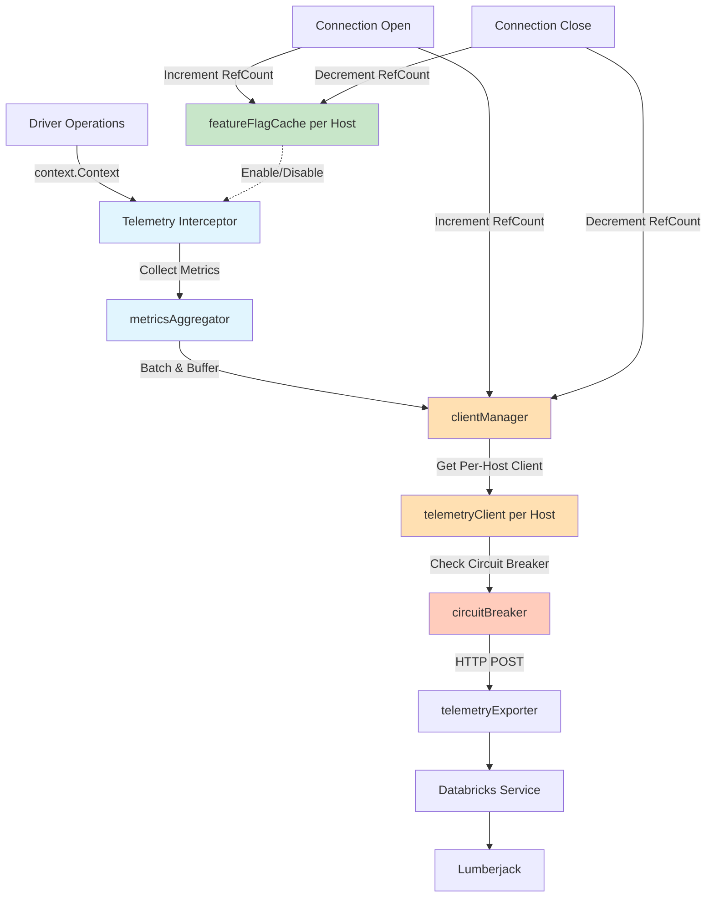
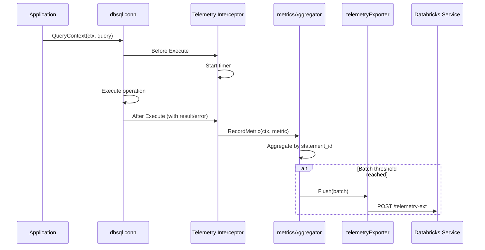

# Databricks SQL Go Driver: Telemetry Design

## Executive Summary

This document outlines a **telemetry design** for the Databricks SQL Go driver that collects usage metrics and exports them to the Databricks telemetry service. The design leverages Go's `context.Context` and middleware patterns to instrument driver operations without impacting performance.

**Key Objectives:**
- Collect driver usage metrics and performance data
- Export aggregated metrics to Databricks telemetry service
- Maintain server-side feature flag control
- Ensure zero impact on driver performance and reliability
- Follow Go best practices and idiomatic patterns

**Design Principles:**
- **Non-blocking**: All operations async using goroutines
- **Privacy-first**: No PII or query data collected
- **Server-controlled**: Feature flag support for enable/disable
- **Fail-safe**: All telemetry errors swallowed silently
- **Idiomatic Go**: Use standard library patterns and interfaces

**Production Requirements** (from JDBC driver experience):
- **Feature flag caching**: Per-host caching to avoid rate limiting
- **Circuit breaker**: Protect against telemetry endpoint failures
- **Exception swallowing**: All telemetry errors caught with minimal logging
- **Per-host telemetry client**: One client per host to prevent rate limiting
- **Graceful shutdown**: Proper cleanup with reference counting
- **Smart exception flushing**: Only flush terminal errors immediately

---

## Table of Contents

1. [Background & Motivation](#1-background--motivation)
2. [Architecture Overview](#2-architecture-overview)
3. [Core Components](#3-core-components)
   - 3.1 [featureFlagCache (Per-Host)](#31-featureflagcache-per-host)
   - 3.2 [clientManager (Per-Host)](#32-clientmanager-per-host)
   - 3.3 [circuitBreaker](#33-circuitbreaker)
   - 3.4 [Telemetry Interceptor](#34-telemetry-interceptor)
   - 3.5 [metricsAggregator](#35-metricsaggregator)
   - 3.6 [telemetryExporter](#36-telemetryexporter)
4. [Data Collection](#4-data-collection)
5. [Export Mechanism](#5-export-mechanism)
6. [Configuration](#6-configuration)
7. [Privacy & Compliance](#7-privacy--compliance)
8. [Error Handling](#8-error-handling)
9. [Graceful Shutdown](#9-graceful-shutdown)
10. [Testing Strategy](#10-testing-strategy)
11. [Implementation Checklist](#11-implementation-checklist)
12. [References](#12-references)

---

## 1. Background & Motivation

### 1.1 Current State

The Databricks SQL Go driver (`databricks-sql-go`) provides:
- ✅ Standard `database/sql/driver` interface implementation
- ✅ Thrift-based communication with Databricks clusters
- ✅ Connection pooling via `database/sql` package
- ✅ Context-based cancellation and timeouts
- ✅ Structured logging

### 1.2 Requirements

Product teams need telemetry data to:
- Understand driver feature adoption (CloudFetch, LZ4 compression, etc.)
- Identify performance bottlenecks
- Track error rates and failure modes
- Make data-driven decisions for driver improvements

### 1.3 Design Goals

**Instrumentation Strategy**:
- ✅ Minimal code changes to existing driver
- ✅ Use Go idiomatic patterns (interfaces, middleware, context)
- ✅ Zero performance impact when telemetry disabled
- ✅ < 1% overhead when telemetry enabled
- ✅ No risk to driver reliability

---

## 2. Architecture Overview

### 2.1 High-Level Architecture



**Key Components:**
1. **Telemetry Interceptor** (new): Wraps driver operations to collect metrics
2. **featureFlagCache** (new): Per-host caching of feature flags with reference counting
3. **clientManager** (new): Manages one telemetry client per host with reference counting
4. **circuitBreaker** (new): Protects against failing telemetry endpoint
5. **metricsAggregator** (new): Aggregates by statement, batches events
6. **telemetryExporter** (new): Exports to Databricks service

### 2.2 Data Flow



---

## 3. Core Components

### 3.1 featureFlagCache (Per-Host)

**Purpose**: Cache feature flag values at the host level to avoid repeated API calls and rate limiting.

**Location**: `telemetry/featureflag.go`

#### Rationale
- **Per-host caching**: Feature flags cached by host to prevent rate limiting
- **Reference counting**: Tracks number of connections per host for proper cleanup
- **Automatic expiration**: Refreshes cached flags after TTL expires (15 minutes)
- **Thread-safe**: Uses sync.RWMutex for concurrent access

#### Interface

```go
package telemetry

import (
	"context"
	"net/http"
	"sync"
	"time"
)

// featureFlagCache manages feature flag state per host with reference counting.
// This prevents rate limiting by caching feature flag responses.
type featureFlagCache struct {
	mu       sync.RWMutex
	contexts map[string]*featureFlagContext
}

// featureFlagContext holds feature flag state and reference count for a host.
type featureFlagContext struct {
	enabled      *bool
	lastFetched  time.Time
	refCount     int
	cacheDuration time.Duration
}

var (
	flagCacheOnce     sync.Once
	flagCacheInstance *featureFlagCache
)

// getFeatureFlagCache returns the singleton instance.
func getFeatureFlagCache() *featureFlagCache {
	flagCacheOnce.Do(func() {
		flagCacheInstance = &featureFlagCache{
			contexts: make(map[string]*featureFlagContext),
		}
	})
	return flagCacheInstance
}

// getOrCreateContext gets or creates a feature flag context for the host.
// Increments reference count.
func (c *featureFlagCache) getOrCreateContext(host string) *featureFlagContext {
	c.mu.Lock()
	defer c.mu.Unlock()

	ctx, exists := c.contexts[host]
	if !exists {
		ctx = &featureFlagContext{
			cacheDuration: 15 * time.Minute,
		}
		c.contexts[host] = ctx
	}
	ctx.refCount++
	return ctx
}

// releaseContext decrements reference count for the host.
// Removes context when ref count reaches zero.
func (c *featureFlagCache) releaseContext(host string) {
	c.mu.Lock()
	defer c.mu.Unlock()

	if ctx, exists := c.contexts[host]; exists {
		ctx.refCount--
		if ctx.refCount <= 0 {
			delete(c.contexts, host)
		}
	}
}

// isTelemetryEnabled checks if telemetry is enabled for the host.
// Uses cached value if available and not expired.
func (c *featureFlagCache) isTelemetryEnabled(ctx context.Context, host string, httpClient *http.Client) (bool, error) {
	c.mu.RLock()
	flagCtx, exists := c.contexts[host]
	c.mu.RUnlock()

	if !exists {
		return false, nil
	}

	// Check if cache is valid
	if flagCtx.enabled != nil && time.Since(flagCtx.lastFetched) < flagCtx.cacheDuration {
		return *flagCtx.enabled, nil
	}

	// Fetch fresh value
	enabled, err := fetchFeatureFlag(ctx, host, httpClient)
	if err != nil {
		// Return cached value on error, or false if no cache
		if flagCtx.enabled != nil {
			return *flagCtx.enabled, nil
		}
		return false, err
	}

	// Update cache
	c.mu.Lock()
	flagCtx.enabled = &enabled
	flagCtx.lastFetched = time.Now()
	c.mu.Unlock()

	return enabled, nil
}

// isExpired returns true if the cache has expired.
func (c *featureFlagContext) isExpired() bool {
	return c.enabled == nil || time.Since(c.lastFetched) > c.cacheDuration
}
```

---

### 3.2 clientManager (Per-Host)

**Purpose**: Manage one telemetry client per host to prevent rate limiting from concurrent connections.

**Location**: `telemetry/manager.go`

#### Rationale
- **One client per host**: Large customers open many parallel connections to the same host
- **Prevents rate limiting**: Shared client batches events from all connections
- **Reference counting**: Tracks active connections, only closes client when last connection closes
- **Thread-safe**: Safe for concurrent access from multiple goroutines

#### Interface

```go
package telemetry

import (
	"net/http"
	"sync"
)

// clientManager manages one telemetry client per host.
// Prevents rate limiting by sharing clients across connections.
type clientManager struct {
	mu      sync.RWMutex
	clients map[string]*clientHolder
}

// clientHolder holds a telemetry client and its reference count.
type clientHolder struct {
	client   *telemetryClient
	refCount int
}

var (
	managerOnce     sync.Once
	managerInstance *clientManager
)

// getClientManager returns the singleton instance.
func getClientManager() *clientManager {
	managerOnce.Do(func() {
		managerInstance = &clientManager{
			clients: make(map[string]*clientHolder),
		}
	})
	return managerInstance
}

// getOrCreateClient gets or creates a telemetry client for the host.
// Increments reference count.
func (m *clientManager) getOrCreateClient(host string, httpClient *http.Client, cfg *config) *telemetryClient {
	m.mu.Lock()
	defer m.mu.Unlock()

	holder, exists := m.clients[host]
	if !exists {
		holder = &clientHolder{
			client: newTelemetryClient(host, httpClient, cfg),
		}
		m.clients[host] = holder
		holder.client.start() // Start background flush goroutine
	}
	holder.refCount++
	return holder.client
}

// releaseClient decrements reference count for the host.
// Closes and removes client when ref count reaches zero.
func (m *clientManager) releaseClient(host string) error {
	m.mu.Lock()
	holder, exists := m.clients[host]
	if !exists {
		m.mu.Unlock()
		return nil
	}

	holder.refCount--
	if holder.refCount <= 0 {
		delete(m.clients, host)
		m.mu.Unlock()
		return holder.client.close() // Close and flush
	}

	m.mu.Unlock()
	return nil
}
```

---

### 3.3 circuitBreaker

**Purpose**: Implement circuit breaker pattern to protect against failing telemetry endpoint.

**Location**: `telemetry/circuitbreaker.go`

#### Rationale
- **Endpoint protection**: The telemetry endpoint itself may fail or become unavailable
- **Not just rate limiting**: Protects against 5xx errors, timeouts, network failures
- **Resource efficiency**: Prevents wasting resources on a failing endpoint
- **Auto-recovery**: Automatically detects when endpoint becomes healthy again

#### States
1. **Closed**: Normal operation, requests pass through
2. **Open**: After threshold failures, all requests rejected immediately (drop events)
3. **Half-Open**: After timeout, allows test requests to check if endpoint recovered

#### Interface

```go
package telemetry

import (
	"context"
	"errors"
	"sync"
	"sync/atomic"
	"time"
)

// circuitState represents the state of the circuit breaker.
type circuitState int32

const (
	stateClosed circuitState = iota
	stateOpen
	stateHalfOpen
)

// circuitBreaker implements the circuit breaker pattern.
type circuitBreaker struct {
	mu sync.RWMutex

	state         atomic.Int32 // circuitState
	failureCount  int
	successCount  int
	lastFailTime  time.Time
	lastStateTime time.Time

	config circuitBreakerConfig
}

// circuitBreakerConfig holds circuit breaker configuration.
type circuitBreakerConfig struct {
	failureThreshold int           // Open after N failures
	successThreshold int           // Close after N successes in half-open
	timeout          time.Duration // Try again after timeout
}

// defaultCircuitBreakerConfig returns default configuration.
func defaultCircuitBreakerConfig() circuitBreakerConfig {
	return circuitBreakerConfig{
		failureThreshold: 5,
		successThreshold: 2,
		timeout:          1 * time.Minute,
	}
}

// newCircuitBreaker creates a new circuit breaker.
func newCircuitBreaker(cfg circuitBreakerConfig) *circuitBreaker {
	cb := &circuitBreaker{
		config:        cfg,
		lastStateTime: time.Now(),
	}
	cb.state.Store(int32(stateClosed))
	return cb
}

// ErrCircuitOpen is returned when circuit is open.
var ErrCircuitOpen = errors.New("circuit breaker is open")

// execute executes the function if circuit allows.
func (cb *circuitBreaker) execute(ctx context.Context, fn func() error) error {
	state := circuitState(cb.state.Load())

	switch state {
	case stateOpen:
		// Check if timeout has passed
		cb.mu.RLock()
		shouldRetry := time.Since(cb.lastStateTime) > cb.config.timeout
		cb.mu.RUnlock()

		if shouldRetry {
			// Transition to half-open
			cb.setState(stateHalfOpen)
			return cb.tryExecute(ctx, fn)
		}
		return ErrCircuitOpen

	case stateHalfOpen:
		return cb.tryExecute(ctx, fn)

	case stateClosed:
		return cb.tryExecute(ctx, fn)
	}

	return nil
}

// tryExecute attempts to execute the function and updates state.
func (cb *circuitBreaker) tryExecute(ctx context.Context, fn func() error) error {
	err := fn()

	if err != nil {
		cb.recordFailure()
		return err
	}

	cb.recordSuccess()
	return nil
}

// recordFailure records a failure and potentially opens the circuit.
func (cb *circuitBreaker) recordFailure() {
	cb.mu.Lock()
	defer cb.mu.Unlock()

	cb.failureCount++
	cb.successCount = 0
	cb.lastFailTime = time.Now()

	state := circuitState(cb.state.Load())

	if state == stateHalfOpen {
		// Failure in half-open immediately opens circuit
		cb.setStateUnlocked(stateOpen)
	} else if cb.failureCount >= cb.config.failureThreshold {
		cb.setStateUnlocked(stateOpen)
	}
}

// recordSuccess records a success and potentially closes the circuit.
func (cb *circuitBreaker) recordSuccess() {
	cb.mu.Lock()
	defer cb.mu.Unlock()

	cb.failureCount = 0
	cb.successCount++

	state := circuitState(cb.state.Load())

	if state == stateHalfOpen && cb.successCount >= cb.config.successThreshold {
		cb.setStateUnlocked(stateClosed)
	}
}

// setState transitions to a new state.
func (cb *circuitBreaker) setState(newState circuitState) {
	cb.mu.Lock()
	defer cb.mu.Unlock()
	cb.setStateUnlocked(newState)
}

// setStateUnlocked transitions to a new state without locking.
func (cb *circuitBreaker) setStateUnlocked(newState circuitState) {
	oldState := circuitState(cb.state.Load())
	if oldState == newState {
		return
	}

	cb.state.Store(int32(newState))
	cb.lastStateTime = time.Now()
	cb.failureCount = 0
	cb.successCount = 0

	// Log state transition at DEBUG level
	// logger.Debug().Msgf("circuit breaker: %v -> %v", oldState, newState)
}

// circuitBreakerManager manages circuit breakers per host.
type circuitBreakerManager struct {
	mu       sync.RWMutex
	breakers map[string]*circuitBreaker
}

var (
	breakerManagerOnce     sync.Once
	breakerManagerInstance *circuitBreakerManager
)

// getCircuitBreakerManager returns the singleton instance.
func getCircuitBreakerManager() *circuitBreakerManager {
	breakerManagerOnce.Do(func() {
		breakerManagerInstance = &circuitBreakerManager{
			breakers: make(map[string]*circuitBreaker),
		}
	})
	return breakerManagerInstance
}

// getCircuitBreaker gets or creates a circuit breaker for the host.
func (m *circuitBreakerManager) getCircuitBreaker(host string) *circuitBreaker {
	m.mu.RLock()
	cb, exists := m.breakers[host]
	m.mu.RUnlock()

	if exists {
		return cb
	}

	m.mu.Lock()
	defer m.mu.Unlock()

	// Double-check after acquiring write lock
	if cb, exists = m.breakers[host]; exists {
		return cb
	}

	cb = newCircuitBreaker(defaultCircuitBreakerConfig())
	m.breakers[host] = cb
	return cb
}
```

---

### 3.4 Telemetry Interceptor

**Purpose**: Intercept driver operations to collect metrics without modifying core driver logic.

**Location**: `telemetry/interceptor.go`

#### Approach

Use Go's context and function wrapping patterns to intercept operations:

```go
package telemetry

import (
	"context"
	"time"
)

// interceptor wraps driver operations to collect metrics.
type interceptor struct {
	aggregator *metricsAggregator
	enabled    bool
}

// metricContext holds metric collection state in context.
type metricContext struct {
	statementID string
	startTime   time.Time
	tags        map[string]interface{}
}

type contextKey int

const metricContextKey contextKey = 0

// withMetricContext adds metric context to the context.
func withMetricContext(ctx context.Context, mc *metricContext) context.Context {
	return context.WithValue(ctx, metricContextKey, mc)
}

// getMetricContext retrieves metric context from the context.
func getMetricContext(ctx context.Context) *metricContext {
	if mc, ok := ctx.Value(metricContextKey).(*metricContext); ok {
		return mc
	}
	return nil
}

// beforeExecute is called before statement execution.
func (i *interceptor) beforeExecute(ctx context.Context, statementID string) context.Context {
	if !i.enabled {
		return ctx
	}

	mc := &metricContext{
		statementID: statementID,
		startTime:   time.Now(),
		tags:        make(map[string]interface{}),
	}

	return withMetricContext(ctx, mc)
}

// afterExecute is called after statement execution.
func (i *interceptor) afterExecute(ctx context.Context, err error) {
	if !i.enabled {
		return
	}

	mc := getMetricContext(ctx)
	if mc == nil {
		return
	}

	// Swallow all panics
	defer func() {
		if r := recover(); r != nil {
			// Log at trace level only
		}
	}()

	metric := &telemetryMetric{
		metricType:  "statement",
		timestamp:   mc.startTime,
		statementID: mc.statementID,
		latencyMs:   time.Since(mc.startTime).Milliseconds(),
		tags:        mc.tags,
	}

	if err != nil {
		metric.errorType = classifyError(err)
	}

	// Non-blocking send
	i.aggregator.recordMetric(ctx, metric)
}

// addTag adds a tag to the current metric context.
func (i *interceptor) addTag(ctx context.Context, key string, value interface{}) {
	if !i.enabled {
		return
	}

	mc := getMetricContext(ctx)
	if mc != nil {
		mc.tags[key] = value
	}
}
```

**Integration points in driver**:

```go
// In statement.go
func (s *stmt) QueryContext(ctx context.Context, args []driver.NamedValue) (driver.Rows, error) {
	// Wrap context with telemetry
	if s.conn.telemetry != nil {
		ctx = s.conn.telemetry.beforeExecute(ctx, generateStatementID())
		defer func() {
			s.conn.telemetry.afterExecute(ctx, err)
		}()
	}

	// Existing implementation
	// ...
}
```

---

### 3.5 metricsAggregator

**Purpose**: Aggregate metrics by statement and batch for efficient export.

**Location**: `telemetry/aggregator.go`

#### Interface

```go
package telemetry

import (
	"context"
	"sync"
	"time"
)

// metricsAggregator aggregates metrics by statement and batches for export.
type metricsAggregator struct {
	mu sync.RWMutex

	statements map[string]*statementMetrics
	batch      []*telemetryMetric
	exporter   *telemetryExporter

	batchSize     int
	flushInterval time.Duration
	flushTimer    *time.Timer
	stopCh        chan struct{}
}

// statementMetrics holds aggregated metrics for a statement.
type statementMetrics struct {
	statementID  string
	sessionID    string
	totalLatency time.Duration
	chunkCount   int
	bytesDownloaded int64
	pollCount    int
	errors       []error
	tags         map[string]interface{}
}

// newMetricsAggregator creates a new metrics aggregator.
func newMetricsAggregator(exporter *telemetryExporter, cfg *config) *metricsAggregator {
	agg := &metricsAggregator{
		statements:    make(map[string]*statementMetrics),
		batch:         make([]*telemetryMetric, 0, cfg.batchSize),
		exporter:      exporter,
		batchSize:     cfg.batchSize,
		flushInterval: cfg.flushInterval,
		stopCh:        make(chan struct{}),
	}

	// Start background flush timer
	go agg.flushLoop()

	return agg
}

// recordMetric records a metric for aggregation.
func (agg *metricsAggregator) recordMetric(ctx context.Context, metric *telemetryMetric) {
	// Swallow all errors
	defer func() {
		if r := recover(); r != nil {
			// Log at trace level only
		}
	}()

	agg.mu.Lock()
	defer agg.mu.Unlock()

	switch metric.metricType {
	case "connection":
		// Emit immediately
		agg.batch = append(agg.batch, metric)
		if len(agg.batch) >= agg.batchSize {
			agg.flushUnlocked(ctx)
		}

	case "statement":
		// Aggregate by statement ID
		stmt, exists := agg.statements[metric.statementID]
		if !exists {
			stmt = &statementMetrics{
				statementID: metric.statementID,
				tags:        make(map[string]interface{}),
			}
			agg.statements[metric.statementID] = stmt
		}

		// Update aggregated values
		stmt.totalLatency += time.Duration(metric.latencyMs) * time.Millisecond
		if chunkCount, ok := metric.tags["chunk_count"].(int); ok {
			stmt.chunkCount += chunkCount
		}
		if bytes, ok := metric.tags["bytes_downloaded"].(int64); ok {
			stmt.bytesDownloaded += bytes
		}

		// Merge tags
		for k, v := range metric.tags {
			stmt.tags[k] = v
		}

	case "error":
		// Check if terminal
		if isTerminalError(metric.errorType) {
			// Flush immediately
			agg.batch = append(agg.batch, metric)
			agg.flushUnlocked(ctx)
		} else {
			// Buffer with statement
			if stmt, exists := agg.statements[metric.statementID]; exists {
				stmt.errors = append(stmt.errors, errors.New(metric.errorType))
			}
		}
	}
}

// completeStatement marks a statement as complete and emits aggregated metric.
func (agg *metricsAggregator) completeStatement(ctx context.Context, statementID string, failed bool) {
	defer func() {
		if r := recover(); r != nil {
			// Log at trace level only
		}
	}()

	agg.mu.Lock()
	defer agg.mu.Unlock()

	stmt, exists := agg.statements[statementID]
	if !exists {
		return
	}
	delete(agg.statements, statementID)

	// Create aggregated metric
	metric := &telemetryMetric{
		metricType:      "statement",
		timestamp:       time.Now(),
		statementID:     stmt.statementID,
		sessionID:       stmt.sessionID,
		latencyMs:       stmt.totalLatency.Milliseconds(),
		tags:            stmt.tags,
	}

	// Add aggregated counts
	metric.tags["chunk_count"] = stmt.chunkCount
	metric.tags["bytes_downloaded"] = stmt.bytesDownloaded
	metric.tags["poll_count"] = stmt.pollCount

	agg.batch = append(agg.batch, metric)

	// Emit errors if statement failed
	if failed && len(stmt.errors) > 0 {
		for _, err := range stmt.errors {
			errorMetric := &telemetryMetric{
				metricType:  "error",
				timestamp:   time.Now(),
				statementID: statementID,
				errorType:   err.Error(),
			}
			agg.batch = append(agg.batch, errorMetric)
		}
	}

	// Flush if batch full
	if len(agg.batch) >= agg.batchSize {
		agg.flushUnlocked(ctx)
	}
}

// flushLoop runs periodic flush in background.
func (agg *metricsAggregator) flushLoop() {
	ticker := time.NewTicker(agg.flushInterval)
	defer ticker.Stop()

	for {
		select {
		case <-ticker.C:
			agg.flush(context.Background())
		case <-agg.stopCh:
			return
		}
	}
}

// flush flushes pending metrics to exporter.
func (agg *metricsAggregator) flush(ctx context.Context) {
	agg.mu.Lock()
	defer agg.mu.Unlock()
	agg.flushUnlocked(ctx)
}

// flushUnlocked flushes without locking (caller must hold lock).
func (agg *metricsAggregator) flushUnlocked(ctx context.Context) {
	if len(agg.batch) == 0 {
		return
	}

	// Copy batch and clear
	metrics := make([]*telemetryMetric, len(agg.batch))
	copy(metrics, agg.batch)
	agg.batch = agg.batch[:0]

	// Export asynchronously
	go func() {
		defer func() {
			if r := recover(); r != nil {
				// Log at trace level only
			}
		}()
		agg.exporter.export(ctx, metrics)
	}()
}

// close stops the aggregator and flushes pending metrics.
func (agg *metricsAggregator) close(ctx context.Context) error {
	close(agg.stopCh)
	agg.flush(ctx)
	return nil
}
```

---

### 3.6 telemetryExporter

**Purpose**: Export metrics to Databricks telemetry service.

**Location**: `telemetry/exporter.go`

#### Interface

```go
package telemetry

import (
	"bytes"
	"context"
	"encoding/json"
	"fmt"
	"net/http"
	"time"
)

// telemetryExporter exports metrics to Databricks service.
type telemetryExporter struct {
	host          string
	httpClient    *http.Client
	circuitBreaker *circuitBreaker
	cfg           *config
}

// telemetryMetric represents a metric to export.
type telemetryMetric struct {
	metricType      string
	timestamp       time.Time
	workspaceID     string
	sessionID       string
	statementID     string
	latencyMs       int64
	errorType       string
	tags            map[string]interface{}
}

// newTelemetryExporter creates a new exporter.
func newTelemetryExporter(host string, httpClient *http.Client, cfg *config) *telemetryExporter {
	return &telemetryExporter{
		host:          host,
		httpClient:    httpClient,
		circuitBreaker: getCircuitBreakerManager().getCircuitBreaker(host),
		cfg:           cfg,
	}
}

// export exports metrics to Databricks service.
func (e *telemetryExporter) export(ctx context.Context, metrics []*telemetryMetric) {
	// Swallow all errors
	defer func() {
		if r := recover(); r != nil {
			// Log at trace level only
		}
	}()

	// Check circuit breaker
	err := e.circuitBreaker.execute(ctx, func() error {
		return e.doExport(ctx, metrics)
	})

	if err == ErrCircuitOpen {
		// Drop metrics silently
		return
	}

	if err != nil {
		// Log at trace level only
	}
}

// doExport performs the actual export with retries.
func (e *telemetryExporter) doExport(ctx context.Context, metrics []*telemetryMetric) error {
	// Serialize metrics
	data, err := json.Marshal(metrics)
	if err != nil {
		return fmt.Errorf("failed to marshal metrics: %w", err)
	}

	// Determine endpoint
	endpoint := fmt.Sprintf("https://%s/api/2.0/telemetry-ext", e.host)

	// Create request
	req, err := http.NewRequestWithContext(ctx, "POST", endpoint, bytes.NewReader(data))
	if err != nil {
		return fmt.Errorf("failed to create request: %w", err)
	}

	req.Header.Set("Content-Type", "application/json")

	// Retry logic
	maxRetries := e.cfg.maxRetries
	for attempt := 0; attempt <= maxRetries; attempt++ {
		if attempt > 0 {
			// Exponential backoff
			backoff := time.Duration(attempt) * e.cfg.retryDelay
			time.Sleep(backoff)
		}

		resp, err := e.httpClient.Do(req)
		if err != nil {
			if attempt == maxRetries {
				return fmt.Errorf("failed after %d retries: %w", maxRetries, err)
			}
			continue
		}

		resp.Body.Close()

		// Check status code
		if resp.StatusCode >= 200 && resp.StatusCode < 300 {
			return nil // Success
		}

		// Check if retryable
		if !isRetryableStatus(resp.StatusCode) {
			return fmt.Errorf("non-retryable status: %d", resp.StatusCode)
		}

		if attempt == maxRetries {
			return fmt.Errorf("failed after %d retries: status %d", maxRetries, resp.StatusCode)
		}
	}

	return nil
}

// isRetryableStatus returns true if HTTP status is retryable.
func isRetryableStatus(status int) bool {
	return status == 429 || status == 503 || status >= 500
}
```

---

## 4. Data Collection

### 4.1 Metric Tags

All metric tags are defined in a centralized location for maintainability and security.

**Location**: `telemetry/tags.go`

```go
package telemetry

// Tag names for connection metrics
const (
	TagWorkspaceID   = "workspace.id"
	TagSessionID     = "session.id"
	TagDriverVersion = "driver.version"
	TagDriverOS      = "driver.os"
	TagDriverRuntime = "driver.runtime"
	TagServerAddress = "server.address" // Not exported to Databricks
)

// Tag names for statement metrics
const (
	TagStatementID          = "statement.id"
	TagResultFormat         = "result.format"
	TagResultChunkCount     = "result.chunk_count"
	TagResultBytesDownloaded = "result.bytes_downloaded"
	TagCompressionEnabled   = "result.compression_enabled"
	TagPollCount            = "poll.count"
	TagPollLatency          = "poll.latency_ms"
)

// Tag names for error metrics
const (
	TagErrorType = "error.type"
	TagErrorCode = "error.code"
)

// Feature flag tags
const (
	TagFeatureCloudFetch     = "feature.cloudfetch"
	TagFeatureLZ4            = "feature.lz4"
	TagFeatureDirectResults  = "feature.direct_results"
)

// tagExportScope defines where a tag can be exported.
type tagExportScope int

const (
	exportNone tagExportScope = 0
	exportLocal     = 1 << iota
	exportDatabricks
	exportAll = exportLocal | exportDatabricks
)

// tagDefinition defines a metric tag and its export scope.
type tagDefinition struct {
	name        string
	exportScope tagExportScope
	description string
	required    bool
}

// connectionTags returns tags allowed for connection events.
func connectionTags() []tagDefinition {
	return []tagDefinition{
		{TagWorkspaceID, exportDatabricks, "Databricks workspace ID", true},
		{TagSessionID, exportDatabricks, "Connection session ID", true},
		{TagDriverVersion, exportAll, "Driver version", false},
		{TagDriverOS, exportAll, "Operating system", false},
		{TagDriverRuntime, exportAll, "Go runtime version", false},
		{TagFeatureCloudFetch, exportDatabricks, "CloudFetch enabled", false},
		{TagFeatureLZ4, exportDatabricks, "LZ4 compression enabled", false},
		{TagServerAddress, exportLocal, "Server address (local only)", false},
	}
}

// statementTags returns tags allowed for statement events.
func statementTags() []tagDefinition {
	return []tagDefinition{
		{TagStatementID, exportDatabricks, "Statement ID", true},
		{TagSessionID, exportDatabricks, "Session ID", true},
		{TagResultFormat, exportDatabricks, "Result format", false},
		{TagResultChunkCount, exportDatabricks, "Chunk count", false},
		{TagResultBytesDownloaded, exportDatabricks, "Bytes downloaded", false},
		{TagCompressionEnabled, exportDatabricks, "Compression enabled", false},
		{TagPollCount, exportDatabricks, "Poll count", false},
		{TagPollLatency, exportDatabricks, "Poll latency", false},
	}
}

// shouldExportToDatabricks returns true if tag should be exported to Databricks.
func shouldExportToDatabricks(metricType, tagName string) bool {
	var tags []tagDefinition
	switch metricType {
	case "connection":
		tags = connectionTags()
	case "statement":
		tags = statementTags()
	default:
		return false
	}

	for _, tag := range tags {
		if tag.name == tagName {
			return tag.exportScope&exportDatabricks != 0
		}
	}
	return false
}
```

### 4.2 Metric Collection Points

```go
// In connection.go - Connection open
func (c *connector) Connect(ctx context.Context) (driver.Conn, error) {
	// ... existing code ...

	conn := &conn{
		id:      generateConnectionID(),
		cfg:     c.cfg,
		client:  tclient,
		session: session,
	}

	// Initialize telemetry if enabled
	if c.cfg.telemetryEnabled {
		conn.telemetry = newTelemetryInterceptor(conn.id, c.cfg)

		// Record connection open
		conn.telemetry.recordConnection(ctx, map[string]interface{}{
			TagWorkspaceID:   c.cfg.WorkspaceID,
			TagSessionID:     conn.id,
			TagDriverVersion: c.cfg.DriverVersion,
			TagDriverOS:      runtime.GOOS,
			TagDriverRuntime: runtime.Version(),
		})
	}

	return conn, nil
}

// In statement.go - Statement execution
func (s *stmt) QueryContext(ctx context.Context, args []driver.NamedValue) (driver.Rows, error) {
	statementID := generateStatementID()

	// Start telemetry
	if s.conn.telemetry != nil {
		ctx = s.conn.telemetry.beforeExecute(ctx, statementID)
		defer func() {
			s.conn.telemetry.afterExecute(ctx, err)
			s.conn.telemetry.completeStatement(ctx, statementID, err != nil)
		}()
	}

	// ... existing code ...

	// Add telemetry tags during execution
	if s.conn.telemetry != nil {
		s.conn.telemetry.addTag(ctx, TagResultFormat, "cloudfetch")
		s.conn.telemetry.addTag(ctx, TagResultChunkCount, chunkCount)
	}

	return rows, nil
}
```

---

## 5. Export Mechanism

### 5.1 Data Model

```go
// telemetryPayload is the JSON structure sent to Databricks.
type telemetryPayload struct {
	Metrics []*exportedMetric `json:"metrics"`
}

// exportedMetric is a single metric in the payload.
type exportedMetric struct {
	MetricType   string                 `json:"metric_type"`
	Timestamp    string                 `json:"timestamp"` // RFC3339
	WorkspaceID  string                 `json:"workspace_id,omitempty"`
	SessionID    string                 `json:"session_id,omitempty"`
	StatementID  string                 `json:"statement_id,omitempty"`
	LatencyMs    int64                  `json:"latency_ms,omitempty"`
	ErrorType    string                 `json:"error_type,omitempty"`
	Tags         map[string]interface{} `json:"tags,omitempty"`
}

// toExportedMetric converts internal metric to exported format.
func (m *telemetryMetric) toExportedMetric() *exportedMetric {
	// Filter tags based on export scope
	filteredTags := make(map[string]interface{})
	for k, v := range m.tags {
		if shouldExportToDatabricks(m.metricType, k) {
			filteredTags[k] = v
		}
	}

	return &exportedMetric{
		MetricType:  m.metricType,
		Timestamp:   m.timestamp.Format(time.RFC3339),
		WorkspaceID: m.workspaceID,
		SessionID:   m.sessionID,
		StatementID: m.statementID,
		LatencyMs:   m.latencyMs,
		ErrorType:   m.errorType,
		Tags:        filteredTags,
	}
}
```

### 5.2 Export Endpoints

```go
const (
	// telemetryEndpointAuth is used when connection has auth token
	telemetryEndpointAuth = "/api/2.0/telemetry-ext"

	// telemetryEndpointUnauth is used when no auth available
	telemetryEndpointUnauth = "/api/2.0/telemetry-unauth"
)

// selectEndpoint chooses the appropriate endpoint based on auth.
func (e *telemetryExporter) selectEndpoint() string {
	if e.cfg.hasAuth {
		return telemetryEndpointAuth
	}
	return telemetryEndpointUnauth
}
```

---

## 6. Configuration

### 6.1 Configuration Structure

```go
package telemetry

import "time"

// Config holds telemetry configuration.
type Config struct {
	// Enabled controls whether telemetry is active
	Enabled bool

	// BatchSize is the number of metrics to batch before flushing
	BatchSize int

	// FlushInterval is how often to flush metrics
	FlushInterval time.Duration

	// MaxRetries is the maximum number of retry attempts
	MaxRetries int

	// RetryDelay is the base delay between retries
	RetryDelay time.Duration

	// CircuitBreakerEnabled enables circuit breaker protection
	CircuitBreakerEnabled bool

	// CircuitBreakerThreshold is failures before opening circuit
	CircuitBreakerThreshold int

	// CircuitBreakerTimeout is time before retrying after open
	CircuitBreakerTimeout time.Duration
}

// DefaultConfig returns default telemetry configuration.
func DefaultConfig() *Config {
	return &Config{
		Enabled:                 true,
		BatchSize:               100,
		FlushInterval:           5 * time.Second,
		MaxRetries:              3,
		RetryDelay:              100 * time.Millisecond,
		CircuitBreakerEnabled:   true,
		CircuitBreakerThreshold: 5,
		CircuitBreakerTimeout:   1 * time.Minute,
	}
}
```

### 6.2 Configuration from DSN

```go
// ParseTelemetryConfig extracts telemetry config from DSN query parameters.
func ParseTelemetryConfig(params map[string]string) *Config {
	cfg := DefaultConfig()

	if v, ok := params["telemetry"]; ok {
		cfg.Enabled = v == "true" || v == "1"
	}

	if v, ok := params["telemetry_batch_size"]; ok {
		if size, err := strconv.Atoi(v); err == nil && size > 0 {
			cfg.BatchSize = size
		}
	}

	if v, ok := params["telemetry_flush_interval"]; ok {
		if duration, err := time.ParseDuration(v); err == nil {
			cfg.FlushInterval = duration
		}
	}

	return cfg
}
```

### 6.3 Feature Flag Integration

```go
// checkFeatureFlag checks if telemetry is enabled server-side.
func checkFeatureFlag(ctx context.Context, host string, httpClient *http.Client) (bool, error) {
	endpoint := fmt.Sprintf("https://%s/api/2.0/feature-flags", host)

	req, err := http.NewRequestWithContext(ctx, "GET", endpoint, nil)
	if err != nil {
		return false, err
	}

	// Add query parameters
	q := req.URL.Query()
	q.Add("flags", "databricks.partnerplatform.clientConfigsFeatureFlags.enableTelemetryForAdbc")
	req.URL.RawQuery = q.Encode()

	resp, err := httpClient.Do(req)
	if err != nil {
		return false, err
	}
	defer resp.Body.Close()

	if resp.StatusCode != http.StatusOK {
		return false, fmt.Errorf("feature flag check failed: %d", resp.StatusCode)
	}

	var result struct {
		Flags map[string]bool `json:"flags"`
	}
	if err := json.NewDecoder(resp.Body).Decode(&result); err != nil {
		return false, err
	}

	return result.Flags["databricks.partnerplatform.clientConfigsFeatureFlags.enableTelemetryForAdbc"], nil
}
```

---

## 7. Privacy & Compliance

### 7.1 Data Privacy

**Never Collected**:
- ❌ SQL query text
- ❌ Query results or data values
- ❌ Table/column names
- ❌ User identities

**Always Collected**:
- ✅ Operation latency
- ✅ Error codes (not messages)
- ✅ Feature flags (boolean)
- ✅ Statement IDs (UUIDs)
- ✅ Driver version and runtime info

### 7.2 Tag Filtering

```go
// filterTagsForExport removes tags that shouldn't be sent to Databricks.
func filterTagsForExport(metricType string, tags map[string]interface{}) map[string]interface{} {
	filtered := make(map[string]interface{})

	for key, value := range tags {
		if shouldExportToDatabricks(metricType, key) {
			filtered[key] = value
		}
		// Tags not in allowlist are silently dropped
	}

	return filtered
}
```

---

## 8. Error Handling

### 8.1 Error Swallowing Strategy

**Core Principle**: Every telemetry error must be swallowed with minimal logging.

```go
// recoverAndLog recovers from panics and logs at trace level.
func recoverAndLog(operation string) {
	if r := recover(); r != nil {
		// Use TRACE level logging (not exposed to users by default)
		// logger.Trace().Msgf("telemetry: %s panic: %v", operation, r)
	}
}

// Example usage
func (i *interceptor) afterExecute(ctx context.Context, err error) {
	defer recoverAndLog("afterExecute")

	// Telemetry logic that might panic
	// ...
}
```

### 8.2 Error Classification

```go
// errorClassifier classifies errors as terminal or retryable.
type errorClassifier struct{}

// isTerminalError returns true if error is terminal (non-retryable).
func isTerminalError(err error) bool {
	if err == nil {
		return false
	}

	// Unwrap error to check underlying type
	var httpErr *httpError
	if errors.As(err, &httpErr) {
		return isTerminalHTTPStatus(httpErr.statusCode)
	}

	// Check error message patterns
	errMsg := err.Error()
	terminalPatterns := []string{
		"authentication failed",
		"unauthorized",
		"forbidden",
		"not found",
		"invalid request",
		"syntax error",
	}

	for _, pattern := range terminalPatterns {
		if strings.Contains(strings.ToLower(errMsg), pattern) {
			return true
		}
	}

	return false
}

// isTerminalHTTPStatus returns true for non-retryable HTTP status codes.
func isTerminalHTTPStatus(status int) bool {
	return status == 400 || status == 401 || status == 403 || status == 404
}
```

---

## 9. Graceful Shutdown

### 9.1 Shutdown Sequence

```go
// In connection.go
func (c *conn) Close() error {
	// Close telemetry before closing connection
	if c.telemetry != nil {
		// This is non-blocking and swallows errors
		c.telemetry.close(context.Background())
	}

	// Release per-host resources
	if c.cfg.telemetryEnabled {
		getClientManager().releaseClient(c.cfg.Host)
		getFeatureFlagCache().releaseContext(c.cfg.Host)
	}

	// ... existing connection close logic ...

	return nil
}
```

### 9.2 Client Shutdown

```go
// close shuts down the telemetry client gracefully.
func (c *telemetryClient) close() error {
	defer recoverAndLog("client.close")

	// Stop background flush
	close(c.stopCh)

	// Flush pending metrics with timeout
	ctx, cancel := context.WithTimeout(context.Background(), 5*time.Second)
	defer cancel()

	c.aggregator.flush(ctx)

	return nil
}
```

---

## 10. Testing Strategy

### 10.1 Unit Tests

```go
// telemetry/interceptor_test.go
func TestInterceptor_BeforeAfterExecute(t *testing.T) {
	agg := &mockAggregator{}
	interceptor := &interceptor{
		aggregator: agg,
		enabled:    true,
	}

	ctx := context.Background()
	ctx = interceptor.beforeExecute(ctx, "stmt-123")

	// Verify metric context is attached
	mc := getMetricContext(ctx)
	assert.NotNil(t, mc)
	assert.Equal(t, "stmt-123", mc.statementID)

	// Simulate execution
	time.Sleep(10 * time.Millisecond)

	interceptor.afterExecute(ctx, nil)

	// Verify metric was recorded
	assert.Equal(t, 1, len(agg.metrics))
	assert.True(t, agg.metrics[0].latencyMs >= 10)
}

func TestInterceptor_ErrorHandling(t *testing.T) {
	agg := &mockAggregator{
		shouldPanic: true,
	}
	interceptor := &interceptor{
		aggregator: agg,
		enabled:    true,
	}

	ctx := context.Background()
	ctx = interceptor.beforeExecute(ctx, "stmt-123")

	// Should not panic even if aggregator panics
	assert.NotPanics(t, func() {
		interceptor.afterExecute(ctx, nil)
	})
}
```

### 10.2 Integration Tests

```go
// telemetry/integration_test.go
func TestTelemetry_EndToEnd(t *testing.T) {
	if testing.Short() {
		t.Skip("skipping integration test")
	}

	// Create mock server
	server := httptest.NewServer(http.HandlerFunc(func(w http.ResponseWriter, r *http.Request) {
		if r.URL.Path == "/api/2.0/telemetry-ext" {
			w.WriteHeader(http.StatusOK)
		}
	}))
	defer server.Close()

	// Create connection with telemetry
	cfg := &config.Config{
		Host: server.URL,
		TelemetryEnabled: true,
	}

	conn, err := connect(cfg)
	require.NoError(t, err)
	defer conn.Close()

	// Execute statement
	_, err = conn.QueryContext(context.Background(), "SELECT 1")
	require.NoError(t, err)

	// Wait for flush
	time.Sleep(6 * time.Second)

	// Verify metrics were sent to server
	// (check server mock received requests)
}
```

### 10.3 Benchmark Tests

```go
// telemetry/benchmark_test.go
func BenchmarkInterceptor_Overhead(b *testing.B) {
	agg := &metricsAggregator{
		// ... initialized ...
	}
	interceptor := &interceptor{
		aggregator: agg,
		enabled:    true,
	}

	ctx := context.Background()

	b.ResetTimer()
	for i := 0; i < b.N; i++ {
		ctx = interceptor.beforeExecute(ctx, "stmt-123")
		interceptor.afterExecute(ctx, nil)
	}
}

func BenchmarkInterceptor_Disabled(b *testing.B) {
	agg := &metricsAggregator{
		// ... initialized ...
	}
	interceptor := &interceptor{
		aggregator: agg,
		enabled:    false, // Disabled
	}

	ctx := context.Background()

	b.ResetTimer()
	for i := 0; i < b.N; i++ {
		ctx = interceptor.beforeExecute(ctx, "stmt-123")
		interceptor.afterExecute(ctx, nil)
	}
}
```

---

## 11. Implementation Checklist

### Phase 1: Core Infrastructure
- [ ] Create `telemetry` package structure
- [ ] Implement `config.go` with configuration types
- [ ] Implement `tags.go` with tag definitions and filtering
- [ ] Add unit tests for configuration and tags

### Phase 2: Per-Host Management
- [ ] Implement `featureflag.go` with caching and reference counting
- [ ] Implement `manager.go` for client management
- [ ] Implement `circuitbreaker.go` with state machine
- [ ] Add unit tests for all components

### Phase 3: Collection & Aggregation
- [ ] Implement `interceptor.go` for metric collection
- [ ] Implement `aggregator.go` for batching
- [ ] Implement error classification in `errors.go`
- [ ] Add unit tests for collection and aggregation

### Phase 4: Export
- [ ] Implement `exporter.go` with retry logic
- [ ] Implement `client.go` for telemetry client
- [ ] Wire up circuit breaker with exporter
- [ ] Add unit tests for export logic

### Phase 5: Driver Integration
- [ ] Add telemetry to `connection.go`
- [ ] Add telemetry to `statement.go`
- [ ] Add cleanup in `Close()` methods
- [ ] Add integration tests

### Phase 6: Testing & Validation
- [ ] Run benchmark tests
- [ ] Perform load testing with concurrent connections
- [ ] Validate graceful shutdown
- [ ] Test circuit breaker behavior
- [ ] Verify privacy compliance (no PII)

### Phase 7: Documentation
- [ ] Document configuration options in README
- [ ] Add examples for enabling/disabling telemetry
- [ ] Document metric tags and their meanings
- [ ] Create troubleshooting guide

---

## 12. References

### 12.1 Go Standards
- [context package](https://pkg.go.dev/context)
- [database/sql/driver](https://pkg.go.dev/database/sql/driver)
- [net/http](https://pkg.go.dev/net/http)
- [sync package](https://pkg.go.dev/sync)
- [Effective Go](https://go.dev/doc/effective_go)

### 12.2 Existing Code References

**Databricks SQL Go Driver**:
- `connection.go`: Connection management
- `connector.go`: Connection factory
- `internal/config/config.go`: Configuration patterns
- `internal/client/client.go`: HTTP client patterns

**JDBC Driver** (reference implementation):
- `TelemetryClient.java:15`: Batching and flush logic
- `TelemetryClientFactory.java:27`: Per-host client management
- `CircuitBreakerManager.java:25`: Circuit breaker pattern
- `DatabricksDriverFeatureFlagsContextFactory.java:27`: Feature flag caching

---

## Summary

This **telemetry design for Go** follows idiomatic Go patterns:

1. **Idiomatic Go**: Uses context, interfaces, goroutines, and channels
2. **Minimal changes**: Wraps existing driver operations with interceptors
3. **Type safety**: Strong typing with exported/unexported types
4. **Error handling**: All errors swallowed, uses defer/recover patterns
5. **Concurrency**: Thread-safe using sync primitives (RWMutex, atomic)
6. **Testing**: Comprehensive unit, integration, and benchmark tests
7. **Standard library**: Minimal external dependencies

The design enables collecting valuable usage metrics while maintaining Go best practices and ensuring zero impact on driver reliability and performance.
